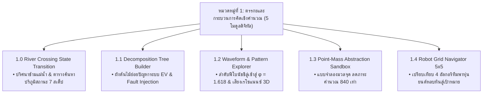

# วิทยาการคำนวณ 4 สื่อการเรียนรู้ดิจิทัลและคู่มือปฏิบัติการเสมือนจริงบนระบบ MOOC
## หมวดหมู่ที่ 1 ตรรกะและกระบวนการคิดเชิงคำนวณ
**ผู้พัฒนาหลักสูตร** ผู้ช่วยศาสตราจารย์ ดร.ชีวะ ทัศนา • สาขาวิชาฟิสิกส์ คณะวิทยาศาสตร์และเทคโนโลยี มหาวิทยาลัยราชภัฏรำไพพรรณี

---

## 🎯 ผลลัพธ์การเรียนรู้ประจำหมวดที่ 1
1. เข้าใจและจำแนกการใช้เหตุผลเชิงตรรกะแบบนิรนัย (Deductive) และอุปนัย (Inductive) ผ่านระบบจำลองสถานการณ์เสมือนจริง
2. ประยุกต์ใช้ 4 เสาหลักของแนวคิดเชิงคำนวณ (Decomposition, Pattern Recognition, Abstraction, Algorithm Design) ในการแก้ปัญหาทางวิทยาศาสตร์
3. ปฏิบัติการทดลองเสมือนจริง 2D Canvas และ 3D AR MediaPipe Hands พร้อมบันทึกตารางผลและสรุปผลตามกระบวนการสืบเสาะ

---

## 📚 รายละเอียด 5 โมดูลบทเรียนดิจิทัลและชุดปฏิบัติการเสมือนจริง 2D/3D

---

### 🔹 โมดูล 1.0 เรื่องเล่าเปิดบทเรียนและทำไมการคิดอย่างเป็นระบบจึงเปลี่ยนโลก
* **เนื้อหาสื่อการสอน** ปริศนาข้ามแม่น้ำ (Wolf, Sheep, Cabbage Puzzle) กับทฤษฎีการเปลี่ยนสถานะในปริภูมิสถานะ (State Space Transitions)
* **สมการเงื่อนไขตรรกะความปลอดภัย**
  $$\text{Danger} = (W \land S_h \land \neg M) \lor (S_h \land C \land \neg M)$$
* **ชุดปฏิบัติการเสมือนจริง 2D/3D:**
  * **ชื่อแล็บ** `LAB 1.0` ปริศนาข้ามแม่น้ำเชิงตรรกะและการสำรวจปริภูมิสถานะ (AR River Crossing State Space Explorer)
  * **วัตถุประสงค์** ค้นหาเส้นทางปลอดภัยและพิสูจน์อัลกอริทึม 7 เที่ยวเรือ
  * **ขั้นตอนการทดลอง** เปิดระบบกล้อง MediaPipe $\rightarrow$ ใช้ท่าทาง Pinch 🤏 หยิบตัวละครลงเรือ $\rightarrow$ พายข้ามฝั่ง $\rightarrow$ ดึงแกะกลับในเที่ยวที่ 4 $\rightarrow$ บันทึกผล
  * **ตารางบันทึกผล** ตาราง 7 เที่ยวเรือ + การทดสอบกรณีผิดพลาด (หมาป่ากินแกะ / แกะกินผัก)
  * **สรุปผล** ค้นพบว่าต้องใช้กลยุทธ์ State Backtracking ในขั้นตอนที่ 4 จึงจะผ่านเงื่อนไขปลอดภัย 100%
  * **ลิงก์จำลองเสมือนจริง** [`chapter01_river_crossing.html`](https://tsanaphy2023.github.io/computing-science/simulators/chapter01_river_crossing.html)

---

### 🔹 โมดูล 1.1 เสาหลักที่ 1 การแยกส่วนประกอบและการย่อยปัญหา
* **เนื้อหาสื่อการสอน** การแตกปัญหาซับซ้อนออกเป็นระบบย่อยอิสระตามสถาปัตยกรรม High Cohesion, Low Coupling
* **กรณีศึกษา** การย่อยระบบรถยนต์ไฟฟ้า EV (BMS, Powertrain, AI Perception, Chassis)
* **ชุดปฏิบัติการเสมือนจริง 2D/3D:**
  * **ชื่อแล็บ** `LAB 1.1` ผังต้นไม้ย่อยปัญหาและสถาปัตยกรรมเชิงโมดูล (Decomposition Tree Builder)
  * **วัตถุประสงค์** ฝึกทักษะการแยกโมดูลย่อยและทดสอบความทนทานต่อข้อผิดพลาด (Fault Tolerance)
  * **ขั้นตอนการทดลอง** กางมือ ✋ สั่ง Exploded View $\rightarrow$ ลากเส้นเชื่อม Tree Nodes $\rightarrow$ ฉีดข้อผิดพลาด (Fault Injection) $\rightarrow$ สังเกตระบบ
  * **ตารางบันทึกผล** ตารางจำแนก 4 โมดูลและผลกระทบเมื่อเกิดความผิดพลาด
  * **สรุปผล** สถาปัตยกรรม Low Coupling ช่วยให้เมื่อกล้อง AI ขัดข้อง ระบบขับเคลื่อนและเบรกยังคงปลอดภัย
  * **ลิงก์จำลองเสมือนจริง** [`chapter01_decomposition_tree.html`](https://tsanaphy2023.github.io/computing-science/simulators/chapter01_decomposition_tree.html)

---

### 🔹 โมดูล 1.2 เสาหลักที่ 2 การหารูปแบบและความเหมือน
* **เนื้อหาสื่อการสอน** การค้นหาความถี่ซ้ำ ความสัมพันธ์เชิงฟังก์ชัน และแนวโน้มของข้อมูล
* **สูตรคณิตศาสตร์แห่งรูปแบบ**
  $$\lim_{n \to \infty} \frac{F_{n+1}}{F_n} = \phi = \frac{1+\sqrt{5}}{2} \approx 1.6180339887...$$
* **ชุดปฏิบัติการเสมือนจริง 2D/3D:**
  * **ชื่อแล็บ** `LAB 1.2` การค้นหารูปแบบลำดับและคลื่นคณิตศาสตร์ (Pattern Recognition & Harmonics)
  * **วัตถุประสงค์** ศึกษาการลู่เข้าของอัตราส่วนฟีโบนัชชีสู่ $\phi$ และความถี่เรโซแนนซ์
  * **ขั้นตอนการทดลอง** ปรับความถี่คลื่นด้วยมือ AR $\rightarrow$ ป้อนค่า $n=1..10$ $\rightarrow$ หมุน 3D Torus $\rightarrow$ ฟังเสียง Synth Resonance
  * **ตารางบันทึกผล** ตารางคำนวณ $F_n, \frac{F_{n+1}}{F_n}$, % Error, และการเกิดคอร์ดประสาน
  * **สรุปผล** เมื่อ $n \ge 8$ ค่าอัตราส่วนคลาดเคลื่อนต่ำกว่า $0.06\%$ ส่งผลให้โครงสร้าง 3D Torus สมมาตรสมบูรณ์ ($R^2 = 0.999$)
  * **ลิงก์จำลองเสมือนจริง** [`chapter01_pattern_recognition.html`](https://tsanaphy2023.github.io/computing-science/simulators/chapter01_pattern_recognition.html)

---

### 🔹 โมดูล 1.3 เสาหลักที่ 3 การคิดเชิงนามธรรม
* **เนื้อหาสื่อการสอน** การคัดกรองเฉพาะสาระสำคัญและละทิ้งสิ่งไม่จำเป็นออกเพื่อสร้างแบบจำลอง (Modeling)
* **กรณีศึกษา** แผนที่รถไฟฟ้าลอนดอน (Topology) และแบบจำลองมวลจุด (Point Mass Model $\vec{F} = m\vec{a}$)
* **ชุดปฏิบัติการเสมือนจริง 2D/3D:**
  * **ชื่อแล็บ** `LAB 1.3` แบบจำลองมวลจุดเชิงนามธรรมและการลดทอนความซับซ้อน (Point-Mass Dynamics)
  * **วัตถุประสงค์** เปรียบเทียบประสิทธิภาพ Frame Time และ RAM ในแต่ละระดับนามธรรม Level 0 ถึง 3
  * **ขั้นตอนการทดลอง** ทดสอบรถยนต์จริง Level 0 $\rightarrow$ ปรับสไลเดอร์สู่ Level 1-3 $\rightarrow$ ปล่อยแรงขับเคลื่อน $\rightarrow$ วัดเวลาประมวลผล
  * **ตารางบันทึกผล** ตารางเปรียบเทียบ Polygons, Frame Time (ms), RAM (MB), และความคลาดเคลื่อนทางฟิสิกส์
  * **สรุปผล** แบบจำลองมวลจุด Level 3 ประมวลผลเร็วขึ้น 840 เท่า และประหยัดแรม 99.5% โดยคงความแม่นยำทางฟิสิกส์ 100%
  * **ลิงก์จำลองเสมือนจริง** [`chapter01_abstraction_sandbox.html`](https://tsanaphy2023.github.io/computing-science/simulators/chapter01_abstraction_sandbox.html)

---

### 🔹 โมดูล 1.4 เสาหลักที่ 4 การออกแบบขั้นตอนวิธีและ Unplugged Coding
* **เนื้อหาสื่อการสอน** การเขียนชุดคำสั่งทีละขั้นที่ไม่กำกวมและมีจุดสิ้นสุดที่แน่นอน (Deterministic Algorithms)
* **ชุดปฏิบัติการเสมือนจริง 2D/3D:**
  * **ชื่อแล็บ** `LAB 1.4` การนำทางหุ่นยนต์บนตารางกริดและการออกแบบขั้นตอนวิธี (Robot Grid Navigation 5x5)
  * **วัตถุประสงค์** ออกแบบขั้นตอนวิธีที่สั้นและปลอดภัยที่สุด พาหุ่นยนต์จาก $(1,1)$ ไปยัง $(5,5)$
  * **ขั้นตอนการทดลอง** สำรวจตำแหน่งเริ่มต้นและสิ่งกีดขวาง $\rightarrow$ ทดสอบ 4 กลยุทธ์การเดิน $\rightarrow$ บันทึกจำนวนก้าวและเวลา
  * **ตารางบันทึกผล** ตารางเปรียบเทียบ 4 กลยุทธ์ (เดินตรง, เลียบขอบ, ซิกแซก, ลัดเลาะเหมาะสมที่สุด)
  * **สรุปผล** กลยุทธ์ Optimal Path ใช้ 8 ก้าว เลี้ยว 3 ครั้ง ประหยัดเวลาสูงสุดเพียง $4.0\text{ s}$
  * **ลิงก์จำลองเสมือนจริง** [`chapter01_robot_grid_navigator.html`](https://tsanaphy2023.github.io/computing-science/simulators/chapter01_robot_grid_navigator.html)
