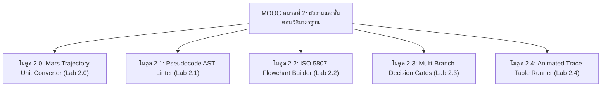

# วิทยาการคำนวณ 4 สื่อการเรียนรู้ดิจิทัลและคู่มือปฏิบัติการเสมือนจริงบนระบบ MOOC
## หมวดหมู่ที่ 2 การออกแบบขั้นตอนวิธีและผังงานมาตรฐาน
### รายวิชา 4122104 วิทยาการคำนวณสำหรับการสอนวิทยาศาสตร์
**ผู้พัฒนาหลักสูตร** ผู้ช่วยศาสตราจารย์ ดร.ชีวะ ทัศนา • สาขาวิชาฟิสิกส์ คณะวิทยาศาสตร์และเทคโนโลยี มหาวิทยาลัยราชภัฏรำไพพรรณี

---

## 🎯 ผลลัพธ์การเรียนรู้ประจำหมวดที่ 2
1. **CLO 1:** เขียนรหัสลำลอง ตามมาตรฐานสากลที่มีโครงสร้างชัดเจนและปราศจากความกำกวม
2. **CLO 2:** ออกแบบและวาดผังงาน ตามมาตรฐาน ISO 5807 ด้วยโครงสร้างควบคุม 3 รูปแบบ (ลำดับ ทางเลือก วนซ้ำ)
3. **CLO 3:** ดำเนินการตรวจสอบและกำจัดข้อผิดพลาดของขั้นตอนวิธีด้วยตารางไล่ค่าตัวแปร (Trace Table) ผ่านชุดห้องปฏิบัติการเสมือนจริง 2D/3D AR MediaPipe Hands

---

## 📚 รายละเอียด 5 โมดูลบทเรียนดิจิทัลและห้องปฏิบัติการเสมือนจริง

---

### 🔹 โมดูล 2.0 ปฐมบทขั้นตอนวิธี บทเรียนยานอวกาศ Mars กับมาตรฐานการสื่อสาร
* **เนื้อหาสื่อการสอน** วิเคราะห์กรณีศึกษาความผิดพลาดมูลค่า 327 ล้านดอลลาร์ของยาน Mars Climate Orbiter จากการไม่แปลงหน่วยแรงขับดัน ($lbf \cdot s$ vs $N \cdot s$)
* **ชุดปฏิบัติการเสมือนจริงประจำโมดูล**
  * **ชื่อแล็บ** `LAB 2.0 แบบจำลองการแปลงหน่วยวิถียานอวกาศดาวอังคาร`
  * **โหมดจำลอง** 2D Planetary Canvas $\leftrightarrow$ 3D AR MediaPipe Hands Spatial Orbiter
  * **ฟังก์ชันในตัว** ตารางบันทึกค่าแรงขับดัน, ระดับความสูงวงโคจร ($h$), สังเคราะห์เสียงไซเรนเตือนภัย / เสียง Chime สำเร็จ
  * **ลิงก์จำลองเสมือนจริง** [`chapter02_visual_flowchart_intro.html`](https://tsanaphy2023.github.io/computing-science/simulators/chapter02_visual_flowchart_intro.html)

---

### 🔹 โมดูล 2.1 การเขียนรหัสลำลองตามหลักสากลและการสร้างต้นไม้ไวยากรณ์
* **เนื้อหาสื่อการสอน** กฎไวยากรณ์สากล 5 ประการ, คำสงวนมาตรฐาน (`INPUT`, `OUTPUT`, `IF-THEN-ELSE-ENDIF`, `WHILE-ENDWHILE`), และการเยื้องวรรค (Indentation)
* **ชุดปฏิบัติการเสมือนจริงประจำโมดูล**
  * **ชื่อแล็บ** `LAB 2.1 ตัววิเคราะห์รหัสลำลองและต้นไม้ไวยากรณ์ 3D (Pseudocode AST Linter)`
  * **โหมดจำลอง** 2D Syntax Highlighter $\leftrightarrow$ 3D Glowing Abstract Syntax Tree
  * **ฟังก์ชันในตัว** ตรวจจับข้อผิดพลาด Missing Block Closure, แจ้งเตือนคำศัพท์เฉพาะทาง, และเรนเดอร์กิ่งไม้ 3 มิติ
  * **ลิงก์จำลองเสมือนจริง** [`chapter02_pseudocode_linter.html`](https://tsanaphy2023.github.io/computing-science/simulators/chapter02_pseudocode_linter.html)

---

### 🔹 โมดูล 2.2 สัญลักษณ์ผังงานมาตรฐาน ISO 5807 และโครงสร้างลำดับ
* **เนื้อหาสื่อการสอน** สัญลักษณ์ 5 รูปทรงเรขาคณิต (Terminator, Process, I/O, Decision, Connector) และการลากเส้น Flowline
* **ชุดปฏิบัติการเสมือนจริงประจำโมดูล**
  * **ชื่อแล็บ** `LAB 2.2 สตูดิโอประกอบผังงานมาตรฐานและทดสอบเลเซอร์ (Flowchart Builder Studio)`
  * **โหมดจำลอง** 2D Drag-and-Drop Canvas $\leftrightarrow$ 3D AR Spatial Flowchart Grid
  * **ฟังก์ชันในตัว** ลากเส้นเชื่อมโยงบล็อก, ปล่อยลำแสงเลเซอร์แสดงการไหลของข้อมูล, และทดสอบคะแนนสอบ ($Score \ge 50$)
  * **ลิงก์จำลองเสมือนจริง** [`chapter02_flowchart_builder.html`](https://tsanaphy2023.github.io/computing-science/simulators/chapter02_flowchart_builder.html)

---

### 🔹 โมดูล 2.3 โครงสร้างทางเลือกและการตัดสินใจหลายเงื่อนไข
* **เนื้อหาสื่อการสอน** โครงสร้าง Nested IF, ตรรกะบูลีนผสม (`AND`, `OR`, `NOT`), และการควบคุมระบบอัตโนมัติในโรงเรือนอัจฉริยะ (Smart Greenhouse)
* **ชุดปฏิบัติการเสมือนจริงประจำโมดูล**
  * **ชื่อแล็บ** `LAB 2.3 ประตูตรรกะและการตัดสินใจหลายเงื่อนไข Smart Farm`
  * **โหมดจำลอง** 2D Sensor Logic Schematic $\leftrightarrow$ 3D Holographic Greenhouse
  * **ฟังก์ชันในตัว** ปรับค่าอุณหภูมิ, ความชื้น, ระดับน้ำ, ทดสอบระบบพ่นหมอกอัตโนมัติ พร้อม Safety Lock
  * **ลิงก์จำลองเสมือนจริง** [`chapter02_decision_branching.html`](https://tsanaphy2023.github.io/computing-science/simulators/chapter02_decision_branching.html)

---

### 🔹 โมดูล 2.4 โครงสร้างวนซ้ำและการไล่ค่าตัวแปรด้วยตารางดรายรัน
* **เนื้อหาสื่อการสอน** กลไกการทำงานของลูป (`WHILE`, `FOR`), การคำนวณผลรวมอนุกรม $\sum_{i=1}^{n} i$, และการสร้างตาราง Trace Table
* **ชุดปฏิบัติการเสมือนจริงประจำโมดูล**
  * **ชื่อแล็บ** `LAB 2.4 ตารางไล่ค่าตัวแปรอนิเมชัน (Animated Trace Table Runner)`
  * **โหมดจำลอง** 2D Interactive Trace Grid $\leftrightarrow$ 3D Variable Memory Cubes
  * **ฟังก์ชันในตัว** ก้าวข้ามคำสั่งทีละบรรทัด (`STEP FORWARD`), อัปเดตค่า $i$ และ $Sum$ แบบสด, บันทึกตารางและพิมพ์ใบงาน
  * **ลิงก์จำลองเสมือนจริง** [`chapter02_trace_table_runner.html`](https://tsanaphy2023.github.io/computing-science/simulators/chapter02_trace_table_runner.html)

---

## 📋 ตารางสรุป 5 ปฏิบัติการเสมือนจริงประจำหมวดที่ 2 บนระบบ MOOC

| รหัสแล็บ | ชื่อการทดลอง | รูปแบบ | สาระสำคัญ | ลิงก์ตรงบน CDN |
| :---: | :--- | :---: | :--- | :--- |
| **LAB 2.0** | แบบจำลองการแปลงหน่วยยาน Mars | 2D/3D AR | ป้องกันบั๊กการคำนวณแรงขับดัน | [เข้าสู่ห้องทดลอง 2.0](https://tsanaphy2023.github.io/computing-science/simulators/chapter02_visual_flowchart_intro.html) |
| **LAB 2.1** | ตัววิเคราะห์รหัสลำลองและ AST | 2D/3D AR | ตรวจสอบกฎไวยากรณ์และบล็อกปิด | [เข้าสู่ห้องทดลอง 2.1](https://tsanaphy2023.github.io/computing-science/simulators/chapter02_pseudocode_linter.html) |
| **LAB 2.2** | สตูดิโอสร้างผังงานมาตรฐาน ISO | 2D/3D AR | ประกอบบล็อกเรขาคณิตและรันเลเซอร์ | [เข้าสู่ห้องทดลอง 2.2](https://tsanaphy2023.github.io/computing-science/simulators/chapter02_flowchart_builder.html) |
| **LAB 2.3** | ประตูตรรกะหลายเงื่อนไข Smart Farm | 2D/3D AR | ระบบควบคุมโรงเรือนเกษตรอัจฉริยะ | [เข้าสู่ห้องทดลอง 2.3](https://tsanaphy2023.github.io/computing-science/simulators/chapter02_decision_branching.html) |
| **LAB 2.4** | ตารางไล่ค่าตัวแปรอนิเมชัน | 2D/3D AR | ตรวจสอบลูปและหาผลรวมอนุกรม | [เข้าสู่ห้องทดลอง 2.4](https://tsanaphy2023.github.io/computing-science/simulators/chapter02_trace_table_runner.html) |

---
