# โครงร่างหลักสูตรสื่อการเรียนรู้ดิจิทัล เล่มที่ 4: สื่อบทเรียนออนไลน์บนระบบ MOOC
## ชื่อหนังสือ: วิทยาการคำนวณ 4: สื่อการเรียนรู้ดิจิทัลและคู่มือปฏิบัติการเสมือนจริงบนระบบ MOOC
### (Computing Science IV: Digital Learning Media & Virtual Interactive MOOC Curriculum)
**ผู้พัฒนาหลักสูตร:** ผู้ช่วยศาสตราจารย์ ดร.ชีวะ ทัศนา  
**สังกัด:** สาขาวิชาฟิสิกส์ คณะวิทยาศาสตร์และเทคโนโลยี มหาวิทยาลัยราชภัฏรำไพพรรณี  
**ระบบเผยแพร่:** RBRU MOOC / LMS (elearning.rbru.ac.th) และ GitHub Pages Global CDN

---

## 🎯 วัตถุประสงค์และสถาปัตยกรรมสื่อ MOOC เล่มที่ 4
เล่มที่ 4 เป็น **คู่มือและโครงสร้างสถาปัตยกรรมสื่อดิจิทัลแบบโต้ตอบ (Interactive E-Learning Courseware)** สำหรับเผยแพร่บนระบบ **RBRU MOOC** ประกอบด้วย **10 หมวดหมู่วิชาหลัก (Sections 1 ถึง 10) รวม 50 โมดูลบทเรียนเจาะลึก** แต่ละโมดูลมาพร้อมกับ:
1. **Interactive Coding Sandbox & Visual Algorithm**: กล่องทดลองเขียนโค้ดและแอนิเมชันขั้นตอนวิธี
2. **SVG Vector Math 100% Crispness**: สมการคณิตศาสตร์คมชัดทุกมิติ
3. **50 Virtual Lab Simulators**: ชุดจำลองสถานการณ์เสมือนจริงบน **GitHub Pages Global CDN**
4. **Concept Checks & Active Assessment**: คำถามทบทวนเชิงคิดวิเคราะห์ 3 ระดับ

---

## 📑 สารบัญและโครงสร้าง 10 หมวดหมู่หลักสูตร MOOC (50 โมดูลเจาะลึก)

```mermaid
graph TD
    A["RBRU MOOC: วิทยาการคำนวณและปัญญาประดิษฐ์"] --> S0["Section 0: ปฐมนิเทศ แบนเนอร์ และคู่มือ 50 Labs"]
    A --> S1["Section 1: ตรรกะและกระบวนการคิดเชิงคำนวณ (5 ตอน)"]
    A --> S2["Section 2: การออกแบบขั้นตอนวิธีและผังงานมาตรฐาน (5 ตอน)"]
    A --> S3["Section 3: พื้นฐานการเขียนโปรแกรมและการจัดการข้อมูล (5 ตอน)"]
    A --> S4["Section 4: โครงสร้างควบคุม เงื่อนไข และการทำซ้ำ (5 ตอน)"]
    A --> S5["Section 5: โครงสร้างข้อมูลและอัลกอริทึมการค้นหา (5 ตอน)"]
    A --> S6["Section 6: อัลกอริทึมการจัดเรียงและการวิเคราะห์ Big-O (5 ตอน)"]
    A --> S7["Section 7: การเขียนโปรแกรมเชิงโมดูลและฟังก์ชันเรียกซ้ำ (5 ตอน)"]
    A --> S8["Section 8: วิทยาศาสตร์เชิงคำนวณและแบบจำลองฟิสิกส์ (5 ตอน)"]
    A --> S9["Section 9: ปัญญาประดิษฐ์ คอมพิวเตอร์วิทัศน์ และ IoT (5 ตอน)"]
    A --> S10["Section 10: การพัฒนาโครงงานบูรณาการและการเผยแพร่ (5 ตอน)"]
```

---

### Section 0 ข้อมูลและข้อตกลงรายวิชา (Course Overview & Syllabus)
* **แบนเนอร์รายวิชา**: 16:9 8K Ambient Cyber Compositing ภาพ ผศ.ดร.ชีวะ ทัศนา
* **คำอธิบายรายวิชาและโครงสร้าง 3 หน่วยกิต (3-0-6)**
* **แผนผังผลลัพธ์การเรียนรู้ประจำรายวิชา (CLO 1–5 & PLO Mapping)**
* **เกณฑ์การสำเร็จการศึกษา (ผ่านการประเมินรวม $\ge 70\%$ พร้อมใบประกาศนียบัตรดิจิทัล)**

---

### Section 1 ตรรกะและกระบวนการคิดเชิงคำนวณ (5 โมดูล)
* **1.0 เรื่องเล่าเปิดบทเรียนและทำไมการคิดอย่างเป็นระบบจึงเปลี่ยนโลก**: ปริศนาข้ามแม่น้ำ, ตรรกะนิรนัย vs อุปนัย, Visual Logic Grid
* **1.1 เสาหลักที่ 1 การแยกส่วนประกอบและการย่อยปัญหา (Decomposition)**: การแตกปัญหาใหญ่ในวิทยาศาสตร์, กิจกรรมจำแนกระบบ
* **1.2 เสาหลักที่ 2 การหารูปแบบและความเหมือน (Pattern Recognition)**: อนุกรมคณิตศาสตร์, กราฟฟิสิกส์, การตรวจจับความถี่ซ้ำ
* **1.3 เสาหลักที่ 3 การคิดเชิงนามธรรม (Abstraction)**: การตัดรายละเอียดส่วนเกิน, แผนภาพวงจรและโมเดลย่อส่วน
* **1.4 เสาหลักที่ 4 การออกแบบขั้นตอนวิธีและ Unplugged Coding**: ลำดับขั้นตอนคำสั่ง deterministic, กิจกรรมสั่งการหุ่นยนต์

---

### Section 2 การออกแบบขั้นตอนวิธีและผังงานมาตรฐาน (5 โมดูล)
* **2.0 เรื่องเล่าเปิดบทเรียนและภาษาภาพแห่งความคิด**: จากกระบวนการคิดสู่สัญลักษณ์มาตรฐาน ANSI/ISO
* **2.1 การเขียนรหัสลำลองตามหลักสากล (Standard Pseudocode)**: ไวยากรณ์ INPUT, OUTPUT, COMPUTE, IF, WHILE, FOR
* **2.2 สัญลักษณ์ผังงานและโครงสร้างแบบเรียงลำดับ (Sequential Flowchart)**: กฎการเชื่อมต่อเส้นกระแสข้อมูล (Flowlines)
* **2.3 โครงสร้างผังงานแบบทางเลือกและการตัดสินใจ (Branching Flowchart)**: เงื่อนไขเดี่ยว เงื่อนไขคู่ และเงื่อนไขซับซ้อน
* **2.4 โครงสร้างผังงานแบบวนซ้ำและการตรวจสอบตารางดรายรัน (Trace Table)**: การทดสอบบั๊กบนกระดาษก่อนลงโค้ดจริง

---

### Section 3 พื้นฐานการเขียนโปรแกรมและการจัดการข้อมูล (5 โมดูล)
* **3.0 เรื่องเล่าเปิดบทเรียนและก้าวแรกสู่โลกแห่งภาษา Python**: ประวัติและจุดเด่นของ Python ในงานวิทยาศาสตร์
* **3.1 ตัวแปร กฎการตั้งชื่อ และตัวระบุสากล**: Dynamic Typing, Variable Assignment, Memory Address เบื้องต้น
* **3.2 ชนิดข้อมูลพื้นฐานและการแปลงชนิด (Data Types & Type Casting)**: int, float, str, bool, type conversion
* **3.3 ตัวดำเนินการทางคณิตศาสตร์ ลำดับ PEMDAS และนิพจน์สัมพันธ์**: `+`, `-`, `*`, `/`, `//`, `%`, `**`
* **3.4 การรับข้อมูลเข้าและการจัดรูปแบบการแสดงผล (f-string Formatting)**: `input()`, `print()`, f-strings formatting

---

### Section 4 โครงสร้างควบคุม เงื่อนไข และการทำซ้ำ (5 โมดูล)
* **4.0 เรื่องเล่าเปิดบทเรียนและการจำลองระบบตัดสินใจอัตโนมัติ**: ตัวอย่างระบบเซนเซอร์และสมองกลอัจฉริยะ
* **4.1 โครงสร้างทางเลือก if, if-else และการประเมินตรรกะ**: การตรวจสอบเกณฑ์คะแนน, การตรวจสอบเลขคู่คี่
* **4.2 โครงสร้างเงื่อนไขหลายชั้น if-elif-else และ Nested Conditions**: โปรแกรมคำนวณดัชนีมวลกาย BMI และคำแนะนำสุขภาพ
* **4.3 การวนซ้ำด้วย for loop และฟังก์ชัน range()**: การประมวลผลอนุกรมเลข, การคำนวณผลรวม $\sum_{i=1}^n i$
* **4.4 การวนซ้ำด้วย while loop และคำสั่งควบคุม break / continue**: เกมทายตัวเลข, ระบบล็อกอินตรวจรหัสผ่าน

---

### Section 5 โครงสร้างข้อมูลและอัลกอริทึมการค้นหา (5 โมดูล)
* **5.0 เรื่องเล่าเปิดบทเรียนและศิลปะการจัดเก็บข้อมูลให้ค้นหาง่าย**: ดาต้าเบสและดัชนีสืบค้น
* **5.1 รายการแบบไดนามิก List และ List Comprehension**: Indexing, Slicing, List operations, Vector Lists
* **5.2 โครงสร้าง Tuple, Set และ Dictionary**: Key-Value Hashing, เซตทางคณิตศาสตร์, ทูเพิลพิกัด 3 มิติ
* **5.3 อัลกอริทึมการค้นหาแบบเชิงเส้น (Linear Search)**: การสแกนข้อมูล $O(n)$, กรณีที่ดีที่สุดและแย่ที่สุด
* **5.4 อัลกอริทึมการค้นหาแบบทวิภาค (Binary Search)**: กลไกแบ่งครึ่งช่วง $O(\log n)$, การประยุกต์กับฐานข้อมูลที่เรียงแล้ว

---

### Section 6 อัลกอริทึมการจัดเรียงและการวิเคราะห์ Big-O (5 โมดูล)
* **6.0 เรื่องเล่าเปิดบทเรียนและการประลองความเร็วของอัลกอริทึม**: การวัดเวลา Execution Time vs Big-O
* **6.1 การวิเคราะห์สัญกรณ์โอใหญ่ (Big-O Notation)**: $O(1), O(\log n), O(n), O(n \log n), O(n^2)$
* **6.2 บับเบิลซอร์ต (Bubble Sort) และซีเลกชันซอร์ต (Selection Sort)**: กราฟิกจำลองการสลับค่าทีละคู่
* **6.3 อินเซอร์ชันซอร์ต (Insertion Sort)**: การจัดเรียงแบบแทรกข้อมูลและการประยุกต์กับข้อมูลเกือบเรียง
* **6.4 เมิร์จซอร์ต (Merge Sort) และการแบ่งแยกเพื่อพิชิต (Divide & Conquer)**: พลังของอัลกอริทึม $O(n \log n)$

---

### Section 7 การเขียนโปรแกรมเชิงโมดูลและฟังก์ชันเรียกซ้ำ (5 โมดูล)
* **7.0 เรื่องเล่าเปิดบทเรียนและสถาปัตยกรรมโค้ดที่สะอาดและยั่งยืน (Clean Architecture)**
* **7.1 การออกแบบฟังก์ชัน พารามิเตอร์ และค่าคืนกลับ (Functions & Return)**: Pure Functions, Default Args, Scope
* **7.2 การสร้างโมดูลและการใช้งานไลบรารีมาตรฐาน (Python Modules)**: math, random, time, os, sys
* **7.3 การอ่านเขียนไฟล์และการจัดการข้อมูล CSV / JSON**: การบันทึก Log การทดลอง, Data Parsing
* **7.4 ฟังก์ชันเรียกซ้ำ (Recursion) และปริศนาหอคอยฮานอย**: Base Case, Recursive Step, Call Stack Simulation

---

### Section 8 วิทยาศาสตร์เชิงคำนวณและแบบจำลองฟิสิกส์ (5 โมดูล)
* **8.0 เรื่องเล่าเปิดบทเรียนและการค้นพบทางวิทยาศาสตร์ผ่านการจำลอง (Simulation Science)**
* **8.1 การคำนวณเชิงเวกเตอร์และเมทริกซ์ด้วย NumPy**: การกระจายการคำนวณ Array, Dot Product
* **8.2 การแสดงผลข้อมูลเชิงวิชาการด้วย Matplotlib**: กราฟ 2 มิติ, แผนภูมิกระจัด-ความเร็ว-ความเร่ง
* **8.3 แบบจำลองการเคลื่อนที่แบบโพรเจกไทล์ (Projectile Motion Simulator)**: วิถีลูกบอล, แรงต้านอากาศ Euler Method
* **8.4 แบบจำลองการสั่นฮาร์มอนิกอย่างง่ายและคลื่น (Harmonic Motion & Wave Sim)**: การสั่นของสปริง, คลื่นนิ่ง

---

### Section 9 ปัญญาประดิษฐ์ คอมพิวเตอร์วิทัศน์ และ IoT (5 โมดูล)
* **9.0 เรื่องเล่าเปิดบทเรียนและยุคสมัยแห่งปัญญาประดิษฐ์และเซนเซอร์รอบตัว**: ปฏิวัติอุตสาหกรรม 4.0
* **9.1 แมชชีนเลิร์นนิงเชิงประยุกต์ด้วย Scikit-learn**: การจำแนกประเภทข้อมูล (Classification) และถดถอย (Regression)
* **9.2 การประมวลผลภาพดิจิทัลและตรวจจับสีด้วย OpenCV**: Image Filtering, Edge Detection, Color Segmentation
* **9.3 คอมพิวเตอร์วิทัศน์และการตรวจจับท่าทางมือ 3 มิติ MediaPipe**: 21 Hand Landmarks Tracking
* **9.4 อินเทอร์เน็ตของสรรพสิ่ง (IoT) และระบบฟาร์มเกษตรอัจฉริยะ**: การอ่านค่าเซนเซอร์ ESP32/Micro:bit สู่คลาวด์

---

### Section 10 การพัฒนาโครงงานบูรณาการและการเผยแพร่ (5 โมดูล)
* **10.0 เรื่องเล่าเปิดบทเรียนและจากไอเดียสู่โครงงานนวัตกรรมจริง**: ตัวอย่างโครงงานชนะเลิศระดับชาติ
* **10.1 วงจรการพัฒนาโครงงาน SDLC และกระบวนการคิดเชิงออกแบบ (Design Thinking)**
* **10.2 การทดสอบระบบ การดีบัก และความปลอดภัยสารสนเทศ (Testing & Cybersecurity)**
* **10.3 การเขียนรายงานโครงงาน 5 บทตามมาตรฐานวิชาการ (Technical Writing)**
* **10.4 การจัดทำโปสเตอร์ 16:9 การนำเสนอแบบมืออาชีพ และบทสรุปส่งท้ายหลักสูตร**

---

## 🌐 แพลตฟอร์มเผยแพร่และการผสานรวมระดับคลาวด์ (Cloud Integrations)
* **Moodle LMS Portal**: `https://elearning.rbru.ac.th/course/view.php?id=<course_id>`
* **GitHub Pages CDN**: `https://tsanaphy2023.github.io/ar-physics/` และคลังซอร์สโค้ด GitHub
* **Interactive Code Runner**: Jupyter Lite / Pyodide WebAssembly Sandbox ฝังตัวบนหน้าเว็บ
