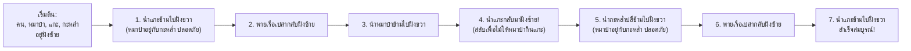
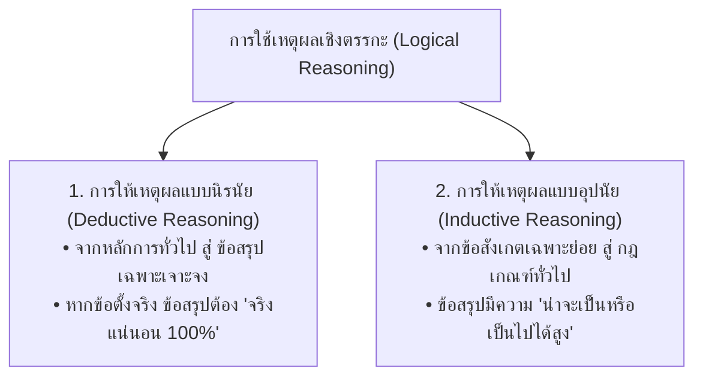

# วิทยาการคำนวณ 1: รากฐานแนวคิดเชิงคำนวณและการแก้ปัญหาอย่างเป็นระบบ
## บทที่ 1 การใช้เหตุผลเชิงตรรกะและการแก้ปัญหา
**ผู้เขียน:** ผู้ช่วยศาสตราจารย์ ดร.ชีวะ ทัศนา • สาขาวิชาฟิสิกส์ คณะวิทยาศาสตร์และเทคโนโลยี มหาวิทยาลัยราชภัฏรำไพพรรณี

---

## 🎯 ผลลัพธ์การเรียนรู้ประจำบท (Behavioral Learning Outcomes)
เมื่อศึกษาบทเรียนนี้จบแล้ว ผู้เรียนสามารถ:
1. **อธิบาย (Explain)** นิยาม ความสำคัญ และความแตกต่างระหว่างการใช้เหตุผลเชิงตรรกะแบบนิรนัย (Deductive) และอุปนัย (Inductive) ได้อย่างถูกต้อง
2. **วิเคราะห์ (Analyze)** สถานการณ์ เงื่อนไข และตรรกะความจริง-เท็จของประพจน์เดี่ยวและประพจน์เชิงประกอบด้วยตารางค่าความจริง (Truth Table) ได้อย่างแม่นยำ
3. **ประยุกต์ใช้ (Apply)** กฎตรรกศาสตร์ในการแก้ปัญหาปริศนาเชิงตรรกะ (Logic Grid Puzzles) และการตัดสินใจในชีวิตประจำวัน
4. **สร้างสรรค์ (Create)** โปรแกรม Python จำลองการตรวจสอบเงื่อนไขทางตรรกะและระบบประเมินความปลอดภัยอัจฉริยะ

---

## 🌌 1.0 เรื่องเล่าเปิดบทเรียน: ปริศนาข้ามแม่น้ำกับภาษาของจักรวาล

ลองจินตนาการถึงสถานการณ์คลาสสิกของนักเดินทางคนหนึ่งที่ต้องนำ **หมาป่า (Wolf)**, **แกะ (Sheep)**, และ **กะหล่ำปลี (Cabbage)** ข้ามแม่น้ำไปยังอีกฝั่งหนึ่ง โดยมีเรือพายขนาดเล็กที่สามารถบรรทุกตัวเขาและสิ่งของได้เพียง **1 อย่างเท่านั้นในแต่ละเที่ยว**

<div style="background: linear-gradient(135deg, #0f172a, #1e293b); border-left: 5px solid #10b981; border-radius: 12px; padding: 20px 24px; margin: 20px 0; color: #f8fafc;">
  <h4 style="color: #34d399; margin-top: 0;">⚠️ ข้อจำกัดและกฎเหล็กของสถานการณ์ (Constraints)</h4>
  <ul style="line-height: 1.8; color: #cbd5e1; margin-bottom: 0;">
    <li>หากมนุษย์ไม่อยู่คุม <strong>หมาป่าจะกินแกะ</strong> ทันที ($Wolf \land Sheep \rightarrow Danger$)</li>
    <li>หากมนุษย์ไม่อยู่คุม <strong>แกะจะกินกะหล่ำปลี</strong> ทันที ($Sheep \land Cabbage \rightarrow Danger$)</li>
    <li>หมาป่าไม่กินกะหล่ำปลี ($Wolf \land Cabbage \rightarrow Safe$)</li>
  </ul>
</div>

หากเราแก้ปัญหานี้ด้วยการ "เดาสุ่ม" หรือลองผิดลองถูก (Trial and Error) โอกาสที่แกะหรือกะหล่ำปลีจะถูกกินย่อมเกิดขึ้นในเที่ยวแรกๆ แต่หากเราใช้ **การใช้เหตุผลเชิงตรรกะ (Logical Reasoning)** วิเคราะห์สถานะ (States) และการเปลี่ยนสถานะ (Transitions) เราจะพบขั้นตอนวิธี (Algorithm) 7 ขั้นตอนที่ปลอดภัย 100%:



นี่คือตัวอย่างอันทรงพลังที่แสดงให้เห็นว่า **ตรรกะ (Logic)** ไม่ใช่สูตรคณิตศาสตร์ที่ไร้ชีวิตชีวา แต่เป็น "ระเบียบแบบแผนแห่งความคิด" ที่ช่วยให้มนุษย์และคอมพิวเตอร์ก้าวข้ามความสับสนวุ่นวายไปสู่ทางออกที่ถูกต้องเสมอ

---

## 🏛️ 1.1 นิยามและรากฐานของการใช้เหตุผลเชิงตรรกะ

**การใช้เหตุผลเชิงตรรกะ (Logical Reasoning)** คือ กระบวนการเชื่อมโยงความจริง ข้อเท็จจริง หรือข้อสมมติฐานเดิม (Premises) ไปสู่ข้อสรุปใหม่ (Conclusion) อย่างสมเหตุสมผลตามหลักเหตุและผล โดยแบ่งออกเป็น 2 รูปแบบหลัก:



### 1. การให้เหตุผลแบบนิรนัย (Deductive Reasoning)
* **โครงสร้าง:** 
  * ข้อตั้งหลัก (Major Premise): มนุษย์ทุกคนต้องตาย ($All\ M\ are\ P$)
  * ข้อตั้งย่อย (Minor Premise): โสกราตีสเป็นมนุษย์ ($S\ is\ M$)
  * ข้อสรุป (Conclusion): ดังนั้น โสกราตีสต้องตาย ($S\ is\ P$)
* **บทบาทในวิทยาการคำนวณ:** ใช้ในการพิสูจน์ความถูกต้องของโปรแกรม (Program Verification), การออกแบบสถาปัตยกรรมชิปประมวลผล, และระบบตรรกะเงื่อนไข (Rule-based Systems)

### 2. การให้เหตุผลแบบอุปนัย (Inductive Reasoning)
* **โครงสร้าง:**
  * ข้อสังเกต 1: กาตัวที่ 1 มีสีดำ
  * ข้อสังเกต 2: กาตัวที่ 2 มีสีดำ ... กาตัวที่ 1,000 มีสีดำ
  * ข้อสรุป: กาทุกตัวในโลกน่าจะมีสีดำ
* **บทบาทในวิทยาการคำนวณ:** เป็นรากฐานสำคัญของ **ปัญญาประดิษฐ์และการเรียนรู้ของเครื่อง (Machine Learning / Data Science)** ที่เรียนรู้รูปแบบ (Patterns) จากข้อมูลตัวอย่างในอดีตเพื่อพยากรณ์อนาคต

---

## ⚡ 1.2 ตัวดำเนินการทางตรรกศาสตร์และตารางค่าความจริง (Truth Tables)

ในระบบคอมพิวเตอร์ ตรรกะถูกแทนด้วยค่าบูลีน (Boolean) 2 สถานะ คือ **จริง (True / 1)** และ **เท็จ (False / 0)**

<div style="background: linear-gradient(135deg, #f0fdf4, #dcfce7); border-left: 5px solid #16a34a; border-radius: 12px; padding: 18px 22px; margin: 20px 0; color: #14532d;">
  <h4 style="color: #15803d; margin-top: 0;">📌 3 ตัวดำเนินการตรรกศาสตร์แกนกลาง</h4>
  <p style="margin: 0; line-height: 1.7;">
    1. <strong>AND ($\land$ หรือ <code>and</code>):</strong> จะเป็นจริงเมื่อ <em>ทุกเงื่อนไขเป็นจริงพร้อมกัน</em> เท่านั้น<br>
    2. <strong>OR ($\lor$ หรือ <code>or</code>):</strong> จะเป็นจริงเมื่อ <em>มีเงื่อนไขใดเงื่อนไขหนึ่งเป็นจริง</em><br>
    3. <strong>NOT ($\neg$ หรือ <code>not</code>):</strong> กลับค่าความจริง จากจริงเป็นเท็จ และจากเท็จเป็นจริง
  </p>
</div>

### ตารางค่าความจริงเปรียบเทียบ (Master Truth Table)

| ประพจน์ $P$ | ประพจน์ $Q$ | $P \land Q$ (AND) | $P \lor Q$ (OR) | $\neg P$ (NOT) | $P \oplus Q$ (XOR) | $P \rightarrow Q$ (IF-THEN) |
| :---: | :---: | :---: | :---: | :---: | :---: | :---: |
| **True (1)** | **True (1)** | **True (1)** | **True (1)** | False (0) | False (0) | **True (1)** |
| **True (1)** | **False (0)**| False (0) | **True (1)** | False (0) | **True (1)** | False (0) |
| **False (0)**| **True (1)** | False (0) | **True (1)** | **True (1)** | **True (1)** | **True (1)** |
| **False (0)**| **False (0)**| False (0) | False (0) | **True (1)** | False (0) | **True (1)** |

---

## 📝 1.3 ตัวอย่างโจทย์เชิงลึกและการวิเคราะห์ตรรกะแบบเป็นขั้นตอน

<div style="background: #ffffff; border: 1px solid #cbd5e1; border-radius: 14px; margin-bottom: 20px; overflow: hidden; box-shadow: 0 4px 12px rgba(0,0,0,0.05);">
  <div style="background: #f8fafc; padding: 14px 20px; border-bottom: 1px solid #e2e8f0; display: flex; align-items: center; justify-content: space-between;">
    <span style="font-weight: 700; color: #0284c7; font-size: 1.05em;">📝 ตัวอย่างที่ 1.1: การออกแบบระบบล็อกเซฟธนาคารอัจฉริยะ (Smart Vault Logic)</span>
    <span style="background: #e0f2fe; color: #0369a1; font-size: 0.80em; font-weight: 700; padding: 3px 10px; border-radius: 20px;">ประยุกต์ใช้งานจริง</span>
  </div>
  <div style="padding: 20px 24px; color: #334155; line-height: 1.8;">
    <p>
      <strong>สถานการณ์:</strong> ตู้นิรภัยของห้องปฏิบัติการวิจัยฟิสิกส์จะเปิดออก ($Unlock = True$) ก็ต่อเมื่อ:
      <br>1. ผู้จัดการ ($M$) ใส่รหัสผ่านถูกต้อง <strong>และ</strong>
      <br>2. มีนักวิจัยคนที่หนึ่ง ($R_1$) <strong>หรือ</strong> นักวิจัยคนที่สอง ($R_2$) สแกนลายนิ้วมือ <strong>และ</strong>
      <br>3. สัญญาณเตือนภัยไฟไหม้ ($Fire$) ต้อง <strong>ไม่ทำงาน</strong>
    </p>
    
    <details style="background: #f8fafc; border: 1px solid #cbd5e1; border-radius: 10px; padding: 14px 18px; margin-top: 12px; cursor: pointer;">
      <summary style="font-weight: 700; color: #0284c7;">👉 คลิกเพื่อดูการแปลงเป็นสมการตรรกะและเฉลยละเอียด</summary>
      <div style="margin-top: 14px; border-top: 1px dashed #cbd5e1; padding-top: 14px;">
        <p><strong>ขั้นตอนที่ 1: แปลงข้อความเป็นนิพจน์บูลีน (Boolean Expression)</strong></p>
        <div style="background: #0f172a; color: #00f0ff; padding: 12px 18px; border-radius: 8px; font-family: monospace; font-size: 1.1em; text-align: center; margin: 10px 0;">
          Unlock = M and (R1 or R2) and (not Fire)
        </div>
        <p><strong>ขั้นตอนที่ 2: ตรวจสอบกรณีทดสอบ (Test Case Analysis)</strong></p>
        <ul>
          <li>หาก $M = 1, R_1 = 1, R_2 = 0, Fire = 0 \rightarrow 1 \land (1 \lor 0) \land \neg 0 = 1 \land 1 \land 1 = \mathbf{True}$ (ประตูเปิด)</li>
          <li>หาก $M = 1, R_1 = 0, R_2 = 0, Fire = 0 \rightarrow 1 \land (0 \lor 0) \land \neg 0 = 1 \land 0 \land 1 = \mathbf{False}$ (ประตูปิด)</li>
          <li>หาก $M = 1, R_1 = 1, R_2 = 1, Fire = 1 \rightarrow 1 \land (1 \lor 1) \land \neg 1 = 1 \land 1 \land 0 = \mathbf{False}$ (ระบบล็อกเพื่อความปลอดภัย)</li>
        </ul>
        <div style="background: #ecfdf5; border-left: 4px solid #10b981; padding: 10px 16px; border-radius: 6px; color: #065f46; font-weight: 600; margin-top: 10px;">
          🎯 สรุป: นิพจน์ตรรกะนี้รัดกุม 100% สามารถนำไปเขียนโปรแกรมควบคุมไมโครคอนโทรลเลอร์ได้ทันที
        </div>
      </div>
    </details>
  </div>
</div>

---

## 💻 1.4 โค้ดคอมพิวเตอร์จำลองระบบตรรกะ (Self-Contained Python)

โค้ดภาษา Python ต่อไปนี้สามารถรันได้ทันทีโดยไม่มีการย่อโค้ด ทำหน้าที่จำลองการประเมินตรรกะและการสร้างตารางค่าความจริงอัตโนมัติ:

```python
# logic_truth_table_simulator.py
# โปรแกรมจำลองการวิเคราะห์ตรรกศาสตร์และสร้างตารางค่าความจริงอัตโนมัติ
# ผู้เขียน: ผศ.ดร.ชีวะ ทัศนา (มรภ.รำไพพรรณี)

def evaluate_smart_vault(manager_pin: bool, researcher1: bool, researcher2: bool, fire_alarm: bool) -> bool:
    """ประเมินเงื่อนไขการเปิดตู้นิรภัยอัจฉริยะตามกฎตรรกศาสตร์"""
    can_unlock = manager_pin and (researcher1 or researcher2) and (not fire_alarm)
    return can_unlock

def generate_full_truth_table():
    """สร้างและพิมพ์ตารางค่าความจริงครบทั้ง 16 กรณี"""
    print("=" * 65)
    print(f"{'Manager':<10} | {'Res1':<8} | {'Res2':<8} | {'Fire':<8} | {'Unlock Status':<15}")
    print("=" * 65)
    
    inputs = [True, False]
    valid_unlock_count = 0
    
    for m in inputs:
        for r1 in inputs:
            for r2 in inputs:
                for fire in inputs:
                    result = evaluate_smart_vault(m, r1, r2, fire)
                    if result:
                        valid_unlock_count += 1
                    status_str = "🔓 UNLOCKED" if result else "🔒 LOCKED"
                    print(f"{str(m):<10} | {str(r1):<8} | {str(r2):<8} | {str(fire):<8} | {status_str:<15}")
                    
    print("=" * 65)
    print(f"📊 สรุปผล: มีทั้งหมด 16 กรณีทดสอบ | สามารถปลดล็อกได้สำเร็จ: {valid_unlock_count} กรณี")

if __name__ == "__main__":
    generate_full_truth_table()
```

---

## 🧪 1.5 กิจกรรมปฏิบัติการแล็บ Unplugged: Logic Grid Master

### วัตถุประสงค์
เพื่อฝึกทักษะการตัดตัวเลือก (Elimination Logic) และการสร้างข้อสรุปที่แน่นอนจากชุดเงื่อนไขที่กำหนด

### ปริศนา "ใครคือนักวิจัยประจำห้องแล็บใด"
กำหนดให้นักวิจัย 3 ท่าน ได้แก่ **ดร.อรุณ**, **ดร.บุญส่ง**, และ **ดร.จินดา** ทำงานในห้องแล็บฟิสิกส์ 3 สาขา ได้แก่ **ควอนตัม (Quantum)**, **ทัศนศาสตร์ (Optics)**, และ **ดาราศาสตร์ (Astronomy)** โดยมีเบาะแสดังนี้:
1. ดร.อรุณ ไม่ชอบการดูดาว และไม่ได้ทำงานในห้องแล็บดาราศาสตร์
2. ผู้ที่ทำงานในห้องแล็บควอนตัม สวมแว่นตากรอบสีฟ้า
3. ดร.บุญส่ง ทำงานวิจัยเกี่ยวกับการหักเหของแสงเลเซอร์
4. ดร.จินดา สวมแว่นตากรอบสีฟ้า

### ตาราง Logic Grid สำหรับบันทึกผลการวิเคราะห์

| รายชื่อนักวิจัย | ห้องแล็บควอนตัม | ห้องแล็บทัศนศาสตร์ | ห้องแล็บดาราศาสตร์ | ข้อสรุปสาขาวิจัย |
| :--- | :---: | :---: | :---: | :--- |
| **ดร.อรุณ** | ❌ (จากเงื่อนไข 2, 4) | ❌ (จากเงื่อนไข 3) | ✅ (โดยการตัดตัวเลือก) | **ดาราศาสตร์ฟิสิกส์** |
| **ดร.บุญส่ง** | ❌ (จากเงื่อนไข 2, 4) | ✅ (จากเงื่อนไข 3 แสงเลเซอร์) | ❌ | **ทัศนศาสตร์** |
| **ดร.จินดา** | ✅ (จากเงื่อนไข 2, 4 แว่นฟ้า) | ❌ | ❌ | **ควอนตัมฟิสิกส์** |

---

## 💡 1.6 สรุปใจความสำคัญและแบบฝึกหัดท้ายบทที่ 1

### 📌 สรุปประเด็นสำคัญ
1. **การใช้เหตุผลเชิงตรรกะ** เป็นรากฐานสำคัญในการวิเคราะห์และจัดโครงสร้างความคิดก่อนลงมือเขียนโปรแกรม
2. **การให้เหตุผลแบบนิรนัย** การันตีความถูกต้อง 100% หากข้อตั้งจริง ขณะที่ **การให้เหตุผลแบบอุปนัย** ให้ข้อสรุปเชิงความน่าจะเป็นที่เป็นหัวใจของ AI
3. **ตัวดำเนินการ AND, OR, NOT** คืออิฐบล็อกพื้นฐานในการสร้างระบบตัดสินใจที่ซับซ้อนในคอมพิวเตอร์

---

### 📝 แบบฝึกหัดทบทวน 3 ระดับ (Exercises)

#### ระดับที่ 1: ความรู้ความเข้าใจพื้นฐาน (Basic Knowledge)
1. จงเขียนตารางค่าความจริงของนิพจน์ $\neg (P \lor Q)$ และพิสูจน์ว่าสมมูลกับ $(\neg P) \land (\neg Q)$ ตามกฎของเดอมอร์แกน (De Morgan's Laws) หรือไม่
2. จงระบุว่าการสรุปต่อไปนี้เป็นแบบ **นิรนัย** หรือ **อุปนัย**: "โลหะทองแดงนำไฟฟ้า โลหะเงินนำไฟฟ้า โลหะเหล็กนำไฟฟ้า ดังนั้น โลหะทุกชนิดในโลกนำไฟฟ้า"

#### ระดับที่ 2: การวิเคราะห์และประยุกต์ใช้ (Analytical Application)
3. ระบบเปิด-ปิดไฟถนนอัตโนมัติจะทำงาน ($LightOn = True$) เมื่อ:
   * เซนเซอร์วัดแสงตรวจพบความมืด ($Dark = True$) **หรือ**
   * เวลาปัจจุบันอยู่ในช่วง 18.00–06.00 น. ($Night = True$) **และ**
   * สวิตช์หลักควบคุมโดยเจ้าหน้าที่ต้องไม่ถูกปิด ($OverrideOff = False$)  
   *จงเขียนนิพจน์บูลีนและตารางค่าความจริงของระบบนี้*

#### ระดับที่ 3: การคิดขั้นสูงและบูรณาการ (Advanced Synthesis)
4. จงเขียนโปรแกรม Python รับค่าอายุของผู้เข้าชม ($Age$) และสถานะบัตรสมาชิก ($isMember$) เพื่อคำนวณราคาตั๋วเข้าชมพิพิธภัณฑ์วิทยาศาสตร์ตามเงื่อนไข:
   * เด็กอายุต่ำกว่า 12 ปี หรือ ผู้สูงอายุ 60 ปีขึ้นไป เข้าชมฟรี (0 บาท)
   * บุคคลทั่วไปอายุ 12–59 ปี หากมีบัตรสมาชิกเสีย 50 บาท หากไม่มีเสีย 100 บาท
