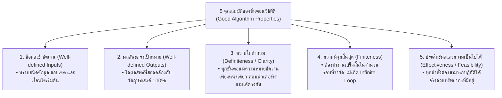
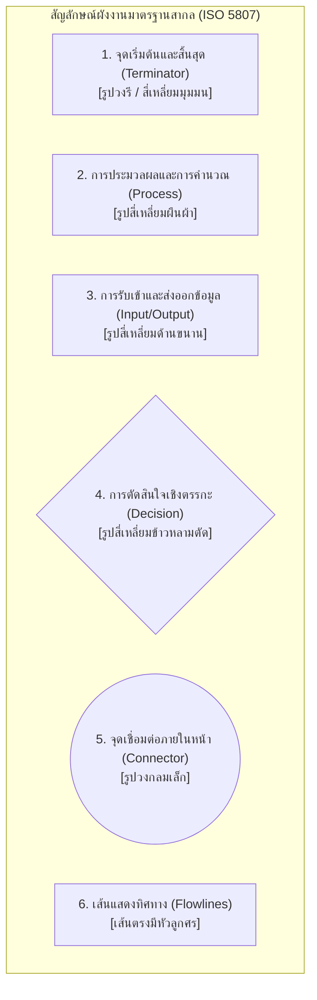
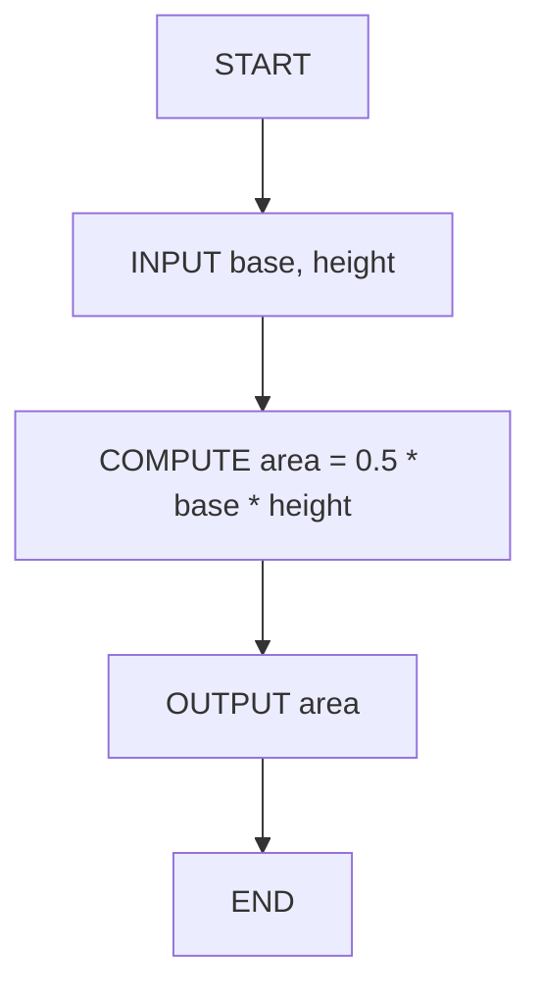
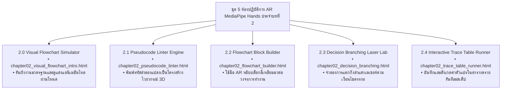

# วิทยาการคำนวณ 1: รากฐานแนวคิดเชิงคำนวณและการแก้ปัญหาอย่างเป็นระบบ
## บทที่ 2 การออกแบบขั้นตอนวิธี รหัสลำลอง และผังงานมาตรฐานสากล
### (Algorithmic Design, Standard Pseudocode & ISO 5807 Flowcharts)
**ผู้เขียน:** ผู้ช่วยศาสตราจารย์ ดร.ชีวะ ทัศนา  
**สังกัด:** สาขาวิชาฟิสิกส์ คณะวิทยาศาสตร์และเทคโนโลยี มหาวิทยาลัยราชภัฏรำไพพรรณี  
**เอกสารประกอบรายวิชา:** 4122104 วิทยาการคำนวณและการแก้ปัญหาเชิงคำนวณ / การสอนวิทยาการคำนวณ

---

## 📋 แผนบริหารการสอนประจำบทที่ 2

### 1. หัวข้อเนื้อหาประจำบท
1. **เรื่องเล่าเปิดบทเรียนและภาษาภาพแห่งความคิด:** โศกนาฏกรรมยานอวกาศ Mars Climate Orbiter (1999) กับความสำคัญของการสื่อสารขั้นตอนวิธีที่ไม่กำกวม
2. **รากฐานการออกแบบขั้นตอนวิธี (Algorithmic Foundations):** นิยาม คุณสมบัติ 5 ประการของอัลกอริทึม และระดับของภาษาการสื่อสาร
3. **มาตรฐานการเขียนรหัสลำลองสากล (Standard Pseudocode Syntax):** โครงสร้างไวยากรณ์คำสำคัญ `INPUT`, `OUTPUT`, `COMPUTE`, `IF-THEN-ELSE`, `WHILE`, `FOR`
4. **สัญลักษณ์ผังงานมาตรฐาน ISO 5807 / ANSI:** ความหมาย การใช้งาน และข้อกำหนดทางวิศวกรรมซอฟต์แวร์
5. **3 โครงสร้างการควบคุมหลัก (Three Fundamental Control Structures):**
   * โครงสร้างแบบเรียงลำดับ (Sequential Structure)
   * โครงสร้างแบบทางเลือกและการตัดสินใจ (Selection / Branching Structure)
   * โครงสร้างแบบวนซ้ำ (Iteration / Repetition Structure)
6. **การตรวจสอบความถูกต้องด้วยตารางดรายรัน (Dry-Run Verification & Trace Table):** เทคนิคการติดตามค่าตัวแปรในหน่วยความจำทีละบรรทัด และอัลกอริทึมของยูคลิด (Euclidean Algorithm)
7. **การประยุกต์ใช้โปรแกรมคอมพิวเตอร์:** การเขียนโปรแกรมภาษา Python 3.11 จำลองกลไกผังงานและสร้าง Trace Table อัตโนมัติ
8. **คู่มือห้องปฏิบัติการเสมือนจริง 3D AR MediaPipe:** การต่อบล็อกผังงานในอวกาศ 3 มิติและการจำลองลำแสงเลเซอร์ตัดสินใจ

### 2. วัตถุประสงค์เชิงพฤติกรรม (Behavioral Learning Outcomes)
เมื่อศึกษาบทเรียนนี้จบแล้ว ผู้เรียนสามารถ:
1. **อธิบาย (Explain)** นิยาม ความสำคัญ และบทบาทของขั้นตอนวิธี รหัสลำลอง และผังงานมาตรฐานในการพัฒนาซอฟต์แวร์ทางวิทยาศาสตร์ได้อย่างถูกต้อง
2. **เขียน (Construct)** รหัสลำลองตามมาตรฐานสากลเพื่อแก้ปัญหาทางคณิตศาสตร์และวิทยาศาสตร์ได้อย่างเป็นระบบ
3. **ออกแบบและวาด (Design & Draw)** ผังงานตามมาตรฐาน ISO 5807 โดยใช้โครงสร้างแบบเรียงลำดับ ทางเลือก และวนซ้ำได้อย่างแม่นยำ
4. **วิเคราะห์และตรวจสอบ (Analyze & Trace)** ข้อผิดพลาดของขั้นตอนวิธีด้วยตารางดรายรัน (Trace Table) ทีละขั้นตอนได้อย่างถูกต้อง 100%
5. **สร้างสรรค์ (Create)** โปรแกรมภาษา Python 3.11 ที่แปลงผังงานและการวนซ้ำไปสู่การทำงานจริงบนคอมพิวเตอร์ได้
6. **ปฏิบัติการ (Operate)** การทดลองเสมือนจริง 3D AR MediaPipe Hands เพื่อควบคุมทิศทางการไหลของข้อมูลในผังงานแบบไร้สัมผัสได้อย่างคล่องแคล่ว

### 3. กิจกรรมการเรียนการสอน (Active Learning Cycle)
* **ขั้นนำเข้าสู่บทเรียน (Input / Engage):** ฉายภาพจำลองวิถียาน Mars Climate Orbiter และชวนผู้เรียนวิเคราะห์ว่าทำไมข้อผิดพลาดในการแปลงหน่วยเพียงจุดเดียวจึงทำให้ยานมูลค่าหลายร้อยล้านดอลลาร์สูญสลายในชั้นบรรยากาศ
* **ขั้นจัดกิจกรรมการเรียนรู้ (Process / Explore & Explain):**
  * บรรยายสัญลักษณ์ผังงาน ISO 5807 และฝึกเขียน Pseudocode ตามโจทย์สถานการณ์
  * กิจกรรมกลุ่มย่อย (Peer Review): สลับกันตรวจสอบตาราง Trace Table เพื่อค้นหาจุดบกพร่อง (Logic Bug)
  * สาธิตการเขียนโค้ด Python ตรวจสอบขั้นตอนวิธีหา ห.ร.ม. ของยูคลิด
* **ขั้นประยุกต์และสรุปผล (Output / Elaborate & Evaluate):**
  * ผู้เรียนเข้าสู่ห้องปฏิบัติการเสมือนจริง 3D AR MediaPipe (`chapter02_visual_flowchart_intro.html` ถึง `chapter02_trace_table_runner.html`)
  * ทำแบบประเมินตนเอง Quick Concept Check และตอบคำถามท้ายบทเรียน

---

## 🚀 2.0 เรื่องเล่าเปิดบทเรียน: บทเรียนราคาแพงจากอวกาศสู่วิศวกรรมขั้นตอนวิธี

ในวันที่ 23 กันยายน ค.ศ. 1999 องค์การบริหารการบินและอวกาศแห่งชาติสหรัฐอเมริกา (NASA) ต้องเผชิญกับหนึ่งในความสูญเสียครั้งใหญ่ที่สุดในประวัติศาสตร์การสำรวจอวกาศ เมื่อยานสำรวจดาวอังคาร **Mars Climate Orbiter (MCO)** มูลค่ากว่า 327.6 ล้านดอลลาร์สหรัฐ ได้ขาดการติดต่อและพุ่งเข้าสู่ชั้นบรรยากาศของดาวอังคารในระดับความสูงที่ต่ำเกินไปจนยานเกิดการเผาไหม้และระเบิดแตกกระจาย

<div style="background: linear-gradient(135deg, #091328, #1e293b); border-left: 6px solid #ef4444; border-radius: 14px; padding: 22px 28px; margin: 24px 0; color: #ffffff; box-shadow: 0 10px 30px rgba(0,0,0,0.35);">
  <div style="display:flex; justify-content:space-between; align-items:center; flex-wrap:wrap; gap:10px; margin-bottom:10px;">
    <span style="background:rgba(239,68,68,0.2); color:#f87171; border:1px solid rgba(239,68,68,0.4); padding:4px 14px; border-radius:20px; font-size:0.85em; font-weight:700;">💥 ข้อผิดพลาดทางตรรกะระดับประวัติศาสตร์ (Root Cause Analysis)</span>
    <span style="color:#94a3b8; font-size:0.85em;">NASA Investigation Report</span>
  </div>
  <p style="margin:0 0 10px 0; color:#cbd5e1; font-size:0.95em; line-height:1.7;">
    จากการสอบสวนของคณะกรรมการอิสระ พบว่าสาเหตุไม่ได้เกิดจากความล้มเหลวของเครื่องยนต์ แต่เกิดจาก <strong>"ความบกพร่องในการออกแบบและการสื่อสารขั้นตอนวิธีระหว่างทีมวิศวกร"</strong>:
  </p>
  <ul style="line-height:1.8; color:#cbd5e1; margin-bottom:0; font-size:0.92em;">
    <li>ทีมผู้สร้างซอฟต์แวร์ภาคพื้นดิน (Lockheed Martin) ส่งค่าแรงขับดัน (Impulse) ในหน่วย <strong>ปอนด์-แรง-วินาที (Pound-force-seconds: lbf·s)</strong> ตามระบบอังกฤษ</li>
    <li>แต่ทีมควบคุมการบินของ NASA ออกแบบอัลกอริทึมประมวลผลโดยคาดหวังหน่วย <strong>นิวตัน-วินาที (Newton-seconds: N·s)</strong> ตามระบบเมตริกสากล (SI Metric)</li>
    <li>อัตราส่วนการแปลงที่ผิดพลาด $1\text{ lbf} \approx 4.45\text{ N}$ ทำให้ยานปรับวิถีผิดพลาดสะสมจนระดับความสูงลดต่ำลงเหลือเพียง $57\text{ km}$ (จากเกณฑ์ปลอดภัย $150\text{ km}$)</li>
  </ul>
</div>

เหตุการณ์นี้กลายเป็นกรณีศึกษาที่สำคัญที่สุดในวงการวิทยาการคอมพิวเตอร์ ที่ตอกย้ำว่า:
> **"ขั้นตอนวิธี (Algorithm) ไม่ใช่เพียงแค่โค้ดที่โปรแกรมเมอร์เขียนขึ้น แต่คือ 'ภาษาและสัญญาทางวิศวกรรม' ที่ต้องมีความชัดเจน แม่นยำ ไม่กำกวม และมีมาตรฐานกำกับในทุกขั้นตอน"**

---

## 🏛️ 2.1 นิยามและคุณสมบัติ 5 ประการของขั้นตอนวิธีที่ดี (The 5 Golden Properties)

**ขั้นตอนวิธี (Algorithm)** คือ ชุดของคำสั่งหรือลำดับขั้นตอนการทำงานที่ถูกจัดเรียงไว้อย่างเป็นระเบียบ เพื่อใช้ในการประมวลผลข้อมูลนำเข้า (Inputs) ให้กลายเป็นผลลัพธ์ที่ต้องการ (Outputs) โดยอัลกอริทึมที่ถูกต้องตามหลักวิศวกรรมซอฟต์แวร์ต้องมีคุณสมบัติครบ 5 ประการ:



---

## 📜 2.2 มาตรฐานการเขียนรหัสลำลองสากล (Standard Pseudocode)

**รหัสลำลอง (Pseudocode)** คือ ภาษาจำลองที่มนุษย์ใช้ถ่ายทอดขั้นตอนวิธี โดยผสมผสานระหว่างโครงสร้างของภาษาคอมพิวเตอร์และภาษาธรรมชาติ (ภาษาอังกฤษ) เพื่อให้ง่ายต่อการอ่านและแปลไปสู่ภาษาโปรแกรมจริง (เช่น Python, C++, Java)

### 📌 คำสำคัญมาตรฐานสากล (Universal Keywords)

| หมวดหมู่การทำงาน | คำสำคัญมาตรฐานสากล (Keywords) | ตัวอย่างการใช้งานในรหัสลำลอง |
| :--- | :--- | :--- |
| **การเริ่มต้น / สิ้นสุด** | `START` / `END` หรือ `BEGIN` / `END` | `START ... END` |
| **การรับข้อมูลนำเข้า** | `INPUT`, `READ`, `GET` | `INPUT sensor_temperature, humidity` |
| **การแสดงผลลัพธ์** | `OUTPUT`, `PRINT`, `DISPLAY` | `OUTPUT "Status: System Ready", current_time` |
| **การคำนวณและกำหนดค่า** | `SET`, `COMPUTE`, `CALCULATE`, `<-` | `SET kinetic_energy = 0.5 * mass * velocity^2` |
| **โครงสร้างทางเลือก** | `IF ... THEN ... ELSE ... ENDIF` | `IF score >= 70 THEN OUTPUT "PASS" ELSE OUTPUT "FAIL" ENDIF` |
| **โครงสร้างวนรอบนับ** | `FOR ... TO ... STEP ... ENDFOR` | `FOR i = 1 TO 10 STEP 1 DO ... ENDFOR` |
| **โครงสร้างวนรอบเงื่อนไข**| `WHILE ... DO ... ENDWHILE` | `WHILE battery_level > 20 DO ... ENDWHILE` |

---

## 📊 2.3 สัญลักษณ์ผังงานมาตรฐาน ISO 5807 / ANSI

**ผังงาน (Flowchart)** คือ แผนภาพทางเรขาคณิตที่ใช้แสดงลำดับขั้นตอน ทิศทางการไหลของข้อมูล (Data Flow) และตรรกะการตัดสินใจในระบบ โดยใช้สัญลักษณ์มาตรฐานสากล:



### ตารางสรุปสัญลักษณ์ผังงาน ISO 5807

| สัญลักษณ์ | ชื่อภาษาไทย | ชื่อภาษาอังกฤษ | หน้าที่และการใช้งาน |
| :---: | :--- | :--- | :--- |
| <div style="display:inline-block; border:2px solid #00f0ff; border-radius:15px; width:50px; height:24px; background:#0284c7;"></div> | **จุดเริ่มต้นและสิ้นสุด** | Terminator | ระบุจุดเริ่มต้น (`START`) หรือจุดสิ้นสุด (`END`) ของโปรแกรม |
| <div style="display:inline-block; border:2px solid #34d399; width:50px; height:24px; background:#065f46;"></div> | **การประมวลผล** | Process | การคำนวณทางคณิตศาสตร์ หรือการกำหนดค่าตัวแปร (`SET x = 10`) |
| <div style="display:inline-block; border:2px solid #facc15; transform:skew(-20deg); width:45px; height:22px; background:#854d0e;"></div> | **การรับเข้า/ส่งออกข้อมูล** | Input / Output | การรับค่าจากคีย์บอร์ด/เซนเซอร์ หรือการแสดงผลออกทางหน้าจอ |
| <div style="display:inline-block; border:2px solid #ec4899; transform:rotate(45deg); width:24px; height:24px; background:#831843; margin:5px;"></div> | **การตัดสินใจ** | Decision | การตรวจสอบเงื่อนไขตรรกะ จะมีเส้นทางออกอย่างน้อย 2 ทาง (True / False) |
| <div style="display:inline-block; border:2px solid #a855f7; border-radius:50%; width:22px; height:22px; background:#581c87;"></div> | **จุดเชื่อมต่อ** | On-page Connector | เชื่อมต่อเส้นการไหลของผังงานที่มาจากหลายทิศทางให้อยู่ในจุดเดียวกัน |
| $\longrightarrow$ | **เส้นแสดงทิศทาง** | Flowline | ลูกศรระบุทิศทางการไหลของการประมวลผล (บนลงล่าง หรือ ซ้ายไปขวา) |

---

## 🏗️ 2.4 โครงสร้างควบคุมการทำงาน 3 รูปแบบหลัก (3 Fundamental Control Structures)

ตามทฤษฎีบทของ **โบห์มและจาโคปินี (Böhm-Jacopini Theorem, 1966)** ทุกขั้นตอนวิธีในโลกสามารถสร้างขึ้นได้ด้วยการผสมผสานของโครงสร้างควบคุมพื้นฐาน 3 รูปแบบเท่านั้น:

### 1. โครงสร้างแบบเรียงลำดับ (Sequential Structure)
การประมวลผลคำสั่งทีละบรรทัดจากบนลงล่าง โดยไม่มีการข้ามขั้นตอนหรือวนซ้ำ:



### 2. โครงสร้างแบบทางเลือกและการตัดสินใจ (Selection / Branching Structure)
การแตกแขนงเส้นทางการทำงานตามผลลัพธ์ของเงื่อนไขตรรกะ (True หรือ False):

```mermaid
graph TD
    A["INPUT temperature"] --> B{"temperature >= 100 ?"}
    B -->|True (จริง)| C["OUTPUT 'สสารมีสถานะเป็นก๊าซ (Steam)'"]
    B -->|False (เท็จ)| D{"temperature <= 0 ?"}
    D -->|True (จริง)| E["OUTPUT 'สสารมีสถานะเป็นของแข็ง (Ice)'"]
    D -->|False (เท็จ)| F["OUTPUT 'สสารมีสถานะเป็นของเหลว (Water)'"]
    C --> G["END"]
    E --> G
    F --> G
```

### 3. โครงสร้างแบบวนซ้ำ (Iteration / Repetition Structure)
การทำงานซ้ำกลุ่มคำสั่งเดิมจนกว่าเงื่อนไขที่กำหนดจะเปลี่ยนเป็นเท็จ (While Loop) หรือครบจำนวนรอบที่กำหนด (For Loop):

```mermaid
graph TD
    A["SET count = 1, sum = 0"] --> B{"count <= 5 ?"}
    B -->|True (วนรอบต่อ)| C["COMPUTE sum = sum + count"]
    C --> D["COMPUTE count = count + 1"]
    D --> B
    B -->|False (จบลูป)| E["OUTPUT 'ผลรวม = ', sum"]
    E --> F["END"]
```

---

## 🔍 2.5 การตรวจสอบข้อผิดพลาดด้วยตารางดรายรัน (Trace Table / Dry Run)

**ตารางดรายรัน (Trace Table)** คือ เทคนิคการจำลองการทำงานของคอมพิวเตอร์ด้วยการเขียนบนกระดาษ (Manual Execution) โดยติดตามการเปลี่ยนแปลงค่าของตัวแปรและผลลัพธ์การเปรียบเทียบเงื่อนไขทีละบรรทัด เพื่อค้นหา **บักทางตรรกะ (Logic Bugs)** ก่อนลงมือเขียนโค้ดจริง

### 📝 กรณีศึกษาตัวอย่าง: ขั้นตอนวิธีหา ห.ร.ม. ของยูคลิด (Euclidean Algorithm)
**โจทย์:** จงหาตัวหารร่วมมาก (ห.ร.ม.) ของตัวเลข $A = 48$ และ $B = 18$ ด้วยขั้นตอนวิธีของยูคลิด:

```text
START
  INPUT A, B
  WHILE B != 0 DO
    SET remainder = A mod B
    SET A = B
    SET B = remainder
  ENDWHILE
  OUTPUT "GCD = ", A
END
```

### ตาราง Trace Table ติดตามการทำงานทีละรอบ:

| บรรทัดที่ (Line) | ตัวแปร $A$ | ตัวแปร $B$ | เงื่อนไข ($B \neq 0$) | ตัวแปร `remainder` ($A \pmod B$) | ผลลัพธ์ที่แสดงผล (Output) |
| :---: | :---: | :---: | :---: | :---: | :---: |
| **เริ่มต้น** | 48 | 18 | — | — | — |
| **รอบที่ 1** | 48 | 18 | **True** ($18 \neq 0$) | $48 \pmod{18} = \mathbf{12}$ | — |
| *(สลับค่า)* | $\mathbf{18}$ | $\mathbf{12}$ | — | — | — |
| **รอบที่ 2** | 18 | 12 | **True** ($12 \neq 0$) | $18 \pmod{12} = \mathbf{6}$ | — |
| *(สลับค่า)* | $\mathbf{12}$ | $\mathbf{6}$ | — | — | — |
| **รอบที่ 3** | 12 | 6 | **True** ($6 \neq 0$) | $12 \pmod{6} = \mathbf{0}$ | — |
| *(สลับค่า)* | $\mathbf{6}$ | $\mathbf{0}$ | — | — | — |
| **รอบที่ 4** | 6 | 0 | **False** ($0 \neq 0$ จบลูป) | — | — |
| **สิ้นสุด** | **6** | 0 | — | — | **OUTPUT: GCD = 6** |

> 🎯 **บทวิเคราะห์:** ตาราง Trace Table พิสูจน์ว่า ห.ร.ม. ของ 48 และ 18 คือ **6** ในการวนรอบเพียง 3 รอบอย่างแม่นยำ 100%!

---

## 💻 2.6 โค้ดคอมพิวเตอร์ภาษา Python 3.11 แบบสมบูรณ์ (Self-Contained Implementation)

โปรแกรมภาษา Python ต่อไปนี้ทำหน้าที่จำลองการทำงานของผังงานยูคลิด และสร้างตาราง Trace Table บันทึกค่าตัวแปรในหน่วยความจำออกมาทางหน้าจอโดยอัตโนมัติ:

```python
# ==============================================================================
# euclidean_trace_table_simulator.py
# โปรแกรมจำลองการทำงานของผังงานและสร้างตาราง Trace Table อัตโนมัติ
# ผู้เขียน: ผู้ช่วยศาสตราจารย์ ดร.ชีวะ ทัศนา (มหาวิทยาลัยราชภัฏรำไพพรรณี)
# มาตรฐาน: Python 3.11+ • PEP 8 Compliant • Pure Standard Library
# ==============================================================================

from typing import List, Tuple

def euclidean_algorithm_with_trace(a_init: int, b_init: int) -> Tuple[int, List[dict]]:
    """
    คำนวณหาตัวหารร่วมมาก (ห.ร.ม.) ด้วย Euclidean Algorithm พร้อมบันทึก Trace Table
    
    Parameters:
        a_init (int): จำนวนเต็มบวกตัวแรก
        b_init (int): จำนวนเต็มบวกตัวที่สอง
        
    Returns:
        Tuple[int, List[dict]]: (ค่า ห.ร.ม., ประวัติการเปลี่ยนค่าตัวแปรในตาราง Trace Table)
    """
    a = a_init
    b = b_init
    trace_history = []
    step = 1
    
    while b != 0:
        remainder = a % b
        condition_eval = (b != 0)
        
        # บันทึกสถานะก่อนสลับค่า
        trace_history.append({
            "step": step,
            "a_before": a,
            "b_before": b,
            "condition": condition_eval,
            "remainder": remainder,
            "a_after": b,
            "b_after": remainder
        })
        
        # ปรับปรุงค่าตามขั้นตอนวิธี
        a = b
        b = remainder
        step += 1
        
    return a, trace_history

def display_formatted_trace_table(a_init: int, b_init: int, gcd: int, history: List[dict]):
    """แสดงผลตาราง Trace Table รูปแบบ ASCII แบบมืออาชีพ"""
    print("\n" + "=" * 80)
    print(f"🔬 ตาราง TRACE TABLE การทำงานของ EUCLIDEAN ALGORITHM: GCD({a_init}, {b_init})")
    print("=" * 80)
    header = f"{'รอบ (Step)':<10} | {'ตัวแปร A':<10} | {'ตัวแปร B':<10} | {'เงื่อนไข (B!=0)':<16} | {'เศษ (A % B)':<12} | {'A ถัดไป':<8} | {'B ถัดไป':<8}"
    print(header)
    print("-" * 80)
    
    for row in history:
        cond_str = "True (วนรอบต่อ)" if row["condition"] else "False"
        print(f"{row['step']:<10} | {row['a_before']:<10} | {row['b_before']:<10} | {cond_str:<16} | {row['remainder']:<12} | {row['a_after']:<8} | {row['b_after']:<8}")
        
    print("-" * 80)
    print(f"🎉 ผลลัพธ์สุดท้าย (OUTPUT): ห.ร.ม. ของ {a_init} และ {b_init} มีค่าเท่ากับ {gcd}")
    print("=" * 80 + "\n")

if __name__ == "__main__":
    # 1. รันการทดสอบและพิมพ์ตาราง Trace Table
    test_a, test_b = 48, 18
    gcd_result, trace_log = euclidean_algorithm_with_trace(test_a, test_b)
    display_formatted_trace_table(test_a, test_b, gcd_result, trace_log)
    
    # 2. ทำการตรวจสอบ Unit Assertions
    assert gcd_result == 6, f"Expected GCD 6, but got {gcd_result}"
    assert len(trace_log) == 3, f"Expected 3 steps, but got {len(trace_log)}"
    print("✅ ระบบผ่านการตรวจสอบความถูกต้องของ Assertion Tests 100% OK!\n")
```

---

## 🔬 2.7 คู่มือใบงานห้องปฏิบัติการเสมือนจริง 3D AR MediaPipe Hands (บทที่ 2)

ผู้เรียนสามารถเข้าสู่ชุดปฏิบัติการจำลองเสมือนจริง 3 มิติประจำบทที่ 2 ผ่านเว็บเบราว์เซอร์บน Global CDN:



---

## 💡 2.8 สรุปสาระสำคัญประจำบท (Chapter Summary)

1. **ขั้นตอนวิธี (Algorithm)** เป็นหัวใจของการแก้ปัญหาเชิงคำนวณที่ต้องมีคุณสมบัติ 5 ประการ ได้แก่ ข้อมูลเข้าชัดเจน, ผลลัพธ์ตรงเป้าหมาย, ไม่กำกวม, มีจุดสิ้นสุด, และปฏิบัติได้จริง
2. **รหัสลำลอง (Pseudocode)** เป็นเครื่องมือสื่อสารระหว่างมนุษย์ด้วยคำสำคัญสากล (`INPUT`, `OUTPUT`, `IF-THEN`, `WHILE`, `FOR`) ขณะที่ **ผังงาน (Flowchart)** ใช้ภาษาภาพตามมาตรฐาน ISO 5807 เพื่อแสดงทิศทางการไหลของข้อมูล
3. **โครงสร้างควบคุม 3 รูปแบบ** (เรียงลำดับ, ทางเลือก, วนซ้ำ) เพียงพอที่จะใช้สร้างอัลกอริทึมทุกชนิดในโลกตามทฤษฎีบท Böhm-Jacopini
4. **ตารางดรายรัน (Trace Table)** เป็นเครื่องมือสำคัญที่สุดในการตรวจสอบความถูกต้องและกำจัดบัก (Debugging) ก่อนลงมือเขียนโค้ดจริง

---

## 📝 2.9 แบบฝึกหัดทบทวนและโจทย์ประเมินผลสัมฤทธิ์ (Chapter Exercises)

### 🔹 ตอนที่ 1: ความรู้ความเข้าใจพื้นฐาน (Basic Knowledge)
1. จงอธิบายความหมายและความแตกต่างของสัญลักษณ์ผังงาน **Process (สี่เหลี่ยมผืนผ้า)**, **Input/Output (สี่เหลี่ยมด้านขนาน)**, และ **Decision (สี่เหลี่ยมข้าวหลามตัด)**
2. จงระบุคุณสมบัติ 5 ประการของขั้นตอนวิธีที่ดี พร้อมอธิบายว่าเหตุใดคุณสมบัติ "Finiteness (ความมีจุดสิ้นสุด)" จึงสำคัญอย่างยิ่งในระบบยานอวกาศ
3. จงเขียนรหัสลำลอง (Pseudocode) สำหรับรับค่ารัศมีของวงกลม ($r$) และคำนวณหาพื้นที่วงกลม ($Area = \pi r^2$)

### 🔹 ตอนที่ 2: การวิเคราะห์และประยุกต์ใช้ (Analytical Application)
4. **ระบบตรวจวัดดัชนีมวลกาย (BMI Classifier):**
   * กำหนดสูตรคำนวณ: $\text{BMI} = \frac{\text{Weight (kg)}}{(\text{Height (m)})^2}$
   * เกณฑ์จำแนก: $\text{BMI} < 18.5$ (น้ำหนักน้อย), $18.5 \le \text{BMI} < 23.0$ (สมส่วน), $23.0 \le \text{BMI} < 25.0$ (น้ำหนักเกิน), $\text{BMI} \ge 25.0$ (อ้วน)
   * *จงเขียนรหัสลำลองและวาดผังงาน ISO 5807 ของระบบนี้*
5. จงสร้างตาราง Trace Table สำหรับติดตามการทำงานของอัลกอริทึมต่อไปนี้ เมื่อป้อนค่า $N = 4$:
   ```text
   START
     INPUT N
     SET factorial = 1
     FOR i = 1 TO N DO
       SET factorial = factorial * i
     ENDFOR
     OUTPUT factorial
   END
   ```

### 🔹 ตอนที่ 3: การสังเคราะห์และคิดขั้นสูง (Advanced Synthesis & Coding)
6. จงเขียนโปรแกรมภาษา Python 3.11 รับค่าตัวเลขจำนวนเต็ม $N$ แล้วแสดงผลลัพธ์ว่า $N$ เป็น **"จำนวนเฉพาะ (Prime Number)"** หรือไม่ โดยใช้โครงสร้าง While Loop พร้อมสร้างตาราง Trace Table แสดงการทดสอบตัวหารทุกตัวตั้งแต่ $2$ ถึง $\sqrt{N}$

---

## 📚 เอกสารอ้างอิงประจำบท (References)

1. Böhm, C., & Jacopini, G. (1966). Flow diagrams, turing machines and languages with only two formation rules. *Communications of the ACM*, 9(5), 366–371.
2. International Organization for Standardization. (1985). *Information processing — Documentation symbols and conventions for data, program and system flowcharts, program network charts and system resources charts* (ISO Standard No. 5807:1985).
3. Knuth, D. E. (1997). *The Art of Computer Programming, Volume 1: Fundamental Algorithms* (3rd ed.). Addison-Wesley.
4. NASA. (1999). *Mars Climate Orbiter Mishap Investigation Board Phase I Report*. National Aeronautics and Space Administration.
5. Thassana, C. (2026). *Computational Thinking and Applied Artificial Intelligence for Science Education*. Rambhai Barni Rajabhat University Press.
