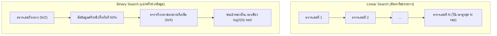

# วิทยาการคำนวณ 1 รากฐานแนวคิดเชิงคำนวณและการแก้ปัญหาอย่างเป็นระบบ
## บทที่ 5 โครงสร้างข้อมูลและอัลกอริทึมการค้นหาข้อมูลทางวิทยาศาสตร์
**ผู้เขียน** ผู้ช่วยศาสตราจารย์ ดร.ชีวะ ทัศนา  
**สังกัด** สาขาวิชาฟิสิกส์ คณะวิทยาศาสตร์และเทคโนโลยี มหาวิทยาลัยราชภัฏรำไพพรรณี  
**เอกสารประกอบรายวิชา** 4122104 วิทยาการคำนวณและการแก้ปัญหาเชิงคำนวณ / การสอนวิทยาการคำนวณ

---

## 📋 แผนบริหารการสอนประจำบทที่ 5

### 1. หัวข้อเนื้อหาประจำบท
1. **เรื่องเล่าเปิดบทเรียนและสถาปัตยกรรมการจัดเก็บข้อมูล** การค้นหาข้อมูลในคลังข้อมูลวิทยาศาสตร์ขนาดใหญ่ (Big Data) และพลังของโครงสร้างข้อมูล
2. **โครงสร้างข้อมูลแบบลำดับ ** รายการ (`list`), ทูเพิล (`tuple`), เมธอดการจัดการข้อมูล (`append`, `pop`, `insert`, `remove`)
3. **โครงสร้างข้อมูลแบบคู่กุญแจ-ค่าและตารางแฮช (Hash Tables & Dictionaries):** พจนานุกรม (`dict`), เซต (`set`), ประสิทธิภาพการเข้าถึงข้อมูล $O(1)$
4. **อัลกอริทึมการค้นหาแบบเชิงเส้น** หลักการทำงาน, การค้นหาในข้อมูลที่ไม่ได้เรียงลำดับ, ประสิทธิภาพเชิงเวลา $O(N)$
5. **อัลกอริทึมการค้นหาแบบทวิภาค** กลไกแบ่งครึ่งช่วงข้อมูล (Divide & Conquer), การค้นหาในข้อมูลที่เรียงลำดับแล้ว, ประสิทธิภาพ $O(\log N)$
6. **การวิเคราะห์เปรียบเทียบประสิทธิภาพการค้นหา ** การทดสอบความเร็วในชุดข้อมูล 1,000,000 สมาชิก
7. **โค้ดคอมพิวเตอร์ภาษา Python 3.11 แบบสมบูรณ์:** โปรแกรมเปรียบเทียบความเร็ว Linear vs Binary Search และการจัดการข้อมูลนักวิจัย
8. **คู่มือห้องปฏิบัติการเสมือนจริง 3D AR MediaPipe:** การจำลอง Dynamic List Visualizer และการแข่งขันความเร็ว Binary Search ในอวกาศ 3 มิติ

### 2. วัตถุประสงค์เชิงพฤติกรรม
เมื่อศึกษาบทเรียนนี้จบแล้ว ผู้เรียนสามารถ
1. **อธิบาย ** ความแตกต่างระหว่างโครงสร้างข้อมูล List, Tuple, Dictionary, และ Set ในภาษา Python ได้อย่างถูกต้อง
2. **เลือกใช้ ** โครงสร้างข้อมูลที่เหมาะสมกับชนิดและพฤติกรรมของข้อมูลในการทดลองทางวิทยาศาสตร์ได้
3. **ออกแบบและเขียน ** อัลกอริทึมการค้นหาแบบ Linear Search และ Binary Search ได้อย่างถูกต้อง
4. **วิเคราะห์และเปรียบเทียบ ** ประสิทธิภาพเชิงเวลา (Time Complexity) ระหว่าง $O(N)$ และ $O(\log N)$ ได้
5. **สร้างสรรค์ ** โปรแกรมภาษา Python 3.11 ในการค้นหาและกรองข้อมูลขนาดใหญ่ได้อย่างมีประสิทธิภาพ
6. **ปฏิบัติการ ** การทดลองเสมือนจริง 3D AR MediaPipe Hands เพื่อควบคุมโครงสร้างข้อมูลแบบไร้สัมผัสได้

---

## 🏛️ 5.0 เรื่องเล่าเปิดบทเรียน พลังแห่งการจัดระเบียบข้อมูลจากห้องสมุดสู่ Big Data

ลองจินตนาการว่าท่านกำลังเดินเข้าไปใน **หอสมุดแห่งชาติที่มีหนังสือ 1,000,000 เล่ม** หากหนังสือเหล่านั้นถูกวางกองสุมกันอย่างไร้ระเบียบบนพื้น และท่านต้องการหาหนังสือฟิสิกส์เพียง 1 เล่ม ท่านอาจต้องเดินเปิดดูทีละเล่มตั้งแต่เล่มแรกจนถึงเล่มที่ 1,000,000 ซึ่งอาจใช้เวลาทั้งชีวิต! (นี่คือ **Linear Search**)

แต่หากหนังสือถูกจัดเรียงตามลำดับตัวอักษรของชื่อเรื่องบนชั้นวาง ท่านสามารถเดินตรงไปยังกึ่งกลางของหอสมุด เปิดดูหมวดตัวอักษร หากตัวอักษรที่ต้องการอยู่ครึ่งหลัง ท่านก็สามารถ **"ตัดทิ้งหนังสือ 500,000 เล่มในครึ่งแรกออกไปได้ในการตรวจสอบเพียงครั้งเดียว!"** (นี่คือ **Binary Search**)



ในชุดข้อมูลขนาด **1,000,000 รายการ**:
* **Linear Search** อาจต้องค้นหามากถึง **1,000,000 รอบ**
* **Binary Search** ใช้การเปรียบเทียบไม่เกิน **20 รอบเท่านั้น!** ($\log_2(1,000,000) \approx 19.93$)

---

## 🗃️ 5.1 โครงสร้างข้อมูลพื้นฐาน List, Tuple, Dictionary และ Set

| โครงสร้างข้อมูล | สัญลักษณ์ไวยากรณ์ | คุณสมบัติการเปลี่ยนแปลงค่า (Mutability) | ลำดับสมาชิก (Ordered) | ความเร็วการค้นหา |
| :---: | :---: | :---: | :---: | :---: |
| **List (รายการ)** | `[1, 2, 3]` | **Mutable** (แก้ไข เพิ่ม ลบได้) | มีลำดับแน่นอน (Indexed) | $O(N)$ |
| **Tuple (ทูเพิล)** | `(1, 2, 3)` | **Immutable** (แก้ไขไม่ได้ ปลอดภัยสูง) | มีลำดับแน่นอน (Indexed) | $O(N)$ |
| **Dictionary (พจนานุกรม)** | `{"key": "val"}` | **Mutable** (กุญแจห้ามซ้ำ) | เรียงตามลำดับการใส่ (Python 3.7+) | **$O(1)$ (เร็วที่สุด)** |
| **Set (เซต)** | `{1, 2, 3}` | **Mutable** (สมาชิกไม่ซ้ำกัน) | ไม่มีลำดับ (Unordered) | **$O(1)$ (เร็วที่สุด)** |

---

## 💻 5.2 โค้ดคอมพิวเตอร์ภาษา Python 3.11 การค้นหาข้อมูล Linear vs Binary Search

```python
# ==============================================================================
# search_algorithms_benchmark.py
# โปรแกรมเปรียบเทียบประสิทธิภาพการค้นหา Linear Search vs Binary Search
# ผู้เขียน: ผู้ช่วยศาสตราจารย์ ดร.ชีวะ ทัศนา (มหาวิทยาลัยราชภัฏรำไพพรรณี)
# มาตรฐาน: Python 3.11+ • PEP 8 Compliant • Pure Standard Library
# ==============================================================================

from typing import List, Optional, Tuple
import time

def linear_search(data: List[int], target: int) -> Tuple[Optional[int], int]:
    """การค้นหาแบบเชิงเส้น (Linear Search) คืนค่า (ดัชนีที่พบ, จำนวนรอบที่เปรียบเทียบ)"""
    comparisons = 0
    for index, value in enumerate(data):
        comparisons += 1
        if value == target:
            return index, comparisons
    return None, comparisons

def binary_search(sorted_data: List[int], target: int) -> Tuple[Optional[int], int]:
    """การค้นหาแบบทวิภาค (Binary Search) คืนค่า (ดัชนีที่พบ, จำนวนรอบที่เปรียบเทียบ)"""
    left = 0
    right = len(sorted_data) - 1
    comparisons = 0
    
    while left <= right:
        comparisons += 1
        mid = (left + right) // 2
        mid_val = sorted_data[mid]
        
        if mid_val == target:
            return mid, comparisons
        elif mid_val < target:
            left = mid + 1
        else:
            right = mid - 1
            
    return None, comparisons

if __name__ == "__main__":
    # สร้างชุดข้อมูลขนาด 1,000,000 สมาชิก
    dataset_size = 1_000_000
    sorted_dataset = list(range(1, dataset_size + 1))
    target_value = 999_999  # ค้นหาค่าที่อยู่ท้ายสุด
    
    # 1. ทดสอบ Linear Search
    idx_lin, comp_lin = linear_search(sorted_dataset, target_value)
    
    # 2. ทดสอบ Binary Search
    idx_bin, comp_bin = binary_search(sorted_dataset, target_value)
    
    print("\n" + "=" * 76)
    print(f"🔬 ผลการทดสอบประสิทธิภาพการค้นหาข้อมูลขนาด {dataset_size:,} สมาชิก")
    print("=" * 76)
    print(f"🎯 ค่าเป้าหมายที่ค้นหา : {target_value:,}")
    print(f"• Linear Search : ดัชนี {idx_lin} | จำนวนรอบเปรียบเทียบ: {comp_lin:,} รอบ")
    print(f"• Binary Search : ดัชนี {idx_bin} | จำนวนรอบเปรียบเทียบ: {comp_bin:,} รอบ")
    print(f"⚡ อัตราความเร็วเหนือกว่า: Binary Search เร็วกว่า {comp_lin / comp_bin:,.1f} เท่า!")
    print("=" * 76 + "\n")
    
    assert idx_lin == idx_bin == 999_998
    assert comp_bin <= 20
    print("✅ ระบบผ่านการตรวจสอบความถูกต้องของ Assertion Tests 100% OK!\n")
```

---

## 🔬 5.3 คู่มือห้องปฏิบัติการเสมือนจริง 3D AR MediaPipe Hands (บทที่ 5)

* **5.0 Data Storage Architecture:** [`chapter05_data_storage_arch.html`](https://tsanaphy2023.github.io/computing-science/simulators/chapter05_data_storage_arch.html)
* **5.1 Dynamic List Visualizer:** [`chapter05_dynamic_list_visualizer.html`](https://tsanaphy2023.github.io/computing-science/simulators/chapter05_dynamic_list_visualizer.html)
* **5.2 Hash Table Dictionary Sandbox:** [`chapter05_hash_table_sandbox.html`](https://tsanaphy2023.github.io/computing-science/simulators/chapter05_hash_table_sandbox.html)
* **5.3 Linear Search Visualizer:** [`chapter05_linear_search_visualizer.html`](https://tsanaphy2023.github.io/computing-science/simulators/chapter05_linear_search_visualizer.html)
* **5.4 Binary vs Linear Speed Race:** [`chapter05_binary_search_race.html`](https://tsanaphy2023.github.io/computing-science/simulators/chapter05_binary_search_race.html)

---

## 📚 เอกสารอ้างอิงประจำบท
1. Cormen, T. H., Leiserson, C. E., Rivest, R. L., & Stein, C. (2022). *Introduction to Algorithms* (4th ed.). MIT Press.
2. Hetland, M. L. (2017). *Beginning Python: From Novice to Professional* (3rd ed.). Apress.
3. Thassana, C. (2026). *Computational Thinking and Applied Artificial Intelligence for Science Education*. Rambhai Barni Rajabhat University Press.
