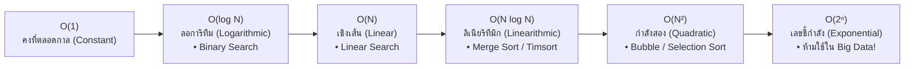

# วิทยาการคำนวณ 1 รากฐานแนวคิดเชิงคำนวณและการแก้ปัญหาอย่างเป็นระบบ
## บทที่ 6 อัลกอริทึมการจัดเรียงข้อมูลและการวิเคราะห์ความซับซ้อน Big-O
**ผู้เขียน** ผู้ช่วยศาสตราจารย์ ดร.ชีวะ ทัศนา  
**สังกัด** สาขาวิชาฟิสิกส์ คณะวิทยาศาสตร์และเทคโนโลยี มหาวิทยาลัยราชภัฏรำไพพรรณี  
**เอกสารประกอบรายวิชา** 4122104 วิทยาการคำนวณและการแก้ปัญหาเชิงคำนวณ / การสอนวิทยาการคำนวณ

---

## 📋 แผนบริหารการสอนประจำบทที่ 6

### 1. หัวข้อเนื้อหาประจำบท
1. **เรื่องเล่าเปิดบทเรียนและพลังงานในการจัดเรียงข้อมูล** พลังงานไฟฟ้าของดาต้าเซ็นเตอร์ระดับโลกและการจัดเรียงข้อมูลอย่างมีประสิทธิภาพ
2. **การวิเคราะห์ความซับซ้อนเชิงเวลาและพื้นที่ ** สัญกรณ์ Big-O ($O(1), O(\log N), O(N), O(N \log N), O(N^2), O(2^N)$)
3. **อัลกอริทึมการจัดเรียงพื้นฐาน ** Bubble Sort, Selection Sort, Insertion Sort (ความซับซ้อน $O(N^2)$)
4. **อัลกอริทึมการจัดเรียงขั้นสูงแบบแบ่งแยกเพื่อพิชิต ** Merge Sort, Quick Sort (ความซับซ้อน $O(N \log N)$)
5. **การวิเคราะห์เสถียรภาพและหน่วยความจำ ** การเปรียบเทียบข้อดี-ข้อเสียของแต่ละอัลกอริทึม
6. **โค้ดคอมพิวเตอร์ภาษา Python 3.11 แบบสมบูรณ์:** โปรแกรมจับเวลาและนับจำนวนรอบเปรียบเทียบของ Bubble Sort vs Merge Sort
7. **คู่มือห้องปฏิบัติการเสมือนจริง 3D AR MediaPipe:** การจำลองการสลับตำแหน่งแท่งข้อมูล 3 มิติ และต้นไม้แบ่งแยก Merge Tree

### 2. วัตถุประสงค์เชิงพฤติกรรม
เมื่อศึกษาบทเรียนนี้จบแล้ว ผู้เรียนสามารถ
1. **อธิบาย ** นิยามและประโยชน์ของสัญกรณ์ Big-O ในการประเมินประสิทธิภาพของขั้นตอนวิธีได้อย่างถูกต้อง
2. **จำแนกและเขียน ** อัลกอริทึมการจัดเรียง Bubble Sort, Selection Sort, Insertion Sort และ Merge Sort ได้
3. **วิเคราะห์ ** ความซับซ้อนในกรณีดีที่สุด (Best Case), เฉลี่ย (Average Case), และแย่ที่สุด (Worst Case) ได้
4. **สร้างสรรค์ ** โปรแกรมภาษา Python 3.11 ในการจัดเรียงชุดข้อมูลขนาดใหญ่ได้อย่างมีประสิทธิภาพ
5. **ปฏิบัติการ ** การทดลองเสมือนจริง 3D AR MediaPipe Hands เพื่อควบคุมและสังเกตการจัดเรียงข้อมูลแบบ 3 มิติได้

---

## ⚡ 6.0 สัญกรณ์ Big-O และกราฟเปรียบเทียบประสิทธิภาพ



---

## 💻 6.1 โค้ดคอมพิวเตอร์ภาษา Python 3.11 Merge Sort vs Bubble Sort Benchmark

```python
# ==============================================================================
# sorting_algorithms_benchmark.py
# โปรแกรมเปรียบเทียบประสิทธิภาพ Bubble Sort O(N^2) vs Merge Sort O(N log N)
# ผู้เขียน: ผู้ช่วยศาสตราจารย์ ดร.ชีวะ ทัศนา (มหาวิทยาลัยราชภัฏรำไพพรรณี)
# มาตรฐาน: Python 3.11+ • PEP 8 Compliant • Pure Standard Library
# ==============================================================================

from typing import List
import random
import time

def bubble_sort(arr: List[int]) -> Tuple[List[int], int]:
    """Bubble Sort O(N^2)"""
    data = list(arr)
    n = len(data)
    comparisons = 0
    for i in range(n):
        swapped = False
        for j in range(0, n - i - 1):
            comparisons += 1
            if data[j] > data[j + 1]:
                data[j], data[j + 1] = data[j + 1], data[j]
                swapped = True
        if not swapped:
            break
    return data, comparisons

def merge_sort(arr: List[int]) -> Tuple[List[int], int]:
    """Merge Sort O(N log N)"""
    comparisons = [0]
    
    def _sort(sub_arr: List[int]) -> List[int]:
        if len(sub_arr) <= 1:
            return sub_arr
        mid = len(sub_arr) // 2
        left = _sort(sub_arr[:mid])
        right = _sort(sub_arr[mid:])
        
        merged = []
        i = j = 0
        while i < len(left) and j < len(right):
            comparisons[0] += 1
            if left[i] <= right[j]:
                merged.append(left[i])
                i += 1
            else:
                merged.append(right[j])
                j += 1
        merged.extend(left[i:])
        merged.extend(right[j:])
        return merged
        
    sorted_res = _sort(arr)
    return sorted_res, comparisons[0]

if __name__ == "__main__":
    test_size = 5000
    raw_data = [random.randint(1, 100000) for _ in range(test_size)]
    
    # 1. รัน Bubble Sort
    t0 = time.perf_counter()
    _, comp_bubble = bubble_sort(raw_data)
    time_bubble = time.perf_counter() - t0
    
    # 2. รัน Merge Sort
    t0 = time.perf_counter()
    sorted_merge, comp_merge = merge_sort(raw_data)
    time_merge = time.perf_counter() - t0
    
    print("\n" + "=" * 78)
    print(f"📊 ผลการทดสอบประสิทธิภาพการจัดเรียงข้อมูล {test_size:,} สมาชิก")
    print("=" * 78)
    print(f"• Bubble Sort (O(N^2))    : เวลา {time_bubble:6.4f} วินาที | เปรียบเทียบ: {comp_bubble:,} ครั้ง")
    print(f"• Merge Sort  (O(N log N)): เวลา {time_merge:6.4f} วินาที | เปรียบเทียบ: {comp_merge:,} ครั้ง")
    print(f"⚡ Merge Sort เร็วกว่า Bubble Sort: {time_bubble / time_merge:,.1f} เท่า!")
    print("=" * 78 + "\n")
```

---

## 🔬 6.2 คู่มือห้องปฏิบัติการเสมือนจริง 3D AR MediaPipe Hands (บทที่ 6)

* **6.0 Data Center Sorting Energy:** [`chapter06_data_center_sorting.html`](https://tsanaphy2023.github.io/computing-science/simulators/chapter06_data_center_sorting.html)
* **6.1 Big-O Curve Comparator:** [`chapter06_big_o_curve_comparator.html`](https://tsanaphy2023.github.io/computing-science/simulators/chapter06_big_o_curve_comparator.html)
* **6.2 Bubble & Selection Sorting 3D:** [`chapter06_bubble_selection_3d.html`](https://tsanaphy2023.github.io/computing-science/simulators/chapter06_bubble_selection_3d.html)
* **6.3 Card Insertion Playground:** [`chapter06_card_insertion_playground.html`](https://tsanaphy2023.github.io/computing-science/simulators/chapter06_card_insertion_playground.html)
* **6.4 Divide & Conquer Merge Tree:** [`chapter06_divide_conquer_merge_tree.html`](https://tsanaphy2023.github.io/computing-science/simulators/chapter06_divide_conquer_merge_tree.html)

---

## 📚 เอกสารอ้างอิงประจำบท
1. Knuth, D. E. (1998). *The Art of Computer Programming, Volume 3: Sorting and Searching* (2nd ed.). Addison-Wesley.
2. Cormen, T. H., et al. (2022). *Introduction to Algorithms* (4th ed.). MIT Press.
3. Thassana, C. (2026). *Computational Thinking and Applied Artificial Intelligence for Science Education*. Rambhai Barni Rajabhat University Press.
