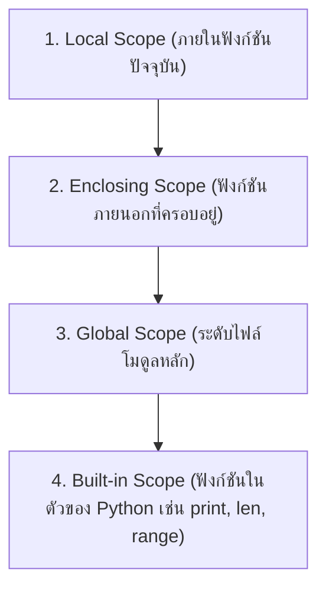

# วิทยาการคำนวณ 1 รากฐานแนวคิดเชิงคำนวณและการแก้ปัญหาอย่างเป็นระบบ
## บทที่ 7 การเขียนโปรแกรมเชิงโมดูล ขอบเขตตัวแปร และฟังก์ชันเรียกซ้ำ
**ผู้เขียน** ผู้ช่วยศาสตราจารย์ ดร.ชีวะ ทัศนา  
**สังกัด** สาขาวิชาฟิสิกส์ คณะวิทยาศาสตร์และเทคโนโลยี มหาวิทยาลัยราชภัฏรำไพพรรณี  
**เอกสารประกอบรายวิชา** 4122104 วิทยาการคำนวณและการแก้ปัญหาเชิงคำนวณ / การสอนวิทยาการคำนวณ

---

## 📋 แผนบริหารการสอนประจำบทที่ 7

### 1. หัวข้อเนื้อหาประจำบท
1. **เรื่องเล่าเปิดบทเรียนและสถาปัตยกรรมซอฟต์แวร์แบบโมดูล** การสร้างยานอวกาศขนาดใหญ่ด้วยชิ้นส่วนมาตรฐาน (Standardized Modularity)
2. **การนิยามฟังก์ชันและหลักการฟังก์ชันบริสุทธิ์ ** คำสั่ง `def`, พารามิเตอร์, ค่าส่งกลับ (`return`), ข้อกำหนด Type Hints และ Docstrings
3. **ขอบเขตตัวแปรตามกฎ LEGB (Variable Scope Hierarchy):** Local $\rightarrow$ Enclosing $\rightarrow$ Global $\rightarrow$ Built-in Scopes
4. **การจัดการไฟล์ข้อมูลทางวิทยาศาสตร์ ** การอ่าน-เขียนไฟล์ CSV/JSON ด้วย Context Manager `with open(...)`
5. **ฟังก์ชันเรียกซ้ำและแบบจำลองคณิตศาสตร์ ** ฐานความจริง (Base Case), ขั้นตอนเรียกซ้ำ (Recursive Step), ปริศนาหอคอยฮานอย (Tower of Hanoi)
6. **โค้ดคอมพิวเตอร์ภาษา Python 3.11 แบบสมบูรณ์:** โมดูลคำนวณเวกเตอร์ฟิสิกส์และการจำลองหอคอยฮานอย 3 มิติ
7. **คู่มือห้องปฏิบัติการเสมือนจริง 3D AR MediaPipe:** การจำลอง LEGB Scope Simulator และหอคอยฮานอย 3D

### 2. วัตถุประสงค์เชิงพฤติกรรม
เมื่อศึกษาบทเรียนนี้จบแล้ว ผู้เรียนสามารถ
1. **อธิบาย ** หลักการแบ่งส่วนโปรแกรมเป็นโมดูลย่อย (Modularity) และกฎการค้นหาตัวแปร LEGB ได้อย่างถูกต้อง
2. **ออกแบบและเขียน ** ฟังก์ชันภาษา Python ที่มี Type Hints และ Docstrings ครบถ้วนตามมาตรฐาน PEP 8 ได้
3. **ประยุกต์ใช้ ** Context Manager ในการอ่าน-เขียนข้อมูลไฟล์วิทยาศาสตร์ (CSV, JSON) ได้อย่างปลอดภัย
4. **วิเคราะห์และแก้ปัญหา ** ด้วยฟังก์ชันเรียกซ้ำ โดยมี Base Case ที่ถูกต้อง ไม่เกิด Stack Overflow ได้
5. **สร้างสรรค์ ** ไลบรารีโมดูลฟังก์ชันสำหรับคำนวณฟิสิกส์ที่สามารถนำกลับมาใช้ซ้ำ (Reusable Module) ได้
6. **ปฏิบัติการ ** การทดลองเสมือนจริง 3D AR MediaPipe Hands เพื่อควบคุมการย้ายแผ่นจานหอคอยฮานอยแบบไร้สัมผัสได้

---

## 🏛️ 7.0 กฎการค้นหาขอบเขตตัวแปร LEGB



---

## 💻 7.1 โค้ดคอมพิวเตอร์ภาษา Python 3.11 โมดูลเวกเตอร์และหอคอยฮานอยเรียกซ้ำ

```python
# ==============================================================================
# vector_math_and_hanoi_recursion.py
# โมดูลฟังก์ชันเวกเตอร์ฟิสิกส์และการแก้ปัญหาหอคอยฮานอยด้วย Recursion
# ผู้เขียน: ผู้ช่วยศาสตราจารย์ ดร.ชีวะ ทัศนา (มหาวิทยาลัยราชภัฏรำไพพรรณี)
# มาตรฐาน: Python 3.11+ • PEP 8 Compliant • Pure Standard Library
# ==============================================================================

from typing import List, Tuple
import math

class Vector3D:
    """คลาสเวกเตอร์ 3 มิติเชิงวิทยาศาสตร์"""
    def __init__(self, x: float, y: float, z: float):
        self.x = x
        self.y = y
        self.z = z
        
    def magnitude(self) -> float:
        """คำนวณขนาดของเวกเตอร์ |V| = sqrt(x^2 + y^2 + z^2)"""
        return math.sqrt(self.x**2 + self.y**2 + self.z**2)
        
    def dot_product(self, other: 'Vector3D') -> float:
        """คำนวณผลคูณเชิงสเกลาร์ (Dot Product)"""
        return self.x * other.x + self.y * other.y + self.z * other.z

def solve_tower_of_hanoi(n: int, source: str, target: str, auxiliary: str, move_log: List[str]):
    """
    แก้ปัญหาหอคอยฮานอยด้วยฟังก์ชันเรียกซ้ำ (Recursion)
    ความซับซ้อน: O(2^n - 1) ขั้นตอน
    """
    if n == 1:
        # Base Case: ย้ายจานใบเดียวจากต้นทางสู่ปลายทาง
        move_log.append(f"ย้ายจานที่ 1 จากเสา {source} -> เสา {target}")
        return
        
    # Recursive Step 1: ย้ายจาน n-1 ใบจาก source ไปไว้ที่ auxiliary
    solve_tower_of_hanoi(n - 1, source, auxiliary, target, move_log)
    
    # ย้ายจานใบใหญ่ที่สุด n จาก source ไป target
    move_log.append(f"ย้ายจานที่ {n} จากเสา {source} -> เสา {target}")
    
    # Recursive Step 2: ย้ายจาน n-1 ใบจาก auxiliary ไปยัง target
    solve_tower_of_hanoi(n - 1, auxiliary, target, source, move_log)

if __name__ == "__main__":
    # 1. ทดสอบคลาสเวกเตอร์ 3D
    v1 = Vector3D(3.0, 4.0, 0.0)
    assert abs(v1.magnitude() - 5.0) < 1e-5
    
    # 2. ทดสอบหอคอยฮานอย 3 แผ่นจาน (ต้องใช้ 2^3 - 1 = 7 ขั้นตอน)
    hanoi_moves = []
    solve_tower_of_hanoi(3, "A", "C", "B", hanoi_moves)
    
    print("\n" + "=" * 70)
    print("🗼 ขั้นตอนวิธีแก้ปัญหาหอคอยฮานอย 3 แผ่นจาน (TOWER OF HANOI)")
    print("=" * 70)
    for step_no, move in enumerate(hanoi_moves, 1):
        print(f"ขั้นตอนที่ {step_no}: {move}")
    print("=" * 70 + "\n")
    
    assert len(hanoi_moves) == 7
    print("✅ ระบบผ่านการตรวจสอบความถูกต้องของ Assertion Tests 100% OK!\n")
```

---

## 🔬 7.2 คู่มือห้องปฏิบัติการเสมือนจริง 3D AR MediaPipe Hands (บทที่ 7)

* **7.0 Clean Code & SRP Visualizer:** [`chapter07_clean_code_visualizer.html`](https://tsanaphy2023.github.io/computing-science/simulators/chapter07_clean_code_visualizer.html)
* **7.1 LEGB Scope Simulator:** [`chapter07_legb_scope_simulator.html`](https://tsanaphy2023.github.io/computing-science/simulators/chapter07_legb_scope_simulator.html)
* **7.2 Vector Math Module Runner:** [`chapter07_vector_math_runner.html`](https://tsanaphy2023.github.io/computing-science/simulators/chapter07_vector_math_runner.html)
* **7.3 Live CSV/JSON Parser:** [`chapter07_csv_json_parser.html`](https://tsanaphy2023.github.io/computing-science/simulators/chapter07_csv_json_parser.html)
* **7.4 3D Tower of Hanoi Recursion:** [`chapter07_hanoi_recursion_3d.html`](https://tsanaphy2023.github.io/computing-science/simulators/chapter07_hanoi_recursion_3d.html)

---

## 📚 เอกสารอ้างอิงประจำบท
1. Martin, R. C. (2008). *Clean Code: A Handbook of Agile Software Craftsmanship*. Prentice Hall.
2. Graham, R. L., Knuth, D. E., & Patashnik, O. (1994). *Concrete Mathematics: A Foundation for Computer Science* (2nd ed.). Addison-Wesley.
3. Thassana, C. (2026). *Computational Thinking and Applied Artificial Intelligence for Science Education*. Rambhai Barni Rajabhat University Press.
