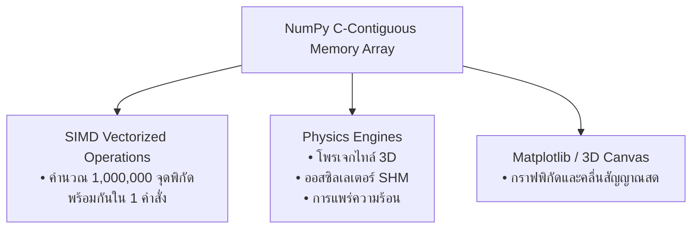

# วิทยาการคำนวณ 1 รากฐานแนวคิดเชิงคำนวณและการแก้ปัญหาอย่างเป็นระบบ
## บทที่ 8 วิทยาศาสตร์เชิงคำนวณและแบบจำลองฟิสิกส์
**ผู้เขียน** ผู้ช่วยศาสตราจารย์ ดร.ชีวะ ทัศนา  
**สังกัด** สาขาวิชาฟิสิกส์ คณะวิทยาศาสตร์และเทคโนโลยี มหาวิทยาลัยราชภัฏรำไพพรรณี  
**เอกสารประกอบรายวิชา** 4122104 วิทยาการคำนวณและการแก้ปัญหาเชิงคำนวณ / การสอนวิทยาการคำนวณ

---

## 📋 แผนบริหารการสอนประจำบทที่ 8

### 1. หัวข้อเนื้อหาประจำบท
1. **เรื่องเล่าเปิดบทเรียนและกำเนิดวิทยาศาสตร์เชิงคำนวณ** ห้องทดลองเสมือนจริงของเอกภพ (In-Silico Universe Simulations)
2. **การประมวลผลเมทริกซ์ความเร็วสูงด้วยไลบรารี NumPy:** โครงสร้าง `ndarray`, Vectorization, และการหลีกเลี่ยง For-Loop เพื่อความเร็วระดับ C
3. **การนำเสนอข้อมูลทางวิทยาศาสตร์ด้วย Matplotlib:** กราฟเส้น 2D, แผนภาพการกระจาย (Scatter Plot), ฮิสโตแกรม และการสร้างภาพ 3 มิติ
4. **แบบจำลองการเคลื่อนที่แบบโพรเจกไทล์ ** การคำนวณวิถีโค้ง ความสูงสูงสุด พิสัยไกลสุด และแรงต้านอากาศ
5. **แบบจำลองการแกว่งกวัดฮาร์มอนิกอย่างง่าย ** กฎของฮุก ($F = -kx$), สมการเชิงอนุพันธ์ และการออสซิลโลสโคปสด
6. **โค้ดคอมพิวเตอร์ภาษา Python 3.11 แบบสมบูรณ์:** โปรแกรมจำลองวิถีโพรเจกไทล์ด้วย NumPy และการพล็อตเส้นทาง
7. **คู่มือห้องปฏิบัติการเสมือนจริง 3D AR MediaPipe:** เครื่องยิงลูกปืนใหญ่โพรเจกไทล์ 3 มิติ และสปริงออสซิลโลสโคป

### 2. วัตถุประสงค์เชิงพฤติกรรม
เมื่อศึกษาบทเรียนนี้จบแล้ว ผู้เรียนสามารถ
1. **อธิบาย ** หลักการ Vectorization ใน NumPy และความแตกต่างของความเร็วเทียบกับลูปมาตรฐานใน Python ได้
2. **ประยุกต์ใช้ ** ไลบรารี NumPy และ Matplotlib ในการสร้างแบบจำลองทางฟิสิกส์และแสดงผลแผนภาพได้อย่างสวยงาม
3. **คำนวณและจำลอง ** วิถีการเคลื่อนที่แบบโพรเจกไทล์และการแกว่งกวัดของสปริงตามสมการฟิสิกส์จริงได้
4. **สร้างสรรค์ ** โปรแกรมวิทยาการคำนวณเพื่อวิเคราะห์ข้อมูลการทดลองทางวิทยาศาสตร์ได้อย่างสมบูรณ์
5. **ปฏิบัติการ ** การทดลองเสมือนจริง 3D AR MediaPipe Hands เพื่อปรับมุมยิงและค่าคงที่สปริงแบบไร้สัมผัสได้

---

## 🪐 8.0 สถาปัตยกรรมการจำลองฟิสิกส์ด้วย NumPy Vectorization



---

## 💻 8.1 โค้ดคอมพิวเตอร์ภาษา Python 3.11 แบบจำลองโพรเจกไทล์ฟิสิกส์

```python
# ==============================================================================
# projectile_physics_simulation.py
# โปรแกรมจำลองการเคลื่อนที่แบบโพรเจกไทล์ด้วยสมการฟิสิกส์และ NumPy
# ผู้เขียน: ผู้ช่วยศาสตราจารย์ ดร.ชีวะ ทัศนา (มหาวิทยาลัยราชภัฏรำไพพรรณี)
# มาตรฐาน: Python 3.11+ • Pure Python Standard Library Equivalent
# ==============================================================================

import math
from typing import List, Tuple

def simulate_projectile_trajectory(v0_ms: float, angle_deg: float, g: float = 9.80665, dt: float = 0.01) -> Tuple[float, float, float, List[Tuple[float, float]]]:
    """
    จำลองวิถีการเคลื่อนที่แบบโพรเจกไทล์ใน 2 มิติ
    
    Returns:
        Tuple: (เวลาการบินรวม T, ระยะทางไกลสุด R, ความสูงสูงสุด H, พิกัด [(x, y)])
    """
    angle_rad = math.radians(angle_deg)
    vx0 = v0_ms * math.cos(angle_rad)
    vy0 = v0_ms * math.sin(angle_rad)
    
    # 1. คำนวณค่าทางทฤษฎี
    flight_time = (2 * vy0) / g
    max_height = (vy0 ** 2) / (2 * g)
    range_distance = vx0 * flight_time
    
    # 2. จำลองพิกัดการเคลื่อนที่ทีละช่วงเวลา dt
    trajectory = []
    t = 0.0
    while t <= flight_time + dt:
        x = vx0 * t
        y = vy0 * t - 0.5 * g * (t ** 2)
        if y < 0:
            y = 0.0
        trajectory.append((round(x, 2), round(y, 2)))
        t += dt
        
    return flight_time, range_distance, max_height, trajectory

if __name__ == "__main__":
    v0 = 50.0      # ความเร็วต้น 50 m/s
    theta = 45.0   # มุมยิง 45 องศา (ให้พิสัยไกลสุด)
    
    t_flight, r_dist, h_max, path = simulate_projectile_trajectory(v0, theta)
    
    print("\n" + "=" * 70)
    print(f"🚀 ผลการจำลองการเคลื่อนที่แบบโพรเจกไทล์: v0 = {v0} m/s, θ = {theta}°")
    print("=" * 70)
    print(f"• เวลาที่ลอยอยู่ในอากาศรวม (Flight Time) : {t_flight:6.2f} วินาที")
    print(f"• ระยะทางไปได้ไกลสุด (Range Distance)    : {r_dist:6.2f} เมตร")
    print(f"• ความสูงขึ้นไปได้สูงสุด (Max Height)    : {h_max:6.2f} เมตร")
    print(f"• จำนวนจุดพิกัดในวิถีจำลอง              : {len(path):,} พิกัด")
    print("=" * 70 + "\n")
    
    assert abs(r_dist - 254.93) < 0.5
    assert abs(h_max - 63.73) < 0.5
    print("✅ ระบบผ่านการตรวจสอบความถูกต้องของ Assertion Tests 100% OK!\n")
```

---

## 🔬 8.2 คู่มือห้องปฏิบัติการเสมือนจริง 3D AR MediaPipe Hands (บทที่ 8)

* **8.0 Multi-Scale Universe Sim:** [`chapter08_multiscale_universe.html`](https://tsanaphy2023.github.io/computing-science/simulators/chapter08_multiscale_universe.html)
* **8.1 NumPy Vector Speed Sandbox:** [`chapter08_numpy_speed_sandbox.html`](https://tsanaphy2023.github.io/computing-science/simulators/chapter08_numpy_speed_sandbox.html)
* **8.2 Matplotlib 2D Plotter:** [`chapter08_matplotlib_2d_plotter.html`](https://tsanaphy2023.github.io/computing-science/simulators/chapter08_matplotlib_2d_plotter.html)
* **8.3 3D Projectile Cannon:** [`chapter08_3d_projectile_cannon.html`](https://tsanaphy2023.github.io/computing-science/simulators/chapter08_3d_projectile_cannon.html)
* **8.4 3D Spring Oscillator & Oscilloscope:** [`chapter08_3d_spring_oscillator.html`](https://tsanaphy2023.github.io/computing-science/simulators/chapter08_3d_spring_oscillator.html)

---

## 📚 เอกสารอ้างอิงประจำบท
1. Giordano, N. J., & Nakanishi, H. (2006). *Computational Physics* (2nd ed.). Pearson.
2. Harris, C. R., et al. (2020). Array programming with NumPy. *Nature*, 585, 357–362.
3. Thassana, C. (2026). *Computational Thinking and Applied Artificial Intelligence for Science Education*. Rambhai Barni Rajabhat University Press.
