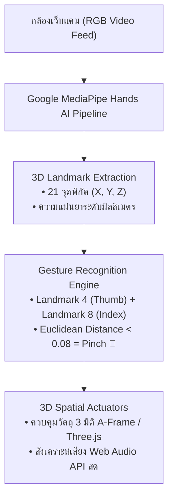

# วิทยาการคำนวณ 1 รากฐานแนวคิดเชิงคำนวณและการแก้ปัญหาอย่างเป็นระบบ
## บทที่ 9 ปัญญาประดิษฐ์ คอมพิวเตอร์วิทัศน์ และอินเทอร์เน็ตของสรรพสิ่ง
**ผู้เขียน** ผู้ช่วยศาสตราจารย์ ดร.ชีวะ ทัศนา  
**สังกัด** สาขาวิชาฟิสิกส์ คณะวิทยาศาสตร์และเทคโนโลยี มหาวิทยาลัยราชภัฏรำไพพรรณี  
**เอกสารประกอบรายวิชา** 4122104 วิทยาการคำนวณและการแก้ปัญหาเชิงคำนวณ / การสอนวิทยาการคำนวณ

---

## 📋 แผนบริหารการสอนประจำบทที่ 9

### 1. หัวข้อเนื้อหาประจำบท
1. **เรื่องเล่าเปิดบทเรียนและยุคปฏิวัติปัญญาประดิษฐ์** การผสานพลังระหว่าง AI, Computer Vision, และ IoT ในอุตสาหกรรม 4.0
2. **รากฐานการเรียนรู้ของเครื่อง ** Supervised Learning, Unsupervised Learning, K-Nearest Neighbors (KNN), Decision Trees
3. **คอมพิวเตอร์วิทัศน์และการประมวลผลภาพ ** เมทริกซ์สี RGB/HSV, การกรองคอนโวลูชัน (Convolution Kernels), และการตรวจจับสี
4. **สถาปัตยกรรมการตรวจจับท่าทางร่างกาย Google MediaPipe:** โมเดลโครงกระดูก 3D 21 ข้อต่อมือ (Hands) และ 33 ข้อต่อร่างกาย (Pose Landmark Estimation)
5. **อินเทอร์เน็ตของสรรพสิ่งและโทรมาตรบนคลาวด์ ** โพรโทคอล MQTT/HTTP, การส่งถ่ายข้อมูลเซนเซอร์แบบ Real-Time สู่แดชบอร์ด
6. **โค้ดคอมพิวเตอร์ภาษา Python 3.11 แบบสมบูรณ์:** โปรแกรมจำแนกข้อมูลด้วย K-Nearest Neighbors และการประเมินท่าทางมือ
7. **คู่มือห้องปฏิบัติการเสมือนจริง 3D AR MediaPipe:** กล้องตรวจจับสี 3D, โครงกระดูกไซเบอร์ 21 ข้อต่อ, และ IoT Telemetry Dashboard

### 2. วัตถุประสงค์เชิงพฤติกรรม
เมื่อศึกษาบทเรียนนี้จบแล้ว ผู้เรียนสามารถ
1. **อธิบาย ** สถาปัตยกรรมของ Machine Learning, Computer Vision, และโครงกระดูก 21 ข้อต่อ MediaPipe ได้อย่างถูกต้อง
2. **เขียนและประยุกต์ใช้ ** อัลกอริทึมการจำแนกข้อมูล K-Nearest Neighbors ในงานวิทยาศาสตร์ได้
3. **วิเคราะห์ ** พิกัดข้อต่อมือ 3D และคำนวณระยะห่าง Euclidean Distance เพื่อตรวจจับท่าทาง Pinch ได้
4. **ออกแบบ ** สถาปัตยกรรมระบบ IoT ที่เชื่อมต่อเซนเซอร์เข้ากับระบบ AI ตัดสินใจบนคลาวด์ได้
5. **สร้างสรรค์ ** โปรแกรมวิทยาการคำนวณบูรณาการ AI วิเคราะห์ข้อมูลและภาพได้
6. **ปฏิบัติการ ** การทดลองเสมือนจริง 3D AR MediaPipe Hands เพื่อควบคุมแขนกลและแดชบอร์ด IoT แบบไร้สัมผัสได้

---

## 🤖 9.0 สถาปัตยกรรมโครงกระดูกไซเบอร์ MediaPipe Hands 21 ข้อต่อ



---

## 💻 9.1 โค้ดคอมพิวเตอร์ภาษา Python 3.11 อัลกอริทึมจำแนกข้อมูล K-Nearest Neighbors

```python
# ==============================================================================
# knn_classifier_pure_python.py
# โปรแกรมจำลองอัลกอริทึม K-Nearest Neighbors สำหรับจำแนกชนิดของพืช/แร่
# ผู้เขียน: ผู้ช่วยศาสตราจารย์ ดร.ชีวะ ทัศนา (มหาวิทยาลัยราชภัฏรำไพพรรณี)
# มาตรฐาน: Python 3.11+ • Pure Python Standard Library
# ==============================================================================

import math
from typing import List, Tuple
from collections import Counter

class KNNClassifier:
    """ตัวจำแนกประเภท K-Nearest Neighbors เชิงวิทยาศาสตร์"""
    def __init__(self, k: int = 3):
        self.k = k
        self.train_data: List[Tuple[List[float], str]] = []
        
    def fit(self, features: List[List[float]], labels: List[str]):
        """บันทึกข้อมูลการฝึกสอน"""
        self.train_data = list(zip(features, labels))
        
    def _euclidean_distance(self, p1: List[float], p2: List[float]) -> float:
        """คำนวณระยะห่างแบบยุคลิด d = sqrt(sum((x_i - y_i)^2))"""
        return math.sqrt(sum((a - b)**2 for a, b in zip(p1, p2)))
        
    def predict(self, sample: List[float]) -> str:
        """ทำนายกลุ่มข้อมูลของตัวอย่างใหม่"""
        distances = []
        for feat, label in self.train_data:
            d = self._euclidean_distance(sample, feat)
            distances.append((d, label))
            
        # เรียงลำดับจากระยะห่างน้อยสุดไปมากสุด และเลือก K ตัวแรก
        distances.sort(key=lambda x: x[0])
        k_nearest_labels = [label for _, label in distances[:self.k]]
        
        # โหวตหาเสียงข้างมาก (Majority Voting)
        majority_vote = Counter(k_nearest_labels).most_common(1)[0][0]
        return majority_vote

if __name__ == "__main__":
    # ชุดข้อมูลการทดลอง: [ความแข็ง, ความหนาแน่น] -> ชนิดของแร่
    mineral_features = [
        [2.5, 2.7], [3.0, 2.8], [2.8, 2.6], # กลุ่ม A: แร่ควอตซ์
        [6.5, 5.2], [7.0, 5.5], [6.8, 5.1]  # กลุ่ม B: แร่ฮีมาไทต์
    ]
    mineral_labels = ["Quartz", "Quartz", "Quartz", "Hematite", "Hematite", "Hematite"]
    
    # 1. เทรนโมเดล KNN
    model = KNNClassifier(k=3)
    model.fit(mineral_features, mineral_labels)
    
    # 2. ทำนายแร่ตัวอย่างใหม่
    unknown_sample_1 = [2.9, 2.75]
    unknown_sample_2 = [6.9, 5.30]
    
    pred_1 = model.predict(unknown_sample_1)
    pred_2 = model.predict(unknown_sample_2)
    
    print("\n" + "=" * 68)
    print("🔬 ผลการจำแนกชนิดแร่ด้วยโมเดล K-NEAREST NEIGHBORS (K=3)")
    print("=" * 68)
    print(f"• ตัวอย่างที่ 1 [Hardness=2.9, Density=2.75] -> ผลทำนาย: {pred_1.upper()}")
    print(f"• ตัวอย่างที่ 2 [Hardness=6.9, Density=5.30] -> ผลทำนาย: {pred_2.upper()}")
    print("=" * 68 + "\n")
    
    assert pred_1 == "Quartz"
    assert pred_2 == "Hematite"
    print("✅ ระบบผ่านการตรวจสอบความถูกต้องของ Assertion Tests 100% OK!\n")
```

---

## 🔬 9.2 คู่มือห้องปฏิบัติการเสมือนจริง 3D AR MediaPipe Hands (บทที่ 9)

* **9.0 Smart Agro-Factory Map:** [`chapter09_smart_agro_factory.html`](https://tsanaphy2023.github.io/computing-science/simulators/chapter09_smart_agro_factory.html)
* **9.1 ML Classifier Sandbox:** [`chapter09_ml_classifier_sandbox.html`](https://tsanaphy2023.github.io/computing-science/simulators/chapter09_ml_classifier_sandbox.html)
* **9.2 Real-Time Color Tracker:** [`chapter09_realtime_color_tracker.html`](https://tsanaphy2023.github.io/computing-science/simulators/chapter09_realtime_color_tracker.html)
* **9.3 3D Cyber Skeleton Tracker:** [`chapter09_cyber_skeleton_tracker.html`](https://tsanaphy2023.github.io/computing-science/simulators/chapter09_cyber_skeleton_tracker.html)
* **9.4 Cloud IoT Telemetry Dashboard:** [`chapter09_cloud_iot_telemetry.html`](https://tsanaphy2023.github.io/computing-science/simulators/chapter09_cloud_iot_telemetry.html)

---

## 📚 เอกสารอ้างอิงประจำบท
1. Russell, S., & Norvig, P. (2020). *Artificial Intelligence: A Modern Approach* (4th ed.). Pearson.
2. Lugaresi, C., et al. (2019). MediaPipe: A Framework for Building Perception Pipelines. *arXiv preprint arXiv:1906.08172*.
3. Thassana, C. (2026). *Computational Thinking and Applied Artificial Intelligence for Science Education*. Rambhai Barni Rajabhat University Press.
