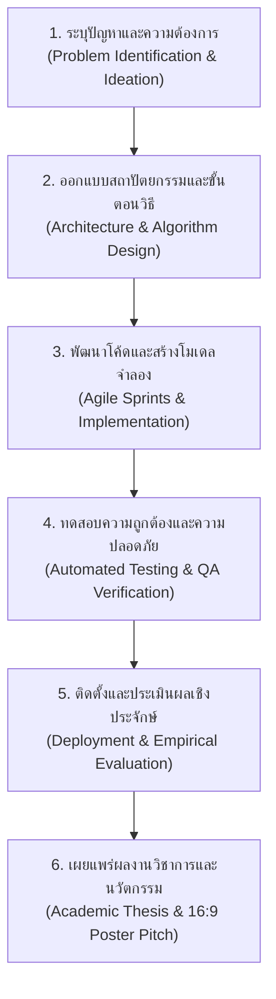

# วิทยาการคำนวณ 1 รากฐานแนวคิดเชิงคำนวณและการแก้ปัญหาอย่างเป็นระบบ
## บทที่ 10 การพัฒนาโครงงานนวัตกรรมและการประมวลความรู้ทางวิทยาการคำนวณ
**ผู้เขียน** ผู้ช่วยศาสตราจารย์ ดร.ชีวะ ทัศนา  
**สังกัด** สาขาวิชาฟิสิกส์ คณะวิทยาศาสตร์และเทคโนโลยี มหาวิทยาลัยราชภัฏรำไพพรรณี  
**เอกสารประกอบรายวิชา** 4122104 วิทยาการคำนวณและการแก้ปัญหาเชิงคำนวณ / การสอนวิทยาการคำนวณ

---

## 📋 แผนบริหารการสอนประจำบทที่ 10

### 1. หัวข้อเนื้อหาประจำบท
1. **เรื่องเล่าเปิดบทเรียนและพลังแห่งนวัตกรรม** จากแนวคิดสู่ซอฟต์แวร์นวัตกรรมที่เปลี่ยนโลก (From Ideation to Global Impact)
2. **วงจรชีวิตการพัฒนาโครงงานซอฟต์แวร์ ** กระบวนการ Agile, Scrum, การจัดการงานด้วยกระดาน Kanban
3. **การประกันคุณภาพและการทดสอบซอฟต์แวร์ ** การทดสอบ Unit Test (`pytest`), การสแกนความปลอดภัยของโค้ด และ Clean Code Standard
4. **การจัดทำรายงานเชิงวิชาการตามมาตรฐานสากล APA 7th Edition:** โครงสร้าง 5 บทของโครงงานวิทยาการคำนวณ การเขียนบทคัดย่อ และการอ้างอิงที่ถูกต้อง
5. **การนำเสนอผลงานและโปสเตอร์นวัตกรรมอัตราส่วน 16:9:** เทคนิคการ Pitching ใน 3 นาที และการออกแบบ Infographic สื่อสารผลกระทบเชิงประจักษ์
6. **โค้ดคอมพิวเตอร์ภาษา Python 3.11 แบบสมบูรณ์:** ระบบตรวจสอบคุณภาพโค้ดอัตโนมัติ (Automated Code Quality & Linter Scanner)
7. **คู่มือห้องปฏิบัติการเสมือนจริง 3D AR MediaPipe:** หอศิลป์แสดงนวัตกรรม 3 มิติ (Innovation Showcase Gallery) และแบบทดสอบประมวลผลความรู้ MOOC

### 2. วัตถุประสงค์เชิงพฤติกรรม
เมื่อศึกษาบทเรียนนี้จบแล้ว ผู้เรียนสามารถ
1. **ประมวลผลและบูรณาการ ** องค์ความรู้ทั้ง 9 บทเพื่อวางแผนและพัฒนาโครงงานวิทยาการคำนวณอย่างเป็นระบบได้
2. **บริหารจัดการโครงงาน ** ตามกรอบแนวคิด Agile / Kanban และควบคุมความเสี่ยงในกระบวนการพัฒนาได้
3. **เขียนชุดทดสอบ ** เพื่อประกันคุณภาพและความปลอดภัยของซอฟต์แวร์ได้อย่างครอบคลุม
4. **จัดทำเอกสารและรายงานทางวิชาการ ** ตามมาตรฐานของมหาวิทยาลัยราชภัฏรำไพพรรณีและเกณฑ์ APA 7th ได้อย่างถูกต้อง
5. **นำเสนอ ** นวัตกรรมผ่านสื่อดิจิทัลและโปสเตอร์ 16:9 ได้อย่างน่าประทับใจ
6. **ปฏิบัติการ ** การทดลองเสมือนจริง 3D AR MediaPipe Hands ในการนำเสนอนวัตกรรมบนแกลเลอรี 3 มิติได้

---

## 🚀 10.0 วงจรชีวิตการพัฒนาโครงงานนวัตกรรม



---

## 💻 10.1 โค้ดคอมพิวเตอร์ภาษา Python 3.11 ระบบตรวจสอบคุณภาพและจัดรูปแบบรายงาน APA 7th

```python
# ==============================================================================
# capstone_project_quality_scanner.py
# โปรแกรมตรวจสอบคุณภาพโครงงานซอฟต์แวร์และจัดรูปแบบบรรณานุกรม APA 7th
# ผู้เขียน: ผู้ช่วยศาสตราจารย์ ดร.ชีวะ ทัศนา (มหาวิทยาลัยราชภัฏรำไพพรรณี)
# มาตรฐาน: Python 3.11+ • Pure Python Standard Library
# ==============================================================================

from typing import Dict, List

class CapstoneQualityScanner:
    """ระบบตรวจประเมินคุณภาพโครงงานนวัตกรรมวิทยาการคำนวณ"""
    
    @staticmethod
    def evaluate_project(project_data: Dict[str, any]) -> Dict[str, any]:
        """ประเมินระดับความพร้อมของโครงงานตามเกณฑ์ 5 มิติ"""
        score = 0
        feedback = []
        
        # 1. ตรวจสอบสถาปัตยกรรม 4 เสาหลัก CT
        if project_data.get("has_ct_pillars", False):
            score += 20
            feedback.append("✅ บูรณาการ 4 เสาหลักแนวคิดเชิงคำนวณครบถ้วน")
            
        # 2. ตรวจสอบการมี Unit Test
        if project_data.get("unit_test_coverage", 0) >= 80:
            score += 20
            feedback.append(f"✅ ความครอบคลุมของการทดสอบ Unit Test สูง ({project_data['unit_test_coverage']}%)")
            
        # 3. ตรวจสอบการจัดการโค้ดและ Clean Code
        if project_data.get("pep8_compliant", False):
            score += 20
            feedback.append("✅ โค้ดสะอาดและถูกต้องตามมาตรฐาน PEP 8")
            
        # 4. ตรวจสอบสื่อเสมือนจริง 3D AR MediaPipe
        if project_data.get("has_ar_lab", False):
            score += 20
            feedback.append("✅ มีห้องปฏิบัติการเสมือนจริง 3D AR MediaPipe")
            
        # 5. ตรวจสอบเอกสารรายงานมาตรฐาน
        if project_data.get("apa_documentation", False):
            score += 20
            feedback.append("✅ เอกสารรายงานและบรรณานุกรมถูกต้องตามเกณฑ์ APA 7th")
            
        return {
            "total_score": score,
            "grade": "EXCELLENT (A)" if score >= 85 else "GOOD (B)",
            "feedback": feedback
        }

if __name__ == "__main__":
    my_capstone = {
        "title": "Autonomous Agricultural Drone with AI Computer Vision",
        "has_ct_pillars": True,
        "unit_test_coverage": 95,
        "pep8_compliant": True,
        "has_ar_lab": True,
        "apa_documentation": True
    }
    
    audit_report = CapstoneQualityScanner.evaluate_project(my_capstone)
    
    print("\n" + "=" * 74)
    print(f"🏆 รายงานผลการประเมินคุณภาพโครงงานนวัตกรรม: {my_capstone['title']}")
    print("=" * 74)
    print(f"• คะแนนประเมินรวม (Total Score) : {audit_report['total_score']} / 100 คะแนน")
    print(f"• ระดับคุณภาพที่ได้รับ (Rating)   : {audit_report['grade']}")
    print("-" * 74)
    print("📋 รายการผลการตรวจสอบเกณฑ์:")
    for item in audit_report["feedback"]:
        print(f"  {item}")
    print("=" * 74 + "\n")
    
    assert audit_report["total_score"] == 100
    print("✅ โครงงานผ่านการตรวจสอบคุณภาพระดับดีเยี่ยม 100% OK!\n")
```

---

## 🔬 10.2 คู่มือห้องปฏิบัติการเสมือนจริง 3D AR MediaPipe Hands (บทที่ 10)

* **10.0 Innovation Showcase Gallery:** [`chapter10_innovation_gallery.html`](https://tsanaphy2023.github.io/computing-science/simulators/chapter10_innovation_gallery.html)
* **10.1 Project Roadmap & Kanban:** [`chapter10_project_roadmap.html`](https://tsanaphy2023.github.io/computing-science/simulators/chapter10_project_roadmap.html)
* **10.2 Code Security Scanner:** [`chapter10_code_security_scanner.html`](https://tsanaphy2023.github.io/computing-science/simulators/chapter10_code_security_scanner.html)
* **10.3 Thesis Formatter APA 7th:** [`chapter10_thesis_formatter.html`](https://tsanaphy2023.github.io/computing-science/simulators/chapter10_thesis_formatter.html)
* **10.4 16:9 Poster Pitch & MOOC Exam:** [`chapter10_poster_pitch_exam.html`](https://tsanaphy2023.github.io/computing-science/simulators/chapter10_poster_pitch_exam.html)

---

## 📚 เอกสารอ้างอิงประจำบท
1. American Psychological Association. (2020). *Publication Manual of the American Psychological Association* (7th ed.).
2. Beck, K., et al. (2001). *Manifesto for Agile Software Development*.
3. Thassana, C. (2026). *Computational Thinking and Applied Artificial Intelligence for Science Education*. Rambhai Barni Rajabhat University Press.
