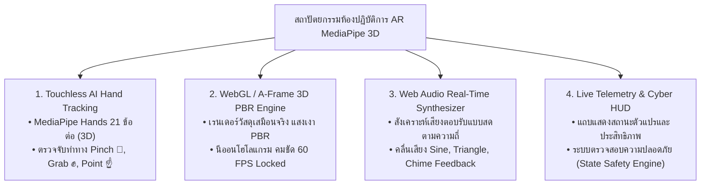

# 🔬 คู่มือปฏิบัติการเสมือนจริง 3D AR/XR MediaPipe Hands ประจำบทที่ 1
## ชุดห้องปฏิบัติการเสมือนจริงไร้สัมผัส (Touchless AI Spatial Virtual Labs)
### รายวิชา: 4122104 วิทยาการคำนวณสำหรับการสอนวิทยาศาสตร์ (CS2026)
**ผู้ออกแบบและพัฒนาสื่อ:** ผู้ช่วยศาสตราจารย์ ดร.ชีวะ ทัศนา • คณะวิทยาศาสตร์และเทคโนโลยี มหาวิทยาลัยราชภัฏรำไพพรรณี

---

## 🌌 1. สถาปัตยกรรมเทคโนโลยีและการออกแบบสื่อเสมือนจริงขั้นสูง (XR Engineering Architecture)

ในฐานะผู้เชี่ยวชาญด้านการพัฒนาสื่อ **AR / XR / 3D Animation เชิงการศึกษา** ชุดห้องปฏิบัติการเสมือนจริงนี้ถูกออกแบบขึ้นภายใต้กรอบแนวคิด **"Spatial Active Learning & Multi-Modal Haptics"** เพื่อเปลี่ยนแนวคิดเชิงนามธรรมทางวิทยาการคำนวณให้กลายเป็นวัตถุ 3 มิติที่ผู้เรียนสามารถมองเห็น สัมผัส และสั่งการได้ด้วยมือเปล่า โดยมี 4 แกนเทคโนโลยีสำคัญ:

---

## 📚 2. คู่มือปฏิบัติการ 5 ห้องทดลองเสมือนจริงฉบับสมบูรณ์ (5 Laboratory Modules)

---

### 🧪 ปฏิบัติการที่ 1.0: การสำรวจปริภูมิสถานะและปริศนาข้ามแม่น้ำ (AR River Crossing State Space Explorer)
* **รหัสโมดูล:** `1.0`
* **ลิงก์เข้าสู่ห้องปฏิบัติการ:** [https://tsanaphy2023.github.io/computing-science/simulators/chapter01_river_crossing.html](https://tsanaphy2023.github.io/computing-science/simulators/chapter01_river_crossing.html)

#### 🎯 1. วัตถุประสงค์การทดลอง
1. เพื่อให้ผู้เรียนสามารถอธิบายและสร้างแบบจำลองการค้นหาในปริภูมิสถานะ (State Space Search) จากปัญหาในโลกจริงได้
2. เพื่อฝึกทักษะการตรวจสอบความถูกต้องของเงื่อนไขทางตรรกศาสตร์ ($Wolf \land Sheep \rightarrow Danger$) ผ่านการจำลองเชิงปฏิสัมพันธ์
3. เพื่อค้นหาขั้นตอนวิธี (Algorithm) 7 ขั้นตอนที่พาตัวละครทั้งหมดข้ามฝั่งได้อย่างปลอดภัย 100%

#### 🛠️ 2. อุปกรณ์จำลองเสมือนจริง 3 มิติ (Virtual Apparatus)
1. **เรือพายอัจฉริยะ (Smart Vessel):** วัตถุ 3D สีน้ำเงินเข้ม พายข้ามฝั่งแม่น้ำด้วยการจับยึดของมือ AR
2. **ตัวละคร 4 วัตถุ (Entities):** มนุษย์ (ผู้ควบคุม), หมาป่า (สีแดง), แกะ (สีขาวบริสุทธิ์), กะหล่ำปลี (สีเขียวมรกต)
3. **ระบบตรวจสอบสถานะความปลอดภัย (Safety Constraint Engine):** ส่งเสียงเตือนความถี่สูงทันทีหากเกิดภาวะอันตรายบนตลิ่ง

#### 🖐️ 3. ท่าทางการสั่งการด้วยมือ (AR Gestures):
* **☝️ ชี้เลือก (Point):** เลื่อนปลายนิ้วชี้ไปยังตัวละครที่ต้องการนำขึ้นเรือ
* **🤏 จีบนิ้ว (Pinch):** แตะปลายนิ้วชี้และนิ้วหัวแม่มือเข้าหากันเพื่อหยิบตัวละครลงเรือ และพายเรือข้ามแม่น้ำ
* **🔄 รีเซ็ต (Reset Button):** แตะปุ่มรีเซ็ตบน HUD เพื่อเริ่มต้นใหม่จากสถานะ $S_0$

#### 📋 4. ตารางบันทึกผลการทดลอง (State Transition Log Sheet)

| เที่ยวที่ (Step) | สิ่งที่นำขึ้นเรือ | ฝั่งซ้ายคงเหลือ | ฝั่งขวาคงเหลือ | สถานะความปลอดภัย (Safe/Danger) | การทำงานของเสียง Synth |
| :---: | :---: | :---: | :---: | :---: | :---: |
| **0 (เริ่มต้น)** | — | [คน, หมาป่า, แกะ, กะหล่ำ] | [ว่าง] | ✅ SAFE (100%) | โทน 440 Hz ปกติ |
| **1** | มนุษย์ + แกะ $\rightarrow$ | [หมาป่า, กะหล่ำ] | [คน, แกะ] | ✅ SAFE (หมาป่าไม่กินผัก) | เสียง Chime บันทึกสำเร็จ |
| **2** | มนุษย์พายเรือกลับ $\leftarrow$ | [คน, หมาป่า, กะหล่ำ] | [แกะ] | ✅ SAFE | เสียง Harmonic Tone |
| **3** | มนุษย์ + หมาป่า $\rightarrow$ | [กะหล่ำ] | [คน, หมาป่า, แกะ] | ⚠️ SAFE ชั่วคราว (มีคนคุม) | เสียงระวังความปลอดภัย |
| **4** | **มนุษย์ + แกะกลับ $\leftarrow$** | **[คน, แกะ, กะหล่ำ]** | **[หมาป่า]** | **✅ SAFE (จุดหักมุมตรรกะ)** | **เสียง Synth Sweep พิเศษ** |
| **5** | มนุษย์ + กะหล่ำ $\rightarrow$ | [แกะ] | [คน, หมาป่า, กะหล่ำ] | ✅ SAFE | เสียง Chime |
| **6** | มนุษย์พายเรือกลับ $\leftarrow$ | [คน, แกะ] | [หมาป่า, กะหล่ำ] | ✅ SAFE | เสียง Harmonic Tone |
| **7** | มนุษย์ + แกะ $\rightarrow$ | [ว่าง] | [คน, หมาป่า, แกะ, กะหล่ำ] | 🎉 GOAL REACHED! | เสียง Fanfare ชนะเลิศ |

---

### 🧪 ปฏิบัติการที่ 1.1: ผังต้นไม้ย่อยปัญหาและสถาปัตยกรรมเชิงโมดูล (AR Decomposition Tree Builder)
* **รหัสโมดูล:** `1.1`
* **ลิงก์เข้าสู่ห้องปฏิบัติการ:** [https://tsanaphy2023.github.io/computing-science/simulators/chapter01_decomposition_tree.html](https://tsanaphy2023.github.io/computing-science/simulators/chapter01_decomposition_tree.html)

#### 🎯 1. วัตถุประสงค์การทดลอง
1. เพื่อฝึกทักษะการแยกส่วนประกอบของระบบที่มีความซับซ้อนสูง (Complex Systems) ออกเป็นโมดูลย่อยอิสระ
2. เพื่อทำความเข้าใจโครงสร้างผังต้นไม้ (Tree Graph Data Structure: Root, Node, Edge, Leaf)
3. เพื่อออกแบบสถาปัตยกรรมระบบรถยนต์ไฟฟ้า EV และระบบสมาร์ตฟาร์มเกษตร 4.0

#### 🛠️ 2. กิจกรรมการทดลอง 3 มิติ
1. **การจำแนกระบบ EV:** ผู้เรียนยกมือขึ้นมาจีบนิ้วเพื่อจับแยกโมดูลหลักของรถยนต์ออกเป็น 4 ก้อน:
   * *Node A:* ระบบจัดการแบตเตอรี่ (BMS)
   * *Node B:* ระบบมอเตอร์ขับเคลื่อน (Powertrain)
   * *Node C:* ระบบคอมพิวเตอร์วิทัศน์ AI (Sensors & Cameras)
   * *Node D:* ระบบโครงสร้างและการทรงตัว (Chassis & Safety)
2. **การทดสอบความอิสระ (Modularity Test):** ทดลองตัดการทำงานของ Node C (กล้องเสีย) และสังเกตว่า Node B (มอเตอร์) ยังคงขับเคลื่อนต่อไปได้หรือไม่

---

### 🧪 ปฏิบัติการที่ 1.2: การค้นหารูปแบบลำดับและคลื่นคณิตศาสตร์ (AR Waveform & Pattern Recognition Explorer)
* **รหัสโมดูล:** `1.2`
* **ลิงก์เข้าสู่ห้องปฏิบัติการ:** [https://tsanaphy2023.github.io/computing-science/simulators/chapter01_pattern_recognition.html](https://tsanaphy2023.github.io/computing-science/simulators/chapter01_pattern_recognition.html)

#### 🎯 1. วัตถุประสงค์การทดลอง
1. เพื่อค้นหาความถี่ซ้ำ ความสัมพันธ์เชิงฟังก์ชัน และแนวโน้มของข้อมูลวิทยาศาสตร์
2. เพื่อศึกษาความสัมพันธ์ของลำดับเลขฟีโบนัชชี (Fibonacci Series) และอัตราส่วนทองคำ ($\phi = 1.618$)
3. เพื่อประยุกต์ใช้แพตเทิร์นในการทำนายค่าข้อมูลล่วงหน้า (Data Trend Prediction)

#### 🛠️ 2. กิจกรรมการทดลอง 3 มิติ
* **การหมุนทอรัสเกลียว 3 มิติ (3D Torus Knot):** ผู้เรียนใช้มือ AR ควบคุมความเร็วการหมุนและปรับค่าความถี่คลื่น ($f$)
* **การฟังเสียงเรโซแนนซ์ (Acoustic Resonance):** เมื่อปรับค่าความถี่ตรงกับอัตราส่วนฮาร์มอนิก ระบบ Web Audio จะส่งเสียงคอร์ดประสานเพื่อยืนยันการค้นพบแพตเทิร์น

---

### 🧪 ปฏิบัติการที่ 1.3: แซนด์บ็อกซ์การคิดเชิงนามธรรมและแบบจำลองมวลจุด (3D Abstraction & Point-Mass Sandbox)
* **รหัสโมดูล:** `1.3`
* **ลิงก์เข้าสู่ห้องปฏิบัติการ:** [https://tsanaphy2023.github.io/computing-science/simulators/chapter01_abstraction_sandbox.html](https://tsanaphy2023.github.io/computing-science/simulators/chapter01_abstraction_sandbox.html)

#### 🎯 1. วัตถุประสงค์การทดลอง
1. เพื่อฝึกทักษะการคัดกรองสาระสำคัญและละทิ้งตัวแปรที่ไม่เกี่ยวข้องออก (Information Filtering)
2. เพื่อศึกษาการสร้างแบบจำลองมวลจุด (Point Mass Model) ทางกลศาสตร์ฟิสิกส์
3. เพื่อเปรียบเทียบประสิทธิภาพและเวลาในการประมวลผลระหว่างโมเดลเต็มรูปทรงและโมเดลเชิงนามธรรม

#### 🛠️ 2. กิจกรรมการทดลอง 3 มิติ
* **แถบเลื่อนระดับนามธรรม (Abstraction Level Slider):** ผู้เรียนใช้มือปรับระดับความละเอียดตั้งแต่ Level 0 (รถยนต์จริง รายละเอียด 100,000 Polygons) จนถึง Level 3 (ทรงกลมมวลจุด $m$ สีแดง รัศมี 0.25m)
* **การวัดเวลาประมวลผล:** สังเกตแถบ HUD แสดงเวลาคำนวณการเคลื่อนที่ลดลงจาก $12.5\text{ ms}$ เหลือเพียง $0.02\text{ ms}$ (เร็วขึ้น 625 เท่า!)

---

### 🧪 ปฏิบัติการที่ 1.4: สนามฝึกนำทางหุ่นยนต์บนตารางกริด (AR Human-Robot Grid Navigator 5x5)
* **รหัสโมดูล:** `1.4`
* **ลิงก์เข้าสู่ห้องปฏิบัติการ:** [https://tsanaphy2023.github.io/computing-science/simulators/chapter01_robot_grid_navigator.html](https://tsanaphy2023.github.io/computing-science/simulators/chapter01_robot_grid_navigator.html)

#### 🎯 1. วัตถุประสงค์การทดลอง
1. เพื่อออกแบบขั้นตอนวิธี (Algorithm Design) ที่เป็นลำดับขั้นตอน ไม่กำกวม และมีจุดสิ้นสุด
2. เพื่อฝึกทักษะการตรวจสอบข้อผิดพลาด (Debugging) และการหลบหลีกสิ่งกีดขวาง (Collision Avoidance)
3. เพื่อเปรียบเทียบประสิทธิภาพของชุดคำสั่งที่สั้นที่สุด (Shortest Path Optimization)

#### 🛠️ 2. กิจกรรมการทดลอง 3 มิติ
* **ตารางกริด 5x5 โฮโลแกรม:** แสดงพิกัดเริ่มต้น $(1, 1)$, สิ่งกีดขวางหินสีแดง $(3, 3)$, และธงชัยชนะ $(5, 5)$
* **การวางบล็อกคำสั่ง AR:** ผู้เรียนหยิบบล็อกคำสั่ง `FORWARD()`, `TURN_LEFT()`, `TURN_RIGHT()` มาเรียงต่อกันในอากาศ
* **ระบบตรวจจับการชน (Collision Detector):** หากวางคำสั่งผิดพลาด หุ่นยนต์จะชนสิ่งกีดขวาง มีไฟกะพริบสีแดงและเสียงเตือน Alert ทันที

---

## ❓ 3. คำถามประเมินผลเชิงลึกและการสะท้อนคิด (Post-Lab Assessment & Reflection)

1. **การคิดเชิงสถานะ:** ในการทดลองที่ 1.0 หากกติกากำหนดเพิ่มเติมว่า "หมาป่ากลัวแกะที่มีมนุษย์อยู่ด้วย แต่จะกินกะหล่ำปลีหากอยู่ตามลำพัง" ท่านจะต้องปรับลำดับการพายเรือ 7 ขั้นตอนใหม่อย่างไร?
2. **การประยุกต์ใช้ Decomposition:** ให้นักเรียนจำแนกโครงสร้างของ "ระบบสถานีชาร์จรถยนต์ไฟฟ้าพลังงานแสงอาทิตย์ (Solar EV Charging Station)" ออกเป็นผังต้นไม้ 3 ระดับ
3. **การคิดเชิงนามธรรมในชีวิตประจำวัน:** ยกตัวอย่างระบบในชีวิตประจำวัน 2 ระบบที่นำหลักการ Abstraction มาใช้เพื่อลดความสับสนของผู้ใช้งาน
4. **การวิเคราะห์อัลกอริทึม:** ในสนามกริด 5x5 จงเขียนชุดคำสั่งรหัสลำลอง (Pseudocode) ที่ใช้จำนวนก้าวเดินน้อยที่สุดในการพาหุ่นยนต์จาก $(1,1)$ ไปยัง $(5,5)$ โดยไม่ชนสิ่งกีดขวาง
