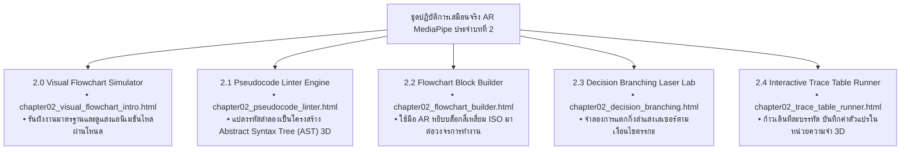

# 🔬 คู่มือปฏิบัติการเสมือนจริง 3D AR/XR MediaPipe Hands ประจำบทที่ 2
## ชุดห้องปฏิบัติการออกแบบขั้นตอนวิธี รหัสลำลอง และผังงานมาตรฐานสากล (Touchless Flowchart Labs)
### รายวิชา: 4122104 วิทยาการคำนวณสำหรับการสอนวิทยาศาสตร์ (CS2026)
**ผู้ออกแบบและพัฒนาสื่อ:** ผู้ช่วยศาสตราจารย์ ดร.ชีวะ ทัศนา • คณะวิทยาศาสตร์และเทคโนโลยี มหาวิทยาลัยราชภัฏรำไพพรรณี

---

## 🌌 1. ภาพรวมชุดปฏิบัติการ 5 ห้องทดลอง 3D AR MediaPipe Hands ประจำบทที่ 2

---

## 📚 2. รายละเอียดและขั้นตอนการทดลอง 5 ปฏิบัติการ

---

### 🧪 ปฏิบัติการที่ 2.0: โปรแกรมจำลองการทำงานของผังงานมาตรฐาน (Visual Flowchart 3D AR)
* **รหัสโมดูล:** `2.0`
* **ลิงก์เข้าสู่ห้องปฏิบัติการ:** [https://tsanaphy2023.github.io/computing-science/simulators/chapter02_visual_flowchart_intro.html](https://tsanaphy2023.github.io/computing-science/simulators/chapter02_visual_flowchart_intro.html)
* **เป้าหมาย:** สังเกตทิศทางการไหลของกระแสข้อมูลผ่านสัญลักษณ์ Terminator, Process, และ Decision
* **การสั่งการ AR:** 
  * ใช้มือชี้ไปที่โหนดผังงานเพื่อดูคำอธิบาย (Hover Tooltip)
  * ทำท่า **🤏 จีบนิ้ว (Pinch)** เพื่อปล่อยกระแสอนุภาคข้อมูลจำลองการรันผังงานจากจุด `START` ไปยัง `END`

---

### 🧪 ปฏิบัติการที่ 2.1: เครื่องมือตรวจสอบรหัสลำลองและโครงสร้างไวยากรณ์ (AR Pseudocode Linter)
* **รหัสโมดูล:** `2.1`
* **ลิงก์เข้าสู่ห้องปฏิบัติการ:** [https://tsanaphy2023.github.io/computing-science/simulators/chapter02_pseudocode_linter.html](https://tsanaphy2023.github.io/computing-science/simulators/chapter02_pseudocode_linter.html)
* **เป้าหมาย:** ตรวจสอบความถูกต้องของคำสำคัญสากล (`INPUT`, `OUTPUT`, `SET`, `IF-THEN`, `WHILE`)
* **การสั่งการ AR:**
  * ป้อนชุดคำสั่งรหัสลำลองลงในช่องข้อความ
  * ใช้มือ AR หมุนดูแบบจำลองโครงสร้างต้นไม้ไวยากรณ์ (AST Tree) 3 มิติ พร้อมฟังเสียง Synth ตรวจสอบไวยากรณ์

---

### 🧪 ปฏิบัติการที่ 2.2: เครื่องมือต่อบล็อกผังงาน 2 มิติและ 3 มิติ (Flowchart Block Builder AR)
* **รหัสโมดูล:** `2.2`
* **ลิงก์เข้าสู่ห้องปฏิบัติการ:** [https://tsanaphy2023.github.io/computing-science/simulators/chapter02_flowchart_builder.html](https://tsanaphy2023.github.io/computing-science/simulators/chapter02_flowchart_builder.html)
* **เป้าหมาย:** ฝึกทักษะการประกอบสัญลักษณ์ผังงานตามโครงสร้างแบบเรียงลำดับ (Sequential Flow)
* **การสั่งการ AR:**
  * ใช้มือจีบนิ้วหยิบบล็อก Terminator, Process, และ Input/Output จากพาเล็ตมาวางเรียงบนแกนกลาง
  * ลากเส้น Flowline เชื่อมต่อกัน เมื่อเชื่อมถูกต้องระบบจะเปล่งแสงสีเขียวมรกตและมีเสียง Chime

---

### 🧪 ปฏิบัติการที่ 2.3: เครื่องมือจำลองการแตกแขนงเงื่อนไขด้วยเลเซอร์ (Decision Branching Laser Lab)
* **รหัสโมดูล:** `2.3`
* **ลิงก์เข้าสู่ห้องปฏิบัติการ:** [https://tsanaphy2023.github.io/computing-science/simulators/chapter02_decision_branching.html](https://tsanaphy2023.github.io/computing-science/simulators/chapter02_decision_branching.html)
* **เป้าหมาย:** ศึกษาการแตกแขนงตรรกะแบบ If-Else คู่และ If-Elif-Else หลายชั้น
* **การสั่งการ AR:**
  * ใช้มือเลื่อนปรับค่าตัวแปรอุณหภูมิ $Temp$ (ตั้งแต่ $-10^\circ\text{C}$ ถึง $150^\circ\text{C}$)
  * สังเกตลำแสงเลเซอร์เปลี่ยนทิศทางวิ่งไปยังแขนง Solid (น้ำแข็ง), Liquid (น้ำ), หรือ Gas (ไอน้ำ) พร้อมเสียง Synth Harmonic Sweep

---

### 🧪 ปฏิบัติการที่ 2.4: เครื่องมือทดสอบตารางดรายรันทีละสเต็ป (Interactive Trace Table Step Runner)
* **รหัสโมดูล:** `2.4`
* **ลิงก์เข้าสู่ห้องปฏิบัติการ:** [https://tsanaphy2023.github.io/computing-science/simulators/chapter02_trace_table_runner.html](https://tsanaphy2023.github.io/computing-science/simulators/chapter02_trace_table_runner.html)
* **เป้าหมาย:** ติดตามค่าตัวแปรในหน่วยความจำและฝึกทักษะการดีบัก (Debugging) ด้วยอัลกอริทึมของยูคลิด
* **การสั่งการ AR:**
  * ใช้มือแตะปุ่ม **"Step Forward"** ในอากาศเพื่อสั่งให้โปรแกรมทำงานทีละบรรทัด
  * บันทึกค่า $A, B, \text{remainder}$ ลงในตาราง Trace Table และฟังเสียง Synth Tick บอกตำแหน่งบรรทัด

---

## 📋 3. ตารางบันทึกผลการทดลองตารางดรายรัน (Lab 2.4 Trace Table Worksheet)

ให้นักเรียนป้อนค่าตัวเลข $A = 56$ และ $B = 24$ แล้วบันทึกผลการจำลองทีละรอบ:

| รอบที่ (Step) | ค่าตัวแปร $A$ | ค่าตัวแปร $B$ | เงื่อนไข ($B \neq 0$) | เศษเหลือ ($A \pmod B$) | ค่า $A$ รอบถัดไป | ค่า $B$ รอบถัดไป |
| :---: | :---: | :---: | :---: | :---: | :---: | :---: |
| **1** | 56 | 24 | True | $56 \pmod{24} = \mathbf{8}$ | 24 | 8 |
| **2** | 24 | 8 | True | $24 \pmod{8} = \mathbf{0}$ | 8 | 0 |
| **3** | 8 | 0 | False (จบลูป) | — | 8 | 0 |
| **ผลลัพธ์** | **ห.ร.ม. = 8** | — | — | — | — | — |
