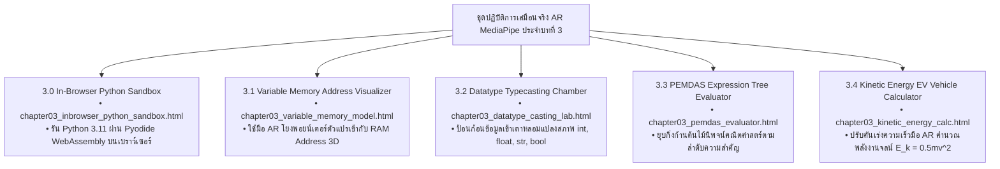

# 🔬 คู่มือปฏิบัติการเสมือนจริง 3D AR/XR MediaPipe Hands ประจำบทที่ 3
## ชุดห้องปฏิบัติการภาษา Python ตัวแปร และการจัดการข้อมูลทางวิทยาศาสตร์
### รายวิชา 4122104 วิทยาการคำนวณสำหรับการสอนวิทยาศาสตร์
**ผู้ออกแบบและพัฒนาสื่อ** ผู้ช่วยศาสตราจารย์ ดร.ชีวะ ทัศนา • คณะวิทยาศาสตร์และเทคโนโลยี มหาวิทยาลัยราชภัฏรำไพพรรณี

---

## 🌌 1. ภาพรวมชุดปฏิบัติการ 5 ห้องทดลอง 3D AR MediaPipe Hands ประจำบทที่ 3

---

## 📚 2. รายละเอียดและขั้นตอนการทดลอง 5 ปฏิบัติการ

---

### 🧪 ปฏิบัติการที่ 3.0 เทอร์มินัลภาษา Python 3.11 บนเบราว์เซอร์
* **รหัสโมดูล** `3.0`
* **ลิงก์เข้าสู่ห้องปฏิบัติการ** [https://tsanaphy2023.github.io/computing-science/simulators/chapter03_inbrowser_python_sandbox.html](https://tsanaphy2023.github.io/computing-science/simulators/chapter03_inbrowser_python_sandbox.html)
* **เป้าหมาย** ทดลองเขียนโค้ดและรันโปรแกรมภาษา Python 3.11 สดๆ ในเบราว์เซอร์
* **การสั่งการ AR:** 
  * แตะคีย์บอร์ดเสมือนหรือพิมพ์โค้ด `import this` เพื่อดูหลักคิด The Zen of Python
  * ใช้มือ AR แตะปุ่ม **"Run Code"** ในอากาศเพื่อสั่งประมวลผลพร้อมเสียง Synth Chime

---

### 🧪 ปฏิบัติการที่ 3.1 แบบจำลองตัวแปรและแอดเดรสในหน่วยความจำ RAM
* **รหัสโมดูล** `3.1`
* **ลิงก์เข้าสู่ห้องปฏิบัติการ** [https://tsanaphy2023.github.io/computing-science/simulators/chapter03_variable_memory_model.html](https://tsanaphy2023.github.io/computing-science/simulators/chapter03_variable_memory_model.html)
* **เป้าหมาย** สังเกตกลไก Dynamic Typing และ Reference Pointers ในหน่วยความจำ Heap
* **การสั่งการ AR:**
  * ใช้มือทำท่า **🤏 จีบนิ้ว (Pinch)** หยิบป้ายตัวแปร `speed` ลากไปผูกกับก้อนตัวเลข `25`
  * เปลี่ยนค่าเป็น `"Fast"` และสังเกตการสร้างก้อน Object ใหม่พร้อมแอดเดรสเปลี่ยนไป

---

### 🧪 ปฏิบัติการที่ 3.2 เตาหลอมแปลงชนิดข้อมูล 3 มิติ
* **รหัสโมดูล** `3.2`
* **ลิงก์เข้าสู่ห้องปฏิบัติการ** [https://tsanaphy2023.github.io/computing-science/simulators/chapter03_datatype_casting_lab.html](https://tsanaphy2023.github.io/computing-science/simulators/chapter03_datatype_casting_lab.html)
* **เป้าหมาย** ศึกษาการแปลงชนิดข้อมูล `int()`, `float()`, `str()`, `bool()` และข้อผิดพลาด `ValueError`
* **การสั่งการ AR:**
  * ใช้มือผลักก้อนสายอักขระ `3.1415` เข้าสู่เตาหลอม `float()` สังเกตการเปลี่ยนเป็นสีเขียวทศนิยม
  * ทดลองผลักเข้าเตา `int()` เพื่อสังเกตสัญญาณไฟกะพริบสีแดงและเสียงแจ้งเตือนข้อผิดพลาด

---

### 🧪 ปฏิบัติการที่ 3.3 ต้นไม้นิพจน์คณิตศาสตร์และลำดับ PEMDAS
* **รหัสโมดูล** `3.3`
* **ลิงก์เข้าสู่ห้องปฏิบัติการ** [https://tsanaphy2023.github.io/computing-science/simulators/chapter03_pemdas_evaluator.html](https://tsanaphy2023.github.io/computing-science/simulators/chapter03_pemdas_evaluator.html)
* **เป้าหมาย** ฝึกทักษะการประเมินค่านิพจน์คณิตศาสตร์ตามลำดับความสำคัญ วงเล็บ $\rightarrow$ ยกกำลัง $\rightarrow$ คูณ/หาร $\rightarrow$ บวก/ลบ
* **การสั่งการ AR:**
  * ใช้มือแตะกิ่งก้านต้นไม้เพื่อสั่งยุบสมการทีละบรรทัด
  * ฟังเสียง Harmonic Synth Tone ไต่ระดับความถี่ตามลำดับความลึกของสมการ

---

### 🧪 ปฏิบัติการที่ 3.4 เครื่องมือคำนวณพลังงานจลน์รถยนต์ไฟฟ้า 3D
* **รหัสโมดูล** `3.4`
* **ลิงก์เข้าสู่ห้องปฏิบัติการ** [https://tsanaphy2023.github.io/computing-science/simulators/chapter03_kinetic_energy_calc.html](https://tsanaphy2023.github.io/computing-science/simulators/chapter03_kinetic_energy_calc.html)
* **เป้าหมาย** ศึกษาความสัมพันธ์แบบไม่เป็นเชิงเส้น ($E_k \propto v^2$) และฝึกจัดรูปแบบรายงาน f-strings
* **การสั่งการ AR:**
  * ใช้มือขยับคันเร่งความเร็ว $v$ ตั้งแต่ $0$ ถึง $120\text{ km/h}$
  * บันทึกค่าพลังงานจลน์ที่แสดงผลบน HUD ดิจิทัล และสังเกตการเพิ่มขึ้นแบบยกกำลังสอง

---

## 📋 3. ใบงานบันทึกผลการทดลอง

| การทดลองที่ | มวลรถยนต์ $m$ (kg) | ความเร็วหน้าปัด $v$ (km/h) | ความเร็ว SI $v$ (m/s) | พลังงานจลน์ $E_k$ (Joules) | พลังงานจลน์ $E_k$ (kJ) |
| :---: | :---: | :---: | :---: | :---: | :---: |
| **1** | 1,850 | 30.0 | 8.3333 | 64,236.11 J | 64.24 kJ |
| **2** | 1,850 | 60.0 | 16.6667 | 256,944.44 J | 256.94 kJ |
| **3** | 1,850 | 90.0 | 25.0000 | 578,125.00 J | 578.13 kJ |
| **4** | 1,850 | 120.0 | 33.3333 | 1,027,777.78 J | 1,027.78 kJ |

> 🎯 **ข้อค้นพบทางวิทยาศาสตร์** เมื่อความเร็วเพิ่มขึ้นเป็น 2 เท่า ($30 \rightarrow 60\text{ km/h}$) พลังงานจลน์สะสมจะเพิ่มขึ้นเป็น **4 เท่า** ($64.24 \rightarrow 256.94\text{ kJ}$) เสมอ!
