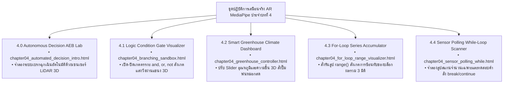

# 🔬 คู่มือปฏิบัติการเสมือนจริง 3D AR/XR MediaPipe Hands ประจำบทที่ 4
## ชุดห้องปฏิบัติการโครงสร้างควบคุม เงื่อนไข และการวนซ้ำในระบบอัตโนมัติ
### รายวิชา 4122104 วิทยาการคำนวณสำหรับการสอนวิทยาศาสตร์
**ผู้ออกแบบและพัฒนาสื่อ** ผู้ช่วยศาสตราจารย์ ดร.ชีวะ ทัศนา • คณะวิทยาศาสตร์และเทคโนโลยี มหาวิทยาลัยราชภัฏรำไพพรรณี

---

## 🌌 1. ภาพรวมชุดปฏิบัติการ 5 ห้องทดลอง 3D AR MediaPipe Hands ประจำบทที่ 4

---

## 📚 2. รายละเอียดและขั้นตอนการทดลอง 5 ปฏิบัติการ

---

### 🧪 ปฏิบัติการที่ 4.0 ระบบตัดสินใจเบรกฉุกเฉินอัตโนมัติ 3D
* **รหัสโมดูล** `4.0`
* **ลิงก์เข้าสู่ห้องปฏิบัติการ** [https://tsanaphy2023.github.io/computing-science/simulators/chapter04_automated_decision_intro.html](https://tsanaphy2023.github.io/computing-science/simulators/chapter04_automated_decision_intro.html)
* **เป้าหมาย** สังเกตการตัดสินใจแบบเรียลไทม์ของอัลกอริทึมเมื่อระยะห่าง $< \text{Threshold}$
* **การสั่งการ AR:** 
  * ใช้มือเลื่อนตำแหน่งสิ่งกีดขวางเข้าหารถยนต์
  * เมื่อเข้าสู่ระยะวิกฤต ($20\text{ m}$) สังเกตระบบ AEB ทำงาน มีไฟเตือนสีแดงกะพริบและเสียงเบรก ABS คำนวณสด

---

### 🧪 ปฏิบัติการที่ 4.1 เครื่องมือจำลองเกตตรรกะและการแตกกิ่ง
* **รหัสโมดูล** `4.1`
* **ลิงก์เข้าสู่ห้องปฏิบัติการ** [https://tsanaphy2023.github.io/computing-science/simulators/chapter04_branching_sandbox.html](https://tsanaphy2023.github.io/computing-science/simulators/chapter04_branching_sandbox.html)
* **เป้าหมาย** ทดสอบตัวดำเนินการเปรียบเทียบและตรรกะ Short-Circuit Evaluation
* **การสั่งการ AR:**
  * ใช้มือทำท่า **🤏 จีบนิ้ว (Pinch)** เพื่อสับสวิตช์เงื่อนไข $A$ และ $B$
  * สังเกตกระแสอนุภาคข้อมูลไหลผ่านเกต `and`, `or` ไปยังเอาต์พุตพร้อมเสียง Synth Chime

---

### 🧪 ปฏิบัติการที่ 4.2 แดชบอร์ดควบคุมโรงเรือนเกษตรอัจฉริยะ 3D
* **รหัสโมดูล** `4.2`
* **ลิงก์เข้าสู่ห้องปฏิบัติการ** [https://tsanaphy2023.github.io/computing-science/simulators/chapter04_greenhouse_controller.html](https://tsanaphy2023.github.io/computing-science/simulators/chapter04_greenhouse_controller.html)
* **เป้าหมาย** ออกแบบเงื่อนไขหลายชั้น `if-elif-else` และ Guard Clause ความปลอดภัย
* **การสั่งการ AR:**
  * ใช้มือปรับ Slider อุณหภูมิ ($20 - 45^\circ\text{C}$) และความชื้น ($30 - 90\%$)
  * สังเกตการหมุนของพัดลมระบายอากาศ การพ่นละอองน้ำ และการกางม่านบังแดดแบบ 3 มิติ

---

### 🧪 ปฏิบัติการที่ 4.3 เครื่องมือสะสมผลรวมอนุกรม For-Loop
* **รหัสโมดูล** `4.3`
* **ลิงก์เข้าสู่ห้องปฏิบัติการ** [https://tsanaphy2023.github.io/computing-science/simulators/chapter04_for_loop_range_visualizer.html](https://tsanaphy2023.github.io/computing-science/simulators/chapter04_for_loop_range_visualizer.html)
* **เป้าหมาย** ศึกษาการทำงานของฟังก์ชัน `range(start, stop, step)` และตัวแปรสะสมผลรวม
* **การสั่งการ AR:**
  * ปรับค่า $N$ ตั้งแต่ $1$ ถึง $20$ แล้วกดปุ่มสั่งรันลูป
  * สังเกตบล็อกตัวเลขค่อยๆ ก่อตัวซ้อนทับกันเป็นพีระมิด 3 มิติ พร้อมเสียง Synth จังหวะก้าวเดิน

---

### 🧪 ปฏิบัติการที่ 4.4 เครื่องสแกนค่าเซนเซอร์และจำนวนเฉพาะ While-Loop
* **รหัสโมดูล** `4.4`
* **ลิงก์เข้าสู่ห้องปฏิบัติการ** [https://tsanaphy2023.github.io/computing-science/simulators/chapter04_sensor_polling_while.html](https://tsanaphy2023.github.io/computing-science/simulators/chapter04_sensor_polling_while.html)
* **เป้าหมาย** ศึกษาการทำงานของ `while` ลูป และคำสั่งควบคุม `break` / `continue`
* **การสั่งการ AR:**
  * ป้อนตัวเลขเป้าหมายและสั่งเริ่มสแกน
  * สังเกตจังหวะที่ระบบสั่ง `break` ทันทีเมื่อพบตัวหาร พร้อมเสียง Harmonic Fanfare ยืนยันผล

---

## 📋 3. ใบงานบันทึกผลการทดลอง

| สภาวะทดสอบ | อุณหภูมิ ($^\circ\text{C}$) | ความชื้น ($\%$) | สถานะถังน้ำ | สถานะปั๊มพ่นหมอก | สถานะพัดลมระบายอากาศ | ผลการประเมินความปลอดภัย |
| :---: | :---: | :---: | :---: | :---: | :---: | :---: |
| **สภาวะที่ 1** | $25.0$ | $70.0$ | ปกติ | 💤 STANDBY | 💤 OFF | ✅ ปลอดภัย สภาพแวดล้อมเหมาะสม |
| **สภาวะที่ 2** | $37.5$ | $45.0$ | ปกติ | ⚡ ACTIVE | 💨 LOW SPEED | ✅ ระบายความร้อนและเพิ่มความชื้น |
| **สภาวะที่ 3** | $39.0$ | $40.0$ | **น้ำแห้ง ** | **🔒 LOCKED (OFF)** | **🌪️ HIGH SPEED** | **🛡️ ตัดการทำงานปั๊ม ป้องกันมอเตอร์ไหม้** |
