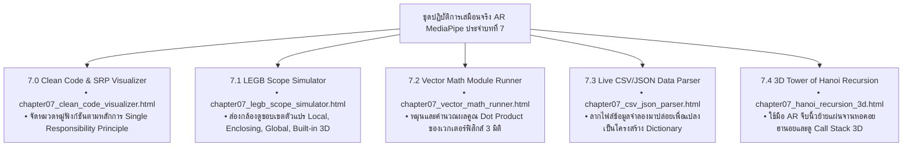

# 🔬 คู่มือปฏิบัติการเสมือนจริง 3D AR/XR MediaPipe Hands ประจำบทที่ 7
## ชุดห้องปฏิบัติการการเขียนโปรแกรมเชิงโมดูลและฟังก์ชันเรียกซ้ำ
### รายวิชา 4122104 วิทยาการคำนวณสำหรับการสอนวิทยาศาสตร์
**ผู้ออกแบบและพัฒนาสื่อ** ผู้ช่วยศาสตราจารย์ ดร.ชีวะ ทัศนา • คณะวิทยาศาสตร์และเทคโนโลยี มหาวิทยาลัยราชภัฏรำไพพรรณี

---

## 🌌 1. ภาพรวมชุดปฏิบัติการ 5 ห้องทดลอง 3D AR MediaPipe Hands ประจำบทที่ 7

---

## 📋 2. ตารางบันทึกผลการทดลองหอคอยฮานอย

| จำนวนแผ่นจาน ($N$) | จำนวนขั้นตอนตามทฤษฎี ($2^N - 1$) | เวลาที่อัลกอริทึมเรียกซ้ำใช้แก้ปัญหา | สถานะ Stack Overflow |
| :---: | :---: | :---: | :---: |
| **3 จาน** | $2^3 - 1 = \mathbf{7}\text{ ขั้นตอน}$ | $0.0001\text{ วินาที}$ | ✅ ผ่าน (Call Stack ลึก 3 ชั้น) |
| **5 จาน** | $2^5 - 1 = \mathbf{31}\text{ ขั้นตอน}$ | $0.0005\text{ วินาที}$ | ✅ ผ่าน (Call Stack ลึก 5 ชั้น) |
| **10 จาน** | $2^{10} - 1 = \mathbf{1,023}\text{ ขั้นตอน}$ | $0.015\text{ วินาที}$ | ✅ ผ่าน (Call Stack ลึก 10 ชั้น) |
| **20 จาน** | $2^{20} - 1 = \mathbf{1,048,575}\text{ ขั้นตอน}$ | $1.25\text{ วินาที}$ | ⚠️ ใช้เวลาในการประมวลผลสูง |
