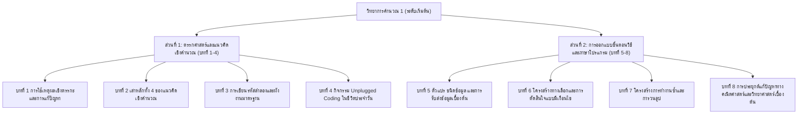

# โครงร่างตำราวิชาการ เล่มที่ 1 วิทยาการคำนวณระดับเริ่มต้น
## ชื่อหนังสือ วิทยาการคำนวณ 1 รากฐานแนวคิดเชิงคำนวณและการแก้ปัญหาอย่างเป็นระบบ
**ผู้เขียน** ผู้ช่วยศาสตราจารย์ ดร.ชีวะ ทัศนา  
**สังกัด** สาขาวิชาฟิสิกส์ คณะวิทยาศาสตร์และเทคโนโลยี มหาวิทยาลัยราชภัฏรำไพพรรณี  
**มาตรฐานหลักสูตร** สอดคล้องกับมาตรฐานการเรียนรู้ ว 4.2 กลุ่มสาระการเรียนรู้วิทยาศาสตร์และเทคโนโลยี และกรอบมาตรฐานคุณวุฒิระดับอุดมศึกษา

---

## 🎯 วัตถุประสงค์และภาพรวมของตำราเล่มที่ 1
ตำราเล่มนี้มุ่งเน้นการสร้าง **ฐานคิดเชิงตรรกะและกระบวนการคิดเชิงคำนวณ** ให้แก่ผู้เรียนตั้งแต่ระดับพื้นฐาน โดยไม่จำกัดอยู่เพียงแค่การเขียนโค้ดหน้าจอคอมพิวเตอร์ แต่เน้นการมองปัญหาในชีวิตประจำวัน ปัญหาทางคณิตศาสตร์ และวิทยาศาสตร์อย่างเป็นระบบ ผ่านกิจกรรม **Unplugged Coding** การเขียน **รหัสลำลอง** และ **ผังงาน** ก่อนเปลี่ยนผ่านสู่การเขียนโปรแกรมคอมพิวเตอร์อย่างง่ายด้วยภาษาที่เป็นมิตร เช่น Block-based Programming และ Python เบื้องต้น

---

## 📑 สารบัญและโครงสร้างเนื้อหารายบท (8 บทเรียนมาตรฐาน)

---

### บทที่ 1 การใช้เหตุผลเชิงตรรกะและการแก้ปัญหา
* **1.0 เรื่องเล่าเปิดบทเรียนและทำไมตรรกะจึงเป็นภาษาของจักรวาล**
  * กรณีศึกษา: ปริศนาข้ามแม่น้ำ, เกมกระดานซูโดกุ, และการตัดสินใจในชีวิตจริง
* **1.1 นิยามและหลักการของการใช้เหตุผลเชิงตรรกะ (Logical Reasoning)**
  * ตรรกะแบบนิรนัย (Deductive Reasoning) และแบบอุปนัย (Inductive Reasoning)
  * ประพจน์และตัวดำเนินการทางตรรกศาสตร์ (AND, OR, NOT)
* **1.2 การระบุปัญหาและการวิเคราะห์เงื่อนไขของสถานการณ์**
  * การจำแนกความจริง (Fact) กับความคิดเห็น (Opinion)
  * การหาข้อขัดแย้งเชิงตรรกะและการให้เหตุผลวิบัติ (Logical Fallacies)
* **1.3 กิจกรรมฝึกทักษะตรรกะและเกมกระตุ้นความคิด**
  * แบบฝึกหัด Logic Grid Puzzles และ Truth Table เบื้องต้น
* **1.4 สรุปบทเรียนและแนวคิดสำคัญประจำบทที่ 1**

---

### บทที่ 2 เสาหลักทั้ง 4 ของแนวคิดเชิงคำนวณ
* **2.0 เรื่องเล่าเปิดบทเรียนและการคิดอย่างคอมพิวเตอร์โดยมนุษย์**
* **2.1 เสาหลักที่ 1: การแยกส่วนประกอบและการย่อยปัญหา**
  * เทคนิคการแตกปัญหาใหญ่เป็นปัญหาย่อย (Divide and Conquer)
  * กรณีศึกษา: การทำงานของจักรยาน, การทำอาหารตามสูตร, การแยกส่วนประกอบของเซลล์พืช
* **2.2 เสาหลักที่ 2: การหารูปแบบและความเหมือน (Pattern Recognition)**
  * การสังเกตแนวโน้มและพฤติกรรมซ้ำซ้อนในข้อมูล
  * ตัวอย่าง: อนุกรมตัวเลข, ลำดับฟีโบนัชชีในธรรมชาติ, กราฟการเคลื่อนที่
* **2.3 เสาหลักที่ 3: การคิดเชิงนามธรรม**
  * การคัดกรองสาระสำคัญและการตัดรายละเอียดที่ไม่จำเป็นออก
  * ตัวอย่าง: แผนที่รถไฟฟ้า BTS/MRT, แผนภาพวงจรไฟฟ้าอย่างย่อ
* **2.4 เสาหลักที่ 4: การออกแบบขั้นตอนวิธี**
  * การจัดลำดับคำสั่งที่ชัดเจน แม่นยำ และทำซ้ำได้ (Deterministic Steps)
* **2.5 สรุปบทเรียนและตารางเปรียบเทียบเสาหลักทั้ง 4**

---

### บทที่ 3 การเขียนรหัสลำลองและผังงานมาตรฐาน
* **3.0 เรื่องเล่าเปิดบทเรียนและสะพานเชื่อมความคิดสู่ภาษาคอมพิวเตอร์**
* **3.1 การเขียนรหัสลำลอง**
  * โครงสร้างไวยากรณ์สากล: INPUT, OUTPUT, COMPUTE, IF-THEN-ELSE, WHILE, FOR
  * ตัวอย่างการเขียนรหัสลำลองสำหรับกิจวัตรประจำวันและสูตรคำนวณ
* **3.2 สัญลักษณ์ผังงานมาตรฐานสากล (ANSI/ISO Flowchart Symbols)**
  * Terminator, Process, Decision, Input/Output, Connector, Flowline
  * กฎเหล็กในการเขียนผังงานที่ดี (ไม่ให้มี Deadlock หรือเส้นตัดข้ามกัน)
* **3.3 โครงสร้างการควบคุมหลัก 3 รูปแบบในผังงาน**
  1. โครงสร้างแบบเรียงลำดับ (Sequential Structure)
  2. โครงสร้างแบบทางเลือก (Selection / Branching Structure)
  3. โครงสร้างแบบวนซ้ำ (Iteration / Repetition Structure)
* **3.4 การตรวจสอบความถูกต้องของขั้นตอนวิธีด้วยตารางตรวจสอบ (Trace Table / Dry Run)**
* **3.5 สรุปบทเรียนและแบบฝึกหัดเขียนรหัสลำลองคู่ขนานผังงาน**

---

### บทที่ 4 กิจกรรม Unplugged Coding ในชีวิตประจำวัน
* **4.0 เรื่องเล่าเปิดบทเรียนและการเรียนโค้ดดิ้งโดยไม่ต้องใช้คอมพิวเตอร์**
* **4.1 กิจกรรมการสั่งการหุ่นยนต์มนุษย์ (Human Robot Algorithm)**
  * การออกแบบชุดคำสั่งเดินตามตารางพิกัด (Grid Navigation)
  * การจัดการข้อผิดพลาด (Debugging in Real-time)
* **4.2 กิจกรรมถอดรหัสพิกเซลและภาพบิตแมป (Pixel Art & Binary Representation)**
  * การแปลงเลขฐานสองเป็นภาพและการบีบอัดข้อมูลแบบ Run-length Encoding
* **4.3 กิจกรรมการเรียงลำดับลูกแก้วและการค้นหาการ์ดลับ (Sorting & Searching Unplugged)**
  * กิจกรรมชั่งน้ำหนักเปรียบเทียบลำดับ (Balance Scale Sorting)
* **4.4 การถอดบทเรียน Unplugged สู่ทักษะการแก้ปัญหาในชีวิตจริง**
* **4.5 สรุปบทเรียนและคู่มือจัดกิจกรรมสำหรับครูผู้สอน**

---

### บทที่ 5 ตัวแปร ชนิดข้อมูล และการรับส่งข้อมูลเบื้องต้น
* **5.0 เรื่องเล่าเปิดบทเรียนและกล่องความจำของคอมพิวเตอร์**
* **5.1 แนวคิดเรื่องตัวแปร (Variables) และตัวระบุ (Identifiers)**
  * กฎการตั้งชื่อตัวแปรที่สื่อความหมาย (Clean Code Naming)
* **5.2 ชนิดข้อมูลพื้นฐาน (Primitive Data Types)**
  * จำนวนเต็ม (Integer), ทศนิยม (Float), ข้อความ (String), ตรรกะ (Boolean)
* **5.3 ตัวดำเนินการทางคณิตศาสตร์และนิพจน์ (Arithmetic Operators & Expressions)**
  * ลำดับความสำคัญของตัวดำเนินการ (Operator Precedence / PEMDAS)
* **5.4 การรับข้อมูลเข้า (Input) และการแสดงผลลัพธ์ (Output)**
  * การแปลงชนิดข้อมูล (Type Casting)
  * ตัวอย่างโค้ด Block-based (Scratch/Blockly) และ Python
* **5.5 สรุปบทเรียน ตัวอย่างโจทย์คำนวณพื้นที่และอุณหภูมิ**

---

### บทที่ 6 โครงสร้างทางเลือกและการตัดสินใจแบบมีเงื่อนไข
* **6.0 เรื่องเล่าเปิดบทเรียนและทางแยกแห่งการตัดสินใจ**
* **6.1 เงื่อนไขและตัวดำเนินการเปรียบเทียบ (Relational Operators)**
  * `==`, `!=`, `>`, `<`, `>=`, `<=`
* **6.2 โครงสร้างเงื่อนไขแบบทางเดียวและสองทาง (if และ if-else)**
  * ตัวอย่าง: ระบบตรวจจับคะแนนสอบผ่าน/ไม่ผ่าน, การตรวจสอบเลขคู่/เลขคี่
* **6.3 โครงสร้างเงื่อนไขแบบหลายทาง (Nested if และ if-elif-else)**
  * ตัวอย่าง: การตัดเกรด A-B-C-D-F, การคำนวณค่าดัชนีมวลกาย (BMI) พร้อมเกณฑ์สุขภาพ
* **6.4 ตัวดำเนินการตรรกะร่วม (and, or, not) ในการสร้างเงื่อนไขซับซ้อน**
* **6.5 สรุปบทเรียนและกรณีศึกษาระบบเซนเซอร์ตรวจจับแสงอัตโนมัติ**

---

### บทที่ 7 โครงสร้างการทำงานซ้ำและการวนลูป
* **7.0 เรื่องเล่าเปิดบทเรียนและพลังการทำซ้ำนับล้านรอบในเสี้ยววินาที**
* **7.1 ลูปแบบทราบจำนวนรอบแน่นอน (Count-controlled Loop / for Loop)**
  * การใช้ฟังก์ชัน `range()` ในการสร้างช่วงลำดับ
  * ตัวอย่าง: การหาผลรวม 1 ถึง N, การสร้างตารางสูตรคูณ
* **7.2 ลูปแบบมีเงื่อนไขตรวจสอบ (Condition-controlled Loop / while Loop)**
  * ตัวอย่าง: การทายตัวเลขปริศนา, การจำลองการถอนเงินจากตู้ ATM
* **7.3 คำสั่งควบคุมพิเศษภายในลูป (break, continue)**
  * การป้องกันการเกิดลูปไม่รู้จบ (Infinite Loop Protection)
* **7.4 การวนลูปซ้อนลูป (Nested Loops) เบื้องต้น**
  * ตัวอย่าง: การวาดลวดลายเรขาคณิตด้วยตัวอักษร, พิกัดตาราง 2 มิติ
* **7.5 สรุปบทเรียนและตัวอย่างการตรวจสอบจำนวนเฉพาะ (Prime Number Tester)**

---

### บทที่ 8 การประยุกต์แก้ปัญหาทางคณิตศาสตร์และวิทยาศาสตร์เบื้องต้น
* **8.0 เรื่องเล่าเปิดบทเรียนและพลังของโค้ดดิ้งในการปลดล็อกความรู้ STEM**
* **8.1 โครงงานคณิตศาสตร์ 1: โปรแกรมคำนวณพื้นที่ ปริมาตร และทฤษฎีบทพีทาโกรัส**
* **8.2 โครงงานคณิตศาสตร์ 2: โปรแกรมหาค่าเฉลี่ย มัธยฐาน และฐานนิยมเบื้องต้น**
* **8.3 โครงงานวิทยาศาสตร์ 1: โปรแกรมจำลองการตกของวัตถุภายใต้แรงโน้มถ่วง ($s = \frac{1}{2}gt^2$)**
* **8.4 โครงงานวิทยาศาสตร์ 2: โปรแกรมคำนวณความเร็ว อัตราเร่ง และกฎของโอห์ม ($V = IR$)**
* **8.5 สรุปภาพรวมเล่มที่ 1 และสะพานเชื่อมสู่ระดับกลาง**

---

## 📊 ตารางมาตรฐานผลลัพธ์การเรียนรู้ (OBE & Bloom's Taxonomy Mapping)

| บทที่ | หัวข้อหลัก | Bloom's Taxonomy | OBE Learning Outcome (CLO) |
| :---: | :--- | :---: | :--- |
| **1** | การใช้เหตุผลเชิงตรรกะ | L2 (Understand), L4 (Analyze) | อธิบายและประยุกต์ใช้ตรรกะในการวิเคราะห์เงื่อนไขของปัญหาได้อย่างถูกต้อง |
| **2** | เสาหลักแนวคิดเชิงคำนวณ | L3 (Apply), L4 (Analyze) | จำแนกและใช้เสาหลักทั้ง 4 ย่อยปัญหาในชีวิตประจำวันอย่างเป็นระบบ |
| **3** | รหัสลำลองและผังงาน | L3 (Apply), L6 (Create) | ออกแบบขั้นตอนวิธี ถ่ายทอดเป็นรหัสลำลองและผังงานมาตรฐานสากล |
| **4** | Unplugged Coding | L3 (Apply), L4 (Analyze) | ร่วมกิจกรรมถอดรหัสและแก้ปัญหาเชิงอัลกอริทึมโดยไม่ต้องพึ่งพาคอมพิวเตอร์ |
| **5** | ตัวแปรและการรับส่งข้อมูล | L2 (Understand), L3 (Apply) | กำหนดตัวแปร เลือกชนิดข้อมูล และเขียนคำสั่งรับส่งข้อมูลได้อย่างถูกต้อง |
| **6** | โครงสร้างทางเลือก | L3 (Apply), L4 (Analyze) | ออกแบบและเขียนโปรแกรมที่มีการตัดสินใจหลายเงื่อนไขได้อย่างแม่นยำ |
| **7** | โครงสร้างการทำงานซ้ำ | L3 (Apply), L4 (Analyze) | เขียนโปรแกรมควบคุมลูป for/while เพื่อประมวลผลงานซ้ำซ้อนได้อย่างมีประสิทธิภาพ |
| **8** | การประยุกต์แก้ปัญหา STEM | L4 (Analyze), L6 (Create) | บูรณาการความรู้เขียนโปรแกรมแก้โจทย์ปัญหาคณิตศาสตร์และวิทยาศาสตร์เบื้องต้น |
