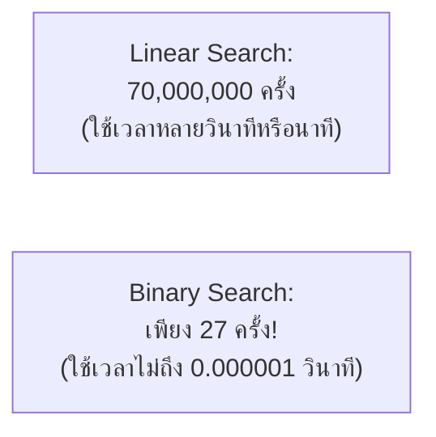
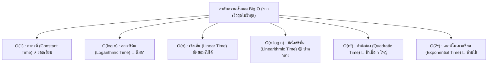

# วิทยาการคำนวณ 2 การออกแบบขั้นตอนวิธี โครงสร้างข้อมูล และการแก้ปัญหาด้วย Python
## บทที่ 1 การออกแบบขั้นตอนวิธีเชิงลึกและการวิเคราะห์ประสิทธิภาพ
**ผู้เขียน** ผู้ช่วยศาสตราจารย์ ดร.ชีวะ ทัศนา • สาขาวิชาฟิสิกส์ คณะวิทยาศาสตร์และเทคโนโลยี มหาวิทยาลัยราชภัฏรำไพพรรณี

---

## 🎯 ผลลัพธ์การเรียนรู้ประจำบท
เมื่อศึกษาบทเรียนนี้จบแล้ว ผู้เรียนสามารถ
1. **อธิบาย ** ความสำคัญของการวิเคราะห์ประสิทธิภาพขั้นตอนวิธีเชิงเวลา (Time Complexity) และเชิงพื้นที่ความจำ (Space Complexity)
2. **จำแนกและวิเคราะห์ ** อัตราการเติบโตของฟังก์ชันด้วยสัญกรณ์โอใหญ่ (Big-O Notation) เช่น $O(1), O(\log n), O(n), O(n \log n), O(n^2), O(2^n)$
3. **ประเมิน ** ประสิทธิภาพในกรณีดีที่สุด (Best Case), กรณีเฉลี่ย (Average Case), และกรณีแย่ที่สุด (Worst Case) ของขั้นตอนวิธี
4. **ออกแบบและปรับแต่ง ** โค้ดภาษา Python ให้มีความซับซ้อนเชิงเวลาลดลงได้อย่างเป็นรูปธรรม

---

## 🌌 1.0 เรื่องเล่าเปิดบทเรียน การประลองความเร็วของอัลกอริทึมในยุค Big Data

ลองจินตนาการว่าท่านมีรายชื่อประชากรไทย **70,000,000 คน** ที่เรียงตามตัวอักษรแล้ว และต้องการค้นหารายชื่อของบุคคลคนหนึ่ง

* **วิธีที่ 1 (Linear Search):** สแกนตรวจทีละคนตั้งแต่คนแรกไปเรื่อยๆ ในกรณีที่แย่ที่สุดจะต้องตรวจสอบถึง **70,000,000 ครั้ง!**
* **วิธีที่ 2 (Binary Search):** เปิดดูคนตรงกลาง ถ้าชื่อที่ต้องการอยู่ครึ่งหลัง ให้ตัดครึ่งแรกทิ้ง แล้วแบ่งครึ่งต่อไปเรื่อยๆ ในกรณีนี้จะใช้การตรวจสอบ **ไม่เกิน 27 ครั้งเท่านั้น!** ($2^{27} \approx 134,217,728 > 70,000,000$)



ความแตกต่างนี้ไม่ได้ขึ้นอยู่กับว่าคอมพิวเตอร์แรงแค่ไหน แต่อยู่ที่ **"ความซับซ้อนของขั้นตอนวิธี (Algorithmic Complexity)"** ซึ่งเป็นหัวใจสำคัญที่แยกแยะระหว่างโปรแกรมเมอร์ทั่วไปกับวิศวกรซอฟต์แวร์ระดับสากล

---

## 📐 1.1 นิยามและสัญกรณ์โอใหญ่

**สัญกรณ์โอใหญ่ ** คือ สัญกรณ์ทางคณิตศาสตร์ที่ใช้อธิบาย **ขอบเขตบน ** ของอัตราการเติบโตของเวลาประมวลผลหรือการใช้หน่วยความจำ เมื่อขนาดของข้อมูลนำเข้า ($n$) มีค่าเพิ่มขึ้นเข้าสู่อนันต์ ($n \rightarrow \infty$)

$$\text{Time Complexity} = O(f(n))$$



---

## 📊 1.2 ตารางเปรียบเทียบจำนวนการทำงานเมื่อ $n$ เพิ่มขึ้น

| สัญกรณ์ Big-O | ชื่อเรียก | $n = 10$ | $n = 100$ | $n = 1,000$ | $n = 1,000,000$ |
| :---: | :---: | :---: | :---: | :---: | :---: |
| **$O(1)$** | Constant | 1 | 1 | 1 | 1 (ทันที) |
| **$O(\log n)$** | Logarithmic | 3.3 | 6.6 | 10 | **20 ครั้ง** |
| **$O(n)$** | Linear | 10 | 100 | 1,000 | **1,000,000 ครั้ง** |
| **$O(n \log n)$** | Linearithmic | 33 | 664 | 9,965 | **~20,000,000 ครั้ง** |
| **$O(n^2)$** | Quadratic | 100 | 10,000 | 1,000,000 | **$10^{12}$ ครั้ง (ระบบค้าง)** |
| **$O(2^n)$** | Exponential | 1,024 | $1.26 \times 10^{30}$ | เป็นไปไม่ได้ | จักรวาลดับสูญ |

---

## 🔍 1.3 กฎการวิเคราะห์ Big-O จากโค้ดคอมพิวเตอร์

<div style="background: linear-gradient(135deg, #eff6ff, #dbeafe); border-left: 5px solid #3b82f6; border-radius: 12px; padding: 18px 22px; margin: 20px 0; color: #1e3a8a;">
  <h4 style="color: #1d4ed8; margin-top: 0;">📌 3 กฎเหล็กในการตัดพจน์ Big-O</h4>
  <ol style="margin: 0; line-height: 1.75;">
    <li><strong>กฎการตัดค่าสัมประสิทธิ์ (Drop Constants):</strong> $O(2n + 50) \rightarrow O(n)$, $O(500) \rightarrow O(1)$</li>
    <li><strong>กฎการตัดพจน์ที่ไม่เด่น (Drop Non-Dominant Terms):</strong> $O(n^2 + 100n + 500) \rightarrow O(n^2)$</li>
    <li><strong>กฎลูปซ้อนลูป (Nested Loops):</strong>
      <br>• ลูปชั้นเดียววน $n$ รอบ $\rightarrow O(n)$
      <br>• ลูปซ้อนกัน 2 ชั้น วนชั้นละ $n$ รอบ $\rightarrow O(n \times n) = O(n^2)$
      <br>• ลูปที่แบ่งครึ่งช่วงทีละ 2 เสมอ $\rightarrow O(\log n)$
    </li>
  </ol>
</div>

---

## 💻 1.4 โค้ดคอมพิวเตอร์ Python การทดสอบจับเวลาจริง

```python
# big_o_benchmarking.py
# โปรแกรมทดลองวัดเวลาการทำงานจริงของอัลกอริทึม O(1), O(n), O(n^2)
# ผู้เขียน: ผศ.ดร.ชีวะ ทัศนา (มรภ.รำไพพรรณี)

import time
import random

def algorithm_o1(data_list):
    """O(1) Constant Time: ดึงข้อมูลตัวแรก"""
    return data_list[0]

def algorithm_on(data_list):
    """O(n) Linear Time: หาผลรวมของสมาชิกทุกตัว"""
    total = 0
    for x in data_list:
        total += x
    return total

def algorithm_on2(data_list):
    """O(n^2) Quadratic Time: เปรียบเทียบสมาชิกทุกคู่ (Nested Loop)"""
    pair_count = 0
    for i in range(len(data_list)):
        for j in range(len(data_list)):
            if data_list[i] == data_list[j]:
                pair_count += 1
    return pair_count

def benchmark():
    sizes = [1000, 2000, 4000]
    print("=" * 65)
    print(f"{'ขนาดข้อมูล (N)':<15} | {'O(1) Time (s)':<15} | {'O(n) Time (s)':<15} | {'O(n²) Time (s)':<15}")
    print("=" * 65)
    
    for n in sizes:
        dataset = [random.randint(1, 100) for _ in range(n)]
        
        # วัดเวลา O(1)
        t0 = time.perf_counter()
        algorithm_o1(dataset)
        t_o1 = time.perf_counter() - t0
        
        # วัดเวลา O(n)
        t0 = time.perf_counter()
        algorithm_on(dataset)
        t_on = time.perf_counter() - t0
        
        # วัดเวลา O(n^2)
        t0 = time.perf_counter()
        algorithm_on2(dataset)
        t_on2 = time.perf_counter() - t0
        
        print(f"{n:<15,d} | {t_o1:<15.8f} | {t_on:<15.6f} | {t_on2:<15.4f}")
        
    print("=" * 65)

if __name__ == "__main__":
    benchmark()
```

---

## 💡 1.5 สรุปใจความสำคัญและแบบฝึกหัดท้ายบทที่ 1

### 📌 สรุปประเด็นสำคัญ
1. สัญกรณ์ **Big-O** คือเครื่องมือวัดประสิทธิภาพขั้นตอนวิธีที่เป็นอิสระจากความเร็วของฮาร์ดแวร์
2. เมื่อข้อมูลมีขนาดใหญ่ขึ้น ความแตกต่างระหว่าง $O(n \log n)$ และ $O(n^2)$ จะส่งผลต่อความเร็วหลายล้านเท่า
3. การพัฒนาโปรแกรมที่ดีต้องคำนึงถึงทั้ง Time Complexity และ Space Complexity ควบคู่กัน

---

### 📝 แบบฝึกหัดทบทวน 3 ระดับ

#### ระดับที่ 1 ความรู้ความเข้าใจพื้นฐาน
1. จงระบุความซับซ้อน Big-O ของฟังก์ชันต่อไปนี้
   * (A) $f(n) = 3n^3 + 500n^2 + 10000$
   * (B) $f(n) = 2^n + n^{10}$
   * (C) $f(n) = 15 \log n + 45$

#### ระดับที่ 2 การวิเคราะห์และประยุกต์ใช้
2. จงวิเคราะห์ความซับซ้อนเชิงเวลา ของโค้ดต่อไปนี้ในรูป Big-O:
```python
def mystery(n):
    count = 0
    for i in range(n):
        j = 1
        while j < n:
            count += 1
            j *= 2
    return count
```

#### ระดับที่ 3 การคิดขั้นสูงและบูรณาการ
3. ให้นักเรียนเขียนโปรแกรมหา **"คู่ของตัวเลขในรายการที่บวกกันได้เท่ากับเป้าหมาย (Two Sum Problem)"** โดย
   * วิธีที่ 1: ใช้ Nested Loop แบบ $O(n^2)$
   * วิธีที่ 2: ปรับปรุงประสิทธิภาพโดยใช้ Dictionary / Hash Table ให้มีความเร็ว $O(n)$ พร้อมทดสอบจับเวลาเปรียบเทียบกัน
