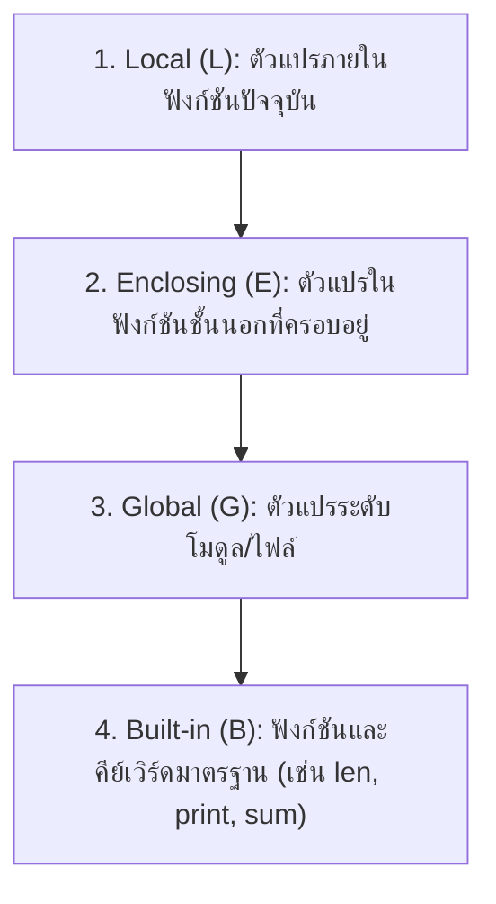

# วิทยาการคำนวณ 2 การออกแบบขั้นตอนวิธี โครงสร้างข้อมูล และการแก้ปัญหาด้วย Python
## บทที่ 2 การเขียนโปรแกรมเชิงโมดูลและฟังก์ชันขั้นสูง
**ผู้เขียน** ผู้ช่วยศาสตราจารย์ ดร.ชีวะ ทัศนา • สาขาวิชาฟิสิกส์ คณะวิทยาศาสตร์และเทคโนโลยี มหาวิทยาลัยราชภัฏรำไพพรรณี

---

## 🎯 ผลลัพธ์การเรียนรู้ประจำบท
เมื่อศึกษาบทเรียนนี้จบแล้ว ผู้เรียนสามารถ
1. **อธิบาย ** หลักการออกแบบโปรแกรมเชิงโมดูล (Modular Design), สถาปัตยกรรมโค้ดที่สะอาด (Clean Architecture), และกฎของขอบเขตตัวแปร (LEGB Scope Rule)
2. **ออกแบบและเขียน ** ฟังก์ชันขั้นสูงที่มีพารามิเตอร์แบบค่าเริ่มต้น (Default Arguments), ตัวแปรไม่จำกัดจำนวน (`*args`, `**kwargs`), และฟังก์ชันนิรนาม (Lambda Functions)
3. **ประยุกต์ใช้ ** ฟังก์ชันอันดับสูง (Higher-Order Functions: `map`, `filter`, `reduce`) ในการประมวลผลชุดข้อมูลทางวิทยาศาสตร์
4. **สร้างและจัดโครงสร้าง ** ไลบรารี/โมดูลภาษา Python ของตนเองเพื่อการนำกลับมาใช้ซ้ำ (Code Reusability)

---

## 🌌 2.0 เรื่องเล่าเปิดบทเรียน ปรัชญา UNIX กับซอฟต์แวร์ควบคุมยานสำรวจอวกาศ

ปรัชญาของระบบปฏิบัติการ UNIX และวิศวกรรมการบินอวกาศมีกฎเหล็กข้อหนึ่งที่ระบุไว้ว่า: **"จงสร้างแต่ละฟังก์ชันให้ทำหน้าที่เพียงอย่างเดียว และทำหน้าที่นั้นให้ยอดเยี่ยมที่สุด (Do One Thing and Do It Well)"**


การเขียนโปรแกรมเชิงโมดูลช่วยเปลี่ยนจากโค้ดที่ยุ่งเหยิงให้กลายเป็น **"บล็อกตัวต่อเลโก้ (Building Blocks)"** ที่มีความยืดหยุ่นสูง พร้อมสำหรับการสร้างระบบขนาดใหญ่ในโลกอุตสาหกรรม

---

## 🏛️ 2.1 ขอบเขตของตัวแปรและกฎ LEGB

ในภาษา Python เมื่อเราเรียกใช้ชื่อตัวแปรหนึ่งๆ โปรแกรมจะค้นหาตัวแปรตามลำดับ **4 ชั้นของกฎ LEGB** เสมอ



<div style="background: linear-gradient(135deg, #fef2f2, #fee2e2); border-left: 5px solid #ef4444; border-radius: 12px; padding: 18px 22px; margin: 20px 0; color: #7f1d1d;">
  <h4 style="color: #991b1b; margin-top: 0;">⚠️ หลีกเลี่ยงการใช้คำสั่ง <code>global</code> ในฟังก์ชัน!</h4>
  <p style="margin: 0; line-height: 1.75;">
    การใช้คำสั่ง <code>global</code> เพื่อแก้ไขตัวแปรภายนอกจากภายในฟังก์ชัน จะสร้าง <strong>ผลข้างเคียง (Side Effects)</strong> ที่ทำให้การติดตามข้อผิดพลาดทำได้ยากยิ่ง ควรส่งค่าเข้าทาง Parameters และส่งผลลัพธ์ออกทาง <code>return</code> เสมอ (Pure Function)
  </p>
</div>

---

## ⚙️ 2.2 ฟังก์ชันขั้นสูง `*args`, `**kwargs` และ Lambda Expressions

### 1. การรับพารามิเตอร์แบบยืดหยุ่น (`*args` และ `**kwargs`)
* `*args` (Arbitrary Positional Arguments): รับค่าอาร์กิวเมนต์แบบตำแหน่งได้ไม่จำกัดจำนวน (รวมเป็น `tuple`)
* `**kwargs` (Arbitrary Keyword Arguments): รับค่าอาร์กิวเมนต์แบบคู่คีย์-ค่าได้ไม่จำกัด (รวมเป็น `dict`)

```python
def log_experiment(experiment_name, *measurements, **metadata):
    print(f"🔬 การทดลอง: {experiment_name}")
    print(f"   • ข้อมูลการวัด: {measurements}")
    print(f"   • ข้อมูลแวดล้อม: {metadata}")

# ตัวอย่างการเรียกใช้
log_experiment("การหักเหของแสง", 1.33, 1.35, 1.34, lab="Optics 101", temp_c=25.0)
```

---

### 2. ฟังก์ชันนิรนาม และ Higher-Order Functions
ฟังก์ชันขนาดสั้นบรรทัดเดียว มักใช้ร่วมกับ `map()` และ `filter()`:

```python
# คัดกรองเฉพาะอุณหภูมิที่เกิน 37.5 องศาเซลเซียส
temperatures = [36.5, 37.8, 36.9, 38.5, 37.1, 39.0]
fever_cases = list(filter(lambda t: t > 37.5, temperatures))
print("ผู้ป่วยที่มีไข้:", fever_cases) # [37.8, 38.5, 39.0]
```

---

## 💻 2.3 โค้ดคอมพิวเตอร์ โมดูลคำนวณเวกเตอร์และฟิสิกส์ (`physics_vectors.py`)

```python
# physics_vectors.py
# โมดูลฟังก์ชันคำนวณเวกเตอร์และกลศาสตร์สำหรับงานวิทยาศาสตร์
# ผู้เขียน: ผศ.ดร.ชีวะ ทัศนา (มรภ.รำไพพรรณี)

import math

def vector_magnitude(vx: float, vy: float, vz: float = 0.0) -> float:
    """คำนวณขนาดของเวกเตอร์ 2 มิติ หรือ 3 มิติ |v| = sqrt(vx^2 + vy^2 + vz^2)"""
    return math.sqrt(vx**2 + vy**2 + vz**2)

def vector_dot_product(v1: tuple, v2: tuple) -> float:
    """คำนวณผลคูณสเกลาร์ (Dot Product) ระหว่าง 2 เวกเตอร์"""
    if len(v1) != len(v2):
        raise ValueError("มิติของเวกเตอร์ต้องเท่ากัน")
    return sum(a * b for a, b in zip(v1, v2))

def vector_normalize(v: tuple) -> tuple:
    """แปลงเวกเตอร์ให้เป็นเวกเตอร์หนึ่งหน่วย (Unit Vector)"""
    mag = vector_magnitude(*v)
    if mag == 0:
        raise ZeroDivisionError("ไม่สามารถแปลงเวกเตอร์ศูนย์เป็น Unit Vector ได้")
    return tuple(round(x / mag, 4) for x in v)

def main():
    print("=" * 65)
    print("🧭 ชุดทดสอบโมดูลเวกเตอร์ฟิสิกส์ (Physics Vector Suite)")
    print("=" * 65)
    
    vec_a = (3.0, 4.0, 0.0)
    vec_b = (1.0, 2.0, 2.0)
    
    mag_a = vector_magnitude(*vec_a)
    unit_a = vector_normalize(vec_a)
    dot_ab = vector_dot_product(vec_a, vec_b)
    
    print(f"📌 เวกเตอร์ A: {vec_a} -> ขนาด |A| = {mag_a:.2f}")
    print(f"📌 เวกเตอร์หนึ่งหน่วยของ A: {unit_a}")
    print(f"📌 ผลคูณ Dot Product (A · B): {dot_ab:.2f}")
    print("=" * 65)

if __name__ == "__main__":
    main()
```

---

## 💡 2.4 สรุปใจความสำคัญและแบบฝึกหัดท้ายบทที่ 2

### 📌 สรุปประเด็นสำคัญ
1. **Modular Programming** ช่วยแบ่งโค้ดเป็นส่วนย่อยที่อ่านง่าย ทดสอบง่าย และนำกลับมาใช้ซ้ำได้
2. **Pure Functions** ไม่สร้าง Side Effects ทำให้โปรแกรมเสถียรและปลอดภัย
3. **Lambda และ Higher-Order Functions** ช่วยให้การประมวลผลข้อมูลขนาดใหญ่มีความกระชับและมีประสิทธิภาพสูง

---

### 📝 แบบฝึกหัดทบทวน 3 ระดับ

#### ระดับที่ 1 ความรู้ความเข้าใจพื้นฐาน
1. จงอธิบายความแตกต่างระหว่าง `*args` และ `**kwargs` พร้อมยกตัวอย่างโค้ดสั้นๆ
2. ตัวแปรที่ประกาศในบรรทัดนอกสุดของไฟล์ `.py` จัดอยู่ในขอบเขตใดตามกฎ LEGB

#### ระดับที่ 2 การวิเคราะห์และประยุกต์ใช้
3. จงเขียนฟังก์ชัน `calculate_stats(*numbers)` ที่รับชุดตัวเลขจำนวนเท่าใดก็ได้ แล้วคืนค่าเป็น `dict` ที่ประกอบด้วย ค่าเฉลี่ย (Mean), ค่าสูงสุด (Max), ค่าต่ำสุด (Min), และจำนวนสมาชิกทั้งหมด

#### ระดับที่ 3 การคิดขั้นสูงและบูรณาการ
4. จงใช้ฟังก์ชัน `map()` และ `filter()` ร่วมกับ `lambda` เพื่อแปลงชุดข้อมูลอุณหภูมิในหน่วยเซลเซียส `c_temps = [0, 25, 37, 100, -10]` ให้เป็นหน่วยเคลวิน ($K = C + 273.15$) โดยคัดกรองเฉพาะอุณหภูมิที่มากกว่า $290\text{ K}$
