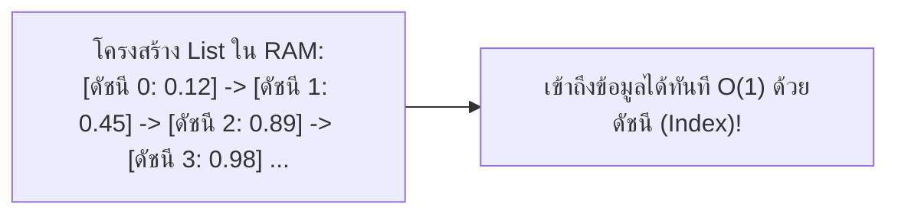
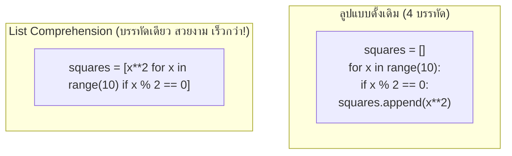

# วิทยาการคำนวณ 2 การออกแบบขั้นตอนวิธี โครงสร้างข้อมูล และการแก้ปัญหาด้วย Python
## บทที่ 3 โครงสร้างข้อมูลเชิงเส้น 1 List และ List Comprehension
**ผู้เขียน** ผู้ช่วยศาสตราจารย์ ดร.ชีวะ ทัศนา • สาขาวิชาฟิสิกส์ คณะวิทยาศาสตร์และเทคโนโลยี มหาวิทยาลัยราชภัฏรำไพพรรณี

---

## 🎯 ผลลัพธ์การเรียนรู้ประจำบท
เมื่อศึกษาบทเรียนนี้จบแล้ว ผู้เรียนสามารถ
1. **อธิบาย ** กลไกการทำงานภายในของ Dynamic Array และความซับซ้อน Big-O ของการดำเนินการกับ List
2. **จัดการข้อมูล ** ใน List ด้วยการระบุตำแหน่ง (Indexing), การสไลซ์ (Slicing `[start:stop:step]`), และเมธอดมาตรฐานได้อย่างคล่องแคล่ว
3. **สร้างและประมวลผล ** แมทริกซ์ 2 มิติ (2D Nested Lists) สำหรับงานคำนวณทางฟิสิกส์และคณิตศาสตร์
4. **เขียนโค้ดแบบกระชับ ** ด้วย List Comprehension ที่มีประสิทธิภาพและความเร็วสูงกว่าลูปแบบดั้งเดิม

---

## 🌌 3.0 เรื่องเล่าเปิดบทเรียน เมมโมรี่แถวตรงกับสัญญาณเสียงดิจิทัล

เมื่อเราฟังเพลงคุณภาพระดับ Hi-Res Audio ข้อมูลเสียงคลื่นไซน์ (Sine Wave) จะถูกบันทึกเป็นค่าความดันอากาศตัวเลขดิจิทัลมากถึง **44,100 ค่าในทุกๆ 1 วินาที (44.1 kHz Sampling Rate)**

ตัวเลขหลายหมื่นตัวเหล่านี้ถูกจัดเก็บเรียงแถวต่อเนื่องกันในหน่วยความจำ RAM ด้วยโครงสร้างที่เรียกว่า **"อาร์เรย์หรือลิสต์ (List / Array)"**



List จึงเป็นกระดูกสันหลังของวิทยาการคอมพิวเตอร์ที่ใช้จัดเก็บทุกสิ่ง ตั้งแต่คลื่นเสียง ภาพถ่ายดิจิทัล ไปจนถึงพิกัดของอนุภาคในแบบจำลองควอนตัม

---

## 📦 3.1 กลไกของ List และการดำเนินการพื้นฐาน

**List ใน Python** เป็นอาร์เรย์แบบไดนามิก (Dynamic Array) ที่สามารถปรับขนาดความจุได้อัตโนมัติ และสามารถบรรจุข้อมูลหลายชนิดปะปนกันได้

### ตารางความซับซ้อน Big-O ของการดำเนินการกับ List

| การดำเนินการ (Operation) | โค้ดตัวอย่าง | Time Complexity | เหตุผลทางโครงสร้าง |
| :--- | :--- | :---: | :--- |
| เข้าถึงข้อมูลด้วยดัชนี | `item = my_list[i]` | **$O(1)$** | คำนวณแอดเดรสหน่วยความจำได้ทันที |
| แก้ไขค่าข้อมูล | `my_list[i] = val` | **$O(1)$** | เขียนทับแอดเดรสเดิมทันที |
| เพิ่มข้อมูลต่อท้าย | `my_list.append(val)` | **$O(1)$** (Amortized)| มีการสำรองพื้นที่ความจำล่วงหน้า |
| แทรกข้อมูลตำแหน่งแรก | `my_list.insert(0, val)`| **$O(n)$** | ต้องเลื่อนสมาชิกทุกตัวถอยหลัง 1 ช่อง |
| ลบข้อมูลตำแหน่งแรก | `my_list.pop(0)` | **$O(n)$** | ต้องเลื่อนสมาชิกทุกตัวเดินหน้า 1 ช่อง |
| ค้นหาว่ามีสมาชิกอยู่หรือไม่ | `if val in my_list:` | **$O(n)$** | ต้องสแกนตรวจทีละตัวตั้งแต่ต้น |

---

## ✂️ 3.2 เทคนิคการสไลซ์ขั้นสูง

ไวยากรณ์: `list[start:stop:step]` (สิ้นสุดก่อนตำแหน่ง `stop` เสมอ):

```python
data = [10, 20, 30, 40, 50, 60, 70, 80, 90, 100]

print(data[2:6])      # [30, 40, 50, 60] (ดัชนี 2 ถึง 5)
print(data[:4])       # [10, 20, 30, 40] (4 ตัวแรก)
print(data[6:])       # [70, 80, 90, 100] (ตั้งแต่ดัชนี 6 จนจบ)
print(data[::2])      # [10, 30, 50, 70, 90] (ก้าวข้ามทีละ 2)
print(data[::-1])     # [100, 90, 80, 70, 60, 50, 40, 30, 20, 10] (กลับหลังลิสต์ทันที!)
```

---

## ⚡ 3.3 การสร้างลิสต์แบบไพธอนิก

ไวยากรณ์พื้นฐาน
```python
new_list = [expression for item in iterable if condition]
```

### เปรียบเทียบระหว่างลูปแบบดั้งเดิม vs List Comprehension 



---

## 💻 3.4 โค้ดคอมพิวเตอร์ การสร้างและทรานสโพสแมทริกซ์ 2 มิติ

```python
# matrix_operations_lab.py
# โปรแกรมประมวลผลแมทริกซ์ 2 มิติด้วย List Comprehension
# ผู้เขียน: ผศ.ดร.ชีวะ ทัศนา (มรภ.รำไพพรรณี)

def create_zero_matrix(rows: int, cols: int):
    """สร้างแมทริกซ์ศูนย์ขนาด rows x cols"""
    return [[0.0 for _ in range(cols)] for _ in range(rows)]

def transpose_matrix(matrix: list):
    """ทรานสโพสแมทริกซ์ (สลับแถวเป็นคอลัมน์) ด้วย List Comprehension บรรทัดเดียว"""
    return [[row[c] for row in matrix] for c in range(len(matrix[0]))]

def print_matrix(matrix: list, name: str = "Matrix"):
    """แสดงผลแมทริกซ์อย่างสวยงาม"""
    print(f"📊 {name} (ขนาด {len(matrix)} x {len(matrix[0])}):")
    for row in matrix:
        formatted_row = "  ".join(f"{val:6.1f}" for val in row)
        print(f"   [ {formatted_row} ]")
    print()

def main():
    print("=" * 65)
    print("🔢 ระบบประมวลผลแมทริกซ์ 2 มิติเชิงวิทยาศาสตร์ (Matrix Suite)")
    print("=" * 65)
    
    # กำหนดแมทริกซ์ขนาด 3x4
    mat_a = [
        [1.0, 2.0, 3.0, 4.0],
        [5.0, 6.0, 7.0, 8.0],
        [9.0, 10.0, 11.0, 12.0]
    ]
    
    print_matrix(mat_a, "แมทริกซ์ต้นฉบับ A")
    
    # ทำการทรานสโพสเป็นขนาด 4x3
    mat_at = transpose_matrix(mat_a)
    print_matrix(mat_at, "แมทริกซ์ทรานสโพส A^T")
    
    # กรองเฉพาะค่าที่มากกว่า 5.0 ออกมาเป็นลิสต์ 1 มิติ
    elements_over_5 = [val for row in mat_a for val in row if val > 5.0]
    print(f"✨ สมาชิกในแมทริกซ์ที่มีค่า > 5.0: {elements_over_5}")
    print("=" * 65)

if __name__ == "__main__":
    main()
```

---

## 💡 3.5 สรุปใจความสำคัญและแบบฝึกหัดท้ายบทที่ 3

### 📌 สรุปประเด็นสำคัญ
1. การเข้าถึงข้อมูลใน List ด้วยดัชนีใช้เวลาคงที่ $O(1)$ แต่การแทรก/ลบข้อมูลตัวหน้าใช้เวลา $O(n)$
2. การสไลซ์ `[::-1]` เป็นวิธีกลับด้านลิสต์ที่มีประสิทธิภาพสูงมากในภาษา Python
3. **List Comprehension** ช่วยให้โค้ดสั้นลง อ่านเข้าใจง่ายขึ้น และทำงานเร็วกว่าการใช้ `for loop + append()` แบบเดิม

---

### 📝 แบบฝึกหัดทบทวน 3 ระดับ

#### ระดับที่ 1 ความรู้ความเข้าใจพื้นฐาน
1. กำหนดให้ `nums = [10, 20, 30, 40, 50, 60, 70]` จงระบุผลลัพธ์ของ
   * (A) `nums[1:5:2]`
   * (B) `nums[-3:]`
   * (C) `nums[::-2]`
2. เพราะเหตุใดคำสั่ง `my_list.insert(0, "item")` จึงมี Time Complexity เป็น $O(n)$

#### ระดับที่ 2 การวิเคราะห์และประยุกต์ใช้
3. จงใช้ **List Comprehension** สร้างรายการตัวเลขกำลังสองของเลขคี่ในช่วง 1 ถึง 30: `[1, 9, 25, 49, ..., 841]` ภายในบรรทัดเดียว

#### ระดับที่ 3 การคิดขั้นสูงและบูรณาการ
4. จงเขียนฟังก์ชัน `matrix_multiply(A, B)` สำหรับคูณแมทริกซ์ 2 มิติ $A_{m \times k} \times B_{k \times n} = C_{m \times n}$ ด้วย List Comprehension หรือ Nested Loop พร้อมตรวจสอบว่ามิติคอลัมน์ของ $A$ เท่ากับมิติแถวของ $B$ หรือไม่
