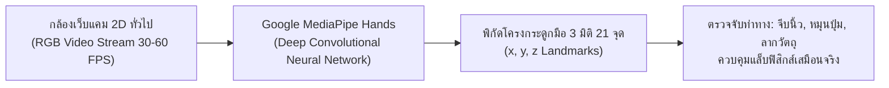
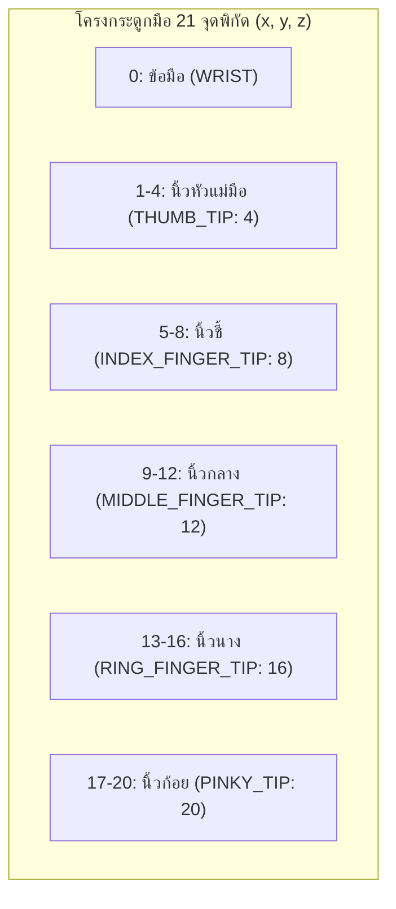

# วิทยาการคำนวณ 3 การพัฒนาโครงงานบูรณาการ ปัญญาประดิษฐ์ และนวัตกรรมการจัดการเรียนรู้วิทยาศาสตร์
## บทที่ 4 คอมพิวเตอร์วิทัศน์และการตรวจจับท่าทางมือ 3 มิติ
**ผู้เขียน** ผู้ช่วยศาสตราจารย์ ดร.ชีวะ ทัศนา • สาขาวิชาฟิสิกส์ คณะวิทยาศาสตร์และเทคโนโลยี มหาวิทยาลัยราชภัฏรำไพพรรณี

---

## 🎯 ผลลัพธ์การเรียนรู้ประจำบท
เมื่อศึกษาบทเรียนนี้จบแล้ว ผู้เรียนสามารถ
1. **อธิบาย ** หลักการพื้นฐานของการประมวลผลภาพดิจิทัล (Digital Image Processing), ระบบปริภูมิสี (RGB, BGR, Grayscale, HSV), และการตรวจจับขอบภาพ (Edge Detection)
2. **วิเคราะห์ ** โครงสร้างพิกัด 21 จุดของโมเดลโครงร่างมือ 3 มิติ (21 3D Hand Landmarks) ของ Google MediaPipe Hands
3. **คำนวณและสร้างอัลกอริทึม ** สำหรับการตรวจจับท่าทางมือ (Gesture Recognition) เช่น การจีบนิ้ว (Pinch Gesture) และการนับนิ้วมือ
4. **พัฒนาแอปพลิเคชัน ** ด้วย OpenCV และ MediaPipe เพื่อควบคุมการทดลองฟิสิกส์เสมือนจริงแบบไร้การสัมผัส (Touchless HCI)

---

## 🌌 4.0 เรื่องเล่าเปิดบทเรียน คอมพิวเตอร์ที่มองเห็นและเข้าใจภาษากายมนุษย์

ในห้องผ่าตัดปลอดเชื้อของศัลยแพทย์ การสัมผัสหน้าจอคอมพิวเตอร์หรือเมาส์อาจก่อให้เกิดความเสี่ยงต่อการติดเชื้อ แต่ด้วย **เทคโนโลยีคอมพิวเตอร์วิทัศน์ และระบบตรวจจับท่าทางมือ 3 มิติ** ศัลยแพทย์สามารถใช้เพียงการ โบกมือกลางอากาศ หรือ จีบนิ้ว เพื่อหมุนดูภาพสแกนสมอง 3 มิติแบบไร้การสัมผัส (Touchless Interaction) ได้อย่างแม่นยำ



เทคโนโลยีนี้ได้เปิดประตูสู่ยุคใหม่ของ **การปฏิสัมพันธ์ระหว่างมนุษย์และคอมพิวเตอร์ ** และห้องปฏิบัติการเสมือนจริงแบบ AR

---

## 👁️ 4.1 การประมวลผลภาพดิจิทัลด้วย OpenCV

ภาพดิจิทัลคือ **แมทริกซ์ของตัวเลข ** ขนาด $H \times W \times C$:
* **Grayscale:** ภาพระดับสีเทา 1 ช่องสัญญาณ ($0-255$)
* **BGR / RGB:** ภาพสี 3 ช่องสัญญาณ (Blue, Green, Red)
* **HSV:** ปริภูมิสีที่แยกค่า Hue (เนื้อสี $0-179$), Saturation (ความอิ่มตัว $0-255$), Value (ความสว่าง $0-255$) เหมาะอย่างยิ่งสำหรับการตรวจจับสีของวัตถุ

---

## 🖐️ 4.2 สถาปัตยกรรมโครงร่างมือ 21 จุด 3 มิติ



<div style="background: linear-gradient(135deg, #eff6ff, #dbeafe); border-left: 5px solid #2563eb; border-radius: 12px; padding: 18px 22px; margin: 20px 0; color: #1e3a8a;">
  <h4 style="color: #1d4ed8; margin-top: 0;">📐 การคำนวณระยะห่างการจีบนิ้ว (Pinch Gesture Formula)</h4>
  <p style="margin: 0; line-height: 1.8;">
    ระยะห่างแบบยุคลิด (Euclidean Distance) ระหว่างปลายนิ้วหัวแม่มือ (Landmark 4) และปลายนิ้วชี้ (Landmark 8):
    $$d = \sqrt{(x_4 - x_8)^2 + (y_4 - y_8)^2 + (z_4 - z_8)^2}$$
    หากระยะห่าง $d < 0.05$ (หน่วย Normalization) แสดงว่าผู้ใช้กำลัง <strong>"จีบนิ้วเพื่อหยิบจับวัตถุ (Pinching / Grabbing)"</strong>
  </p>
</div>

---

## 💻 4.3 โค้ดคอมพิวเตอร์ ระบบตรวจจับท่าทางมือควบคุมสเกลาร์ฟิสิกส์

```python
# mediapipe_gesture_controller.py
# โปรแกรมตรวจจับท่าทางมือและจำลองการควบคุมพารามิเตอร์ฟิสิกส์แบบไร้สัมผัส
# ผู้เขียน: ผศ.ดร.ชีวะ ทัศนา (มรภ.รำไพพรรณี)

import math

class HandLandmarkSimulator:
    """จำลองการคำนวณท่าทางมือจากชุดพิกัด 21 จุด"""
    
    @staticmethod
    def calculate_distance(p1: dict, p2: dict) -> float:
        """คำนวณระยะห่างแบบยุคลิดระหว่าง 2 จุดพิกัด"""
        dx = p1['x'] - p2['x']
        dy = p1['y'] - p2['y']
        dz = p1.get('z', 0.0) - p2.get('z', 0.0)
        return math.sqrt(dx**2 + dy**2 + dz**2)
        
    @staticmethod
    def detect_pinch(landmarks: dict) -> bool:
        """ตรวจสอบว่าผู้ใช้จีบนิ้วโป้งกับนิ้วชี้หรือไม่ (Landmark 4 และ 8)"""
        thumb_tip = landmarks[4]
        index_tip = landmarks[8]
        dist = HandLandmarkSimulator.calculate_distance(thumb_tip, index_tip)
        return dist < 0.06 # Threshold จีบนิ้ว

    @staticmethod
    def count_raised_fingers(landmarks: dict) -> int:
        """นับจำนวนนิ้วที่ยกขึ้น โดยตรวจสอบว่า Tip อยู่สูงกว่า PIP Joint หรือไม่"""
        tips = [8, 12, 16, 20] # ชี้ กลาง นาง ก้อย
        pips = [6, 10, 14, 18]
        raised = 0
        
        # ในพิกัดภาพ y=0 อยู่ด้านบนสุด ดังนั้น y ของปลายนิ้วต้องน้อยกว่าข้อนิ้ว
        for tip, pip in zip(tips, pips):
            if landmarks[tip]['y'] < landmarks[pip]['y']:
                raised += 1
                
        # ตรวจสอบนิ้วโป้ง (แกน x)
        if landmarks[4]['x'] < landmarks[3]['x']: # มือขวา
            raised += 1
            
        return raised

def main():
    print("=" * 65)
    print("🖐️ ระบบจำลองการประมวลผลท่าทางมือ 3 มิติ (MediaPipe Gesture Lab)")
    print("=" * 65)
    
    # พิกัดจำลองของมือ (Normalized 0.0 - 1.0)
    mock_landmarks_pinching = {
        0: {'x': 0.5, 'y': 0.8, 'z': 0.0},
        3: {'x': 0.42, 'y': 0.55, 'z': 0.0},
        4: {'x': 0.46, 'y': 0.42, 'z': 0.0}, # โป้ง
        6: {'x': 0.48, 'y': 0.50, 'z': 0.0},
        8: {'x': 0.47, 'y': 0.43, 'z': 0.0}, # ชี้ (อยู่ชิดโป้ง -> Pinching)
        10: {'x': 0.52, 'y': 0.50, 'z': 0.0},
        12: {'x': 0.52, 'y': 0.35, 'z': 0.0}, # กลาง (ยกขึ้น)
        14: {'x': 0.55, 'y': 0.52, 'z': 0.0},
        16: {'x': 0.55, 'y': 0.60, 'z': 0.0}, # นาง (พับลง)
        18: {'x': 0.58, 'y': 0.55, 'z': 0.0},
        20: {'x': 0.58, 'y': 0.65, 'z': 0.0}, # ก้อย (พับลง)
    }
    
    is_pinch = HandLandmarkSimulator.detect_pinch(mock_landmarks_pinching)
    num_fingers = HandLandmarkSimulator.count_raised_fingers(mock_landmarks_pinching)
    
    print(f"📌 ผลการวิเคราะห์ท่าทางมือ:")
    print(f"   • สถานะการจีบนิ้ว (Pinch Gesture): [{'✅ PINCHING (GRAB)' if is_pinch else '❌ OPEN'}]")
    print(f"   • จำนวนนิ้วที่กางออก:             {num_fingers} นิ้ว")
    print("=" * 65)

if __name__ == "__main__":
    main()
```

---

## 💡 4.4 สรุปใจความสำคัญและแบบฝึกหัดท้ายบทที่ 4

### 📌 สรุปประเด็นสำคัญ
1. **OpenCV** คือเครื่องมือมาตรฐานในการจัดการภาพและวิดีโอสตรีมระดับพิกเซล
2. **Google MediaPipe Hands** แปลงข้อมูลภาพ 2D ให้กลายเป็นพิกัดโครงกระดูกมือ 3 มิติ 21 จุดได้แบบ Real-time บนเว็บเบราว์เซอร์และ Python
3. การตรวจจับท่าทางอาศัยเรขาคณิตวิเคราะห์และระยะห่างแบบยุคลิดระหว่างจุดต่อ (Joints)

---

### 📝 แบบฝึกหัดทบทวน 3 ระดับ

#### ระดับที่ 1 ความรู้ความเข้าใจพื้นฐาน
1. จงระบุหมายเลข Landmark ของจุดต่อไปนี้ในโมเดล MediaPipe Hands:
   * (A) ข้อมือ (Wrist)
   * (B) ปลายนิ้วชี้ (Index Finger Tip)
   * (C) ปลายนิ้วหัวแม่มือ (Thumb Tip)
2. เพราะเหตุใดในระบบพิกัดภาพดิจิทัล (Computer Vision Coordinates) ค่า $y=0$ จึงอยู่ที่ขอบบนสุดของภาพ

#### ระดับที่ 2 การวิเคราะห์และประยุกต์ใช้
3. จงเขียนสมการทางคณิตศาสตร์และเงื่อนไขภาษา Python สำหรับตรวจจับท่าทาง **"ชู 2 นิ้วสัญลักษณ์สู้ตาย (Peace Sign: ✌️)"** โดยนิ้วชี้และนิ้วกลางต้องกางออก แต่นิ้วนางและนิ้วก้อยต้องพับเก็บ

#### ระดับที่ 3 การคิดขั้นสูงและบูรณาการ
4. จงออกแบบโครงสร้างระบบ Virtual Physics Lab ที่ให้ผู้เรียนใช้มือหมุนลูกบิดปรับค่าความต้านทานไฟฟ้า ($R$) หรือปรับความยาวเชือกลูกตุ้ม ($L$) ในอากาศ โดยระบุชุดคำนวณทางคณิตศาสตร์และโฟลว์การทำงาน
